# ME-NeuralFMU from the Modelica Conference 2021
Tutorial by Johannes Stoljar, Tobias Thummerer

## License
Copyright (c) 2021 Tobias Thummerer, Lars Mikelsons, Johannes Stoljar

Licensed under the MIT license. See [LICENSE](https://github.com/thummeto/FMIFlux.jl/blob/main/LICENSE) file in the project root for details.

## Motivation
The Julia Package *FMIFlux.jl* is motivated by the application of hybrid modeling. This package enables the user to integrate his simulation model between neural networks (NeuralFMU). For this, the simulation model must be exported as FMU (functional mock-up unit), which corresponds to a widely used standard. The big advantage of hybrid modeling with artificial neural networks is, that the effects that are difficult to model (because they might be unknown) can be easily learned by the neural networks. For this purpose, the NeuralFMU is trained with measurement data containing the unmodeled physical effect. The final product is a simulation model including the orignially unmodeled effects. Another big advantage of the NeuralFMU is that it works with little data, because the FMU already contains the characterisitic functionality of the simulation and only the missing effects are added.

NeuralFMUs do not need to be as easy as in this example. Basically a NeuralFMU can combine different ANN topologies that manipulate any FMU-input (system state, system inputs, time) and any FMU-output (system state derivative, system outputs, other system variables). However, for this example a NeuralFMU topology as shown in the following picture is used.


*NeuralFMU (ME) from* [[1]](#Source).

## Introduction to the example
In this example, simplified modeling of a one-dimensional spring pendulum (without friction) is compared to a model of the same system that includes a nonlinear friction model. The FMU with the simplified model will be named *simpleFMU* in the following and the model with the friction will be named *realFMU*. At the beginning, the actual state of both simulations is shown, whereby clear deviations can be seen in the graphs. In addition, the initial states are changed for both models and these graphs are also contrasted, and the differences can again be clearly seen. The *realFMU* serves as a reference graph. The *simpleFMU* is then integrated into a NeuralFMU architecture and a training of the entire network is performed. After the training the final state is compared again to the *realFMU*. It can be clearly seen that by using the NeuralFMU, learning of the friction process has taken place.  


## Target group
The example is primarily intended for users who work in the field of first principle and/or hybrid modeling and are further interested in hybrid model building. The example wants to show how simple it is to combine FMUs with machine learning and to illustrate the advantages of this approach.


## Other formats
Besides this [Jupyter Notebook](https://github.com/thummeto/FMIFlux.jl/blob/main/example/modelica_conference_2021.ipynb) there is also a [Julia file](https://github.com/thummeto/FMIFlux.jl/blob/main/example/modelica_conference_2021.jl) with the same name, which contains only the code cells. For the documentation there is a [Markdown file](https://github.com/thummeto/FMIFlux.jl/blob/main/docs/src/examples/modelica_conference_2021.md) corresponding to the notebook.  


## Getting started

### Installation prerequisites
|    | Description                       | Command     |  Alternative  |   
|:--- |:---                              |:---         |:---|
|1.  | Enter Package Manager via         |     ]       |     |
|2.  | Install FMI via                   |   add FMI   | add " https://github.com/ThummeTo/FMI.jl "   |
|3.  | Install FMIFlux via               | add FMIFlux | add " https://github.com/ThummeTo/FMIFlux.jl " |
|4.  | Install FMIZoo via                | add FMIZoo  | add " https://github.com/ThummeTo/FMIZoo.jl " |
|5.  | Install Flux via                  |  add Flux   |     |
|6.  | Install DifferentialEquations via | add DifferentialEquations |  |
|7.  | Install Plots via                 | add Plots   |     |
|8.  | Install Random via                | add Random  |     |

## Code section

To run the example, the previously installed packages must be included. 


```julia
# imports
using FMI
using FMIFlux
using FMIZoo
using Flux
using DifferentialEquations: Tsit5
import Plots

# set seed
import Random
Random.seed!(1234);
```

After importing the packages, the path to the *Functional Mock-up Units* (FMUs) is set. The exported FMU is a model meeting the *Functional Mock-up Interface* (FMI) Standard. The FMI is a free standard ([fmi-standard.org](http://fmi-standard.org/)) that defines a container and an interface to exchange dynamic models using a combination of XML files, binaries and C code zipped into a single file. 

The object-orientated structure of the *SpringPendulum1D* (*simpleFMU*) can be seen in the following graphic and corresponds to a simple modeling.


In contrast, the model *SpringFrictionPendulum1D* (*realFMU*) is somewhat more accurate, because it includes a friction component. 


Next, the start time and end time of the simulation are set. Finally, a step size is specified to store the results of the simulation at these time steps.


```julia
tStart = 0.0
tStep = 0.01
tStop = 4.0
tSave = collect(tStart:tStep:tStop)
```


    401-element Vector{Float64}:
     0.0
     0.01
     0.02
     0.03
     0.04
     0.05
     0.06
     0.07
     0.08
     0.09
     0.1
     0.11
     0.12
     ⋮
     3.89
     3.9
     3.91
     3.92
     3.93
     3.94
     3.95
     3.96
     3.97
     3.98
     3.99
     4.0


### RealFMU

In the next lines of code the FMU of the *realFMU* model from *FMIZoo.jl* is loaded and instantiated.  


```julia
realFMU = fmiLoad("SpringFrictionPendulum1D", "Dymola", "2022x")
fmiInstantiate!(realFMU; loggingOn=false)
fmiInfo(realFMU)
```

    ┌ Info: fmi2Unzip(...): Successfully unzipped 29 files at `/tmp/fmijl_bpGSFU/SpringFrictionPendulum1D`.
    └ @ FMIImport /home/runner/.julia/packages/FMIImport/S8pFT/src/FMI2_ext.jl:75
    ┌ Info: fmi2Load(...): FMU resources location is `file:////tmp/fmijl_bpGSFU/SpringFrictionPendulum1D/resources`
    └ @ FMIImport /home/runner/.julia/packages/FMIImport/S8pFT/src/FMI2_ext.jl:190
    ┌ Info: fmi2Load(...): FMU supports both CS and ME, using CS as default if nothing specified.
    └ @ FMIImport /home/runner/.julia/packages/FMIImport/S8pFT/src/FMI2_ext.jl:193


    #################### Begin information for FMU ####################
    	Model name:			SpringFrictionPendulum1D
    	FMI-Version:			2.0
    	GUID:				{df491d8d-0598-4495-913e-5b025e54d7f2}
    	Generation tool:		Dymola Version 2022x (64-bit), 2021-10-08
    	Generation time:		2022-03-03T15:09:18Z
    	Var. naming conv.:		structured
    	Event indicators:		24
    	Inputs:				0
    	Outputs:			0
    	States:				2
    		33554432 ["mass.s"]
    		33554433 ["mass.v", "mass.v_relfric"]
    	Supports Co-Simulation:		true
    		Model identifier:	SpringFrictionPendulum1D
    		Get/Set State:		true
    		Serialize State:	true
    		Dir. Derivatives:	true
    		Var. com. steps:	true
    		Input interpol.:	true
    		Max order out. der.:	1
    	Supports Model-Exchange:	true
    		Model identifier:	SpringFrictionPendulum1D
    		Get/Set State:		true
    		Serialize State:	true
    		Dir. Derivatives:	true
    ##################### End information for FMU #####################


In the following two subsections, the *realFMU* is simulated twice with different initial states to show what effect the choice of initial states has.

#### Default initial states

The start and end time are set via the `fmiSetupExperiment()` function. In the next steps the initial states are set. The first state is the position of the mass, which is initilized with $0.5m$, the second state is the velocity, which is initialized with $0\frac{m}{s}$.   


```julia
fmiSetupExperiment(realFMU, tStart, tStop)
states = ["s0", "v0"]
x₀ = [0.5, 0.0]

fmiEnterInitializationMode(realFMU)
fmiExitInitializationMode(realFMU);
```

In the following code block the *realFMU* is simulated, still specifying which variables are included. After the simulation is finished the result of the *realFMU* can be plotted. This plot also serves as a reference for the other model (*simpleFMU*). The extracted data will still be needed later on.


```julia
params = Dict(zip(states, x₀))
vrs = ["mass.s", "mass.v", "mass.a", "mass.f"]
solution = fmiSimulate(realFMU, tStart, tStop; parameters=params, recordValues=vrs, saveat=tSave, reset=false)
realSimData = solution.values.saveval
posReal = collect(data[1] for data in realSimData)
velReal = collect(data[2] for data in realSimData)
fmiPlot(solution)
```


    
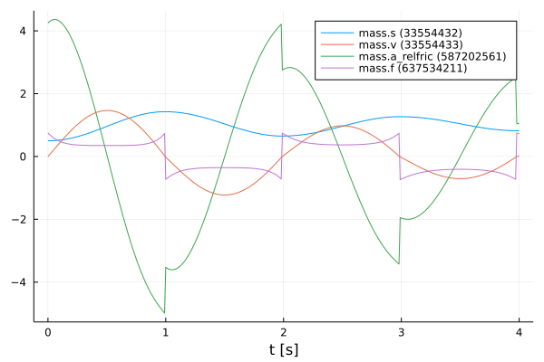
    


#### Define functions

The structure of the previous code section is used more often in the further sections, so for clarity the previously explained code sections for resetting, initializing and simulating are combined into one function `simulate()`.


```julia
function simulate(FMU, states, x₀, variables, tStart, tStop, tSave)
    # [2,3] => fmi2ComponentStateEventMode, fmi2ComponentStateContinuousTimeMode
    if Int(FMU.components[end].state) in [2, 3]
        fmiTerminate(FMU)
        fmiReset(FMU)
    end
    fmiSetupExperiment(FMU, tStart, tStop)

    fmiEnterInitializationMode(FMU)
    fmiExitInitializationMode(FMU)

    params = Dict(zip(states, x₀))
    return fmiSimulate(FMU, tStart, tStop; parameters=params, recordValues=variables, saveat=tSave, reset=false)
end
```


    simulate (generic function with 1 method)


Also, a function to extract the position and velocity from the simulation data is created.


```julia
function extractPosVel(simData)
    posData = collect(data[1] for data in simData)
    velData = collect(data[2] for data in simData)
    return posData, velData
end
```


    extractPosVel (generic function with 1 method)


#### Modified initial states

In contrast to the previous section, other initial states are selected. The position of the mass is initilized with $1.0m$ and the velocity is initialized with $-1.5\frac{m}{s}$. With the modified initial states the *realFMU* is simulated and a graph is generated.


```julia
xMod₀ = [1.0, -1.5]
solution = simulate(realFMU, states, xMod₀, vrs, tStart, tStop, tSave)
realSimDataMod = solution.values.saveval
fmiPlot(solution)
```


    
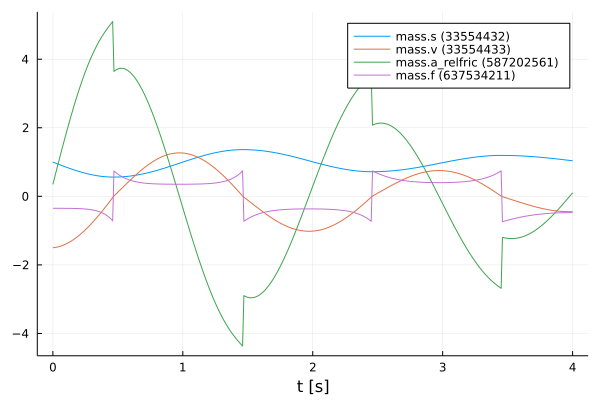
    


 After the plots are created, the FMU is unloaded.


```julia
fmiUnload(realFMU)
```

### SimpleFMU

The following lines load and instantiate the *simpleFMU* from *FMIZoo.jl*. 


```julia
simpleFMU = fmiLoad("SpringPendulum1D", "Dymola", "2022x")
fmiInstantiate!(simpleFMU; loggingOn=false)
fmiInfo(simpleFMU)
```

    #################### Begin information for FMU ####################
    	Model name:			SpringPendulum1D
    	FMI-Version:			2.0
    	GUID:				{a3e886fa-675c-4308-8e91-3490e598ba11}
    	Generation tool:		Dymola Version 2022x (64-bit), 2021-10-08
    	Generation time:		2022-03-03T15:08:57Z
    	Var. naming conv.:		structured
    	Event indicators:		0
    	Inputs:				0
    	Outputs:			0
    	States:				2
    		33554432 ["mass.s"]
    		33554433 ["mass.v"]
    	Supports Co-Simulation:		true
    		Model identifier:	SpringPendulum1D
    		Get/Set State:		true
    		Serialize State:	true
    		Dir. Derivatives:	true
    		Var. com. steps:	true
    		Input interpol.:	true
    		Max order out. der.:	1
    	Supports Model-Exchange:	true
    		Model identifier:	SpringPendulum1D
    		Get/Set State:		true
    		Serialize State:	true
    		Dir. Derivatives:	true
    ##################### End information for FMU #####################


    ┌ Info: fmi2Unzip(...): Successfully unzipped 29 files at `/tmp/fmijl_0uGPRS/SpringPendulum1D`.
    └ @ FMIImport /home/runner/.julia/packages/FMIImport/S8pFT/src/FMI2_ext.jl:75
    ┌ Info: fmi2Load(...): FMU resources location is `file:////tmp/fmijl_0uGPRS/SpringPendulum1D/resources`
    └ @ FMIImport /home/runner/.julia/packages/FMIImport/S8pFT/src/FMI2_ext.jl:190
    ┌ Info: fmi2Load(...): FMU supports both CS and ME, using CS as default if nothing specified.
    └ @ FMIImport /home/runner/.julia/packages/FMIImport/S8pFT/src/FMI2_ext.jl:193


The differences between both systems can be clearly seen from the plots in the subchapters. In the plot for the *realFMU* it can be seen that the oscillation continues to decrease due to the effect of the friction. If you would simulate long enough, the oscillation would come to a standstill in a certain time. The oscillation in the *simpleFMU* behaves differently, since the friction was not taken into account here. The oscillation in this model would continue to infinity with the same oscillation amplitude. From this observation the desire of an improvement of this model arises.     


In the following two subsections, the *simpleFMU* is simulated twice with different initial states to show what effect the choice of initial states has.

#### Default initial states

Similar to the simulation of the *realFMU*, the *simpleFMU* is also simulated with the default values for the position and velocity of the mass and then plotted. There is one difference, however, as another state representing a fixed displacement is set. In addition, the last variable is also removed from the varibals to be plotted.


```julia
states = ["mass_s0", "mass_v0", "fixed.s0"]
displacement = 0.1
xSimple₀ = vcat(x₀, displacement)
vrs = vrs[1:end-1]

solution = simulate(simpleFMU, states, xSimple₀, vrs, tStart, tStop, tSave)
simpleSimData = solution.values.saveval
fmiPlot(solution)
```


    
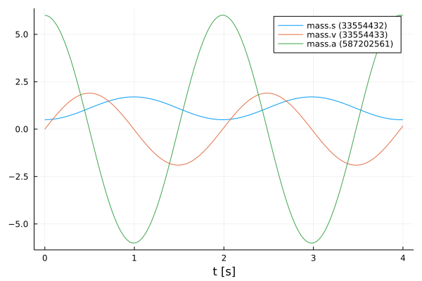
    


#### Modified initial states

The same values for the initial states are used for this simulation as for the simulation from the *realFMU* with the modified initial states.


```julia
xSimpleMod₀ = vcat(xMod₀, displacement)

solution = simulate(simpleFMU, states, xSimpleMod₀, vrs, tStart, tStop, tSave)
simpleSimDataMod = solution.values.saveval
fmiPlot(solution)
```


    

    


## NeuralFMU

#### Loss function

In order to train our model, a loss function must be implemented. The solver of the NeuralFMU can calculate the gradient of the loss function. The gradient descent is needed to adjust the weights in the neural network so that the sum of the error is reduced and the model becomes more accurate.

The error function in this implementation consists of the mean of the mean squared erros. The first part of the addition is the deviation of the position and the second part is the deviation of the velocity. The mean squared error (mse) for the position consists from the real position of the *realFMU* simulation (posReal) and the position data of the network (posNet). The mean squared error for the velocity consists of the real velocity of the *realFMU* simualtion (velReal) and the velocity data of the network (velNet).
$$ loss = \frac{1}{2} \Bigl[ \frac{1}{n} \sum\limits_{i=0}^n (posReal[i] - posNet[i])^2 + \frac{1}{n} \sum\limits_{i=0}^n (velReal[i] - velNet[i])^2 \Bigr]$$


```julia
# loss function for training
function lossSum()
    global x₀
    solution = neuralFMU(x₀)

    posNet, velNet = extractPosVel(solution.states.u)

    (Flux.Losses.mse(posReal, posNet) + Flux.Losses.mse(velReal, velNet)) / 2.0
end
```


    lossSum (generic function with 1 method)


#### Callback

To output the loss in certain time intervals, a callback is implemented as a function in the following. Here a counter is incremented, every fiftieth pass the loss function is called and the average error is printed out. Also the parmaters for the velocity in the first layer are kept to a fixed value.


```julia
# callback function for training
global counter = 0
function callb()
    global counter, paramsNet
    counter += 1

    # freeze first layer parameters (2,4,6) for velocity -> (static) direct feed trough for velocity
    # parameters for position (1,3,5) are learned
    paramsNet[1][2] = 0.0
    paramsNet[1][4] = 1.0
    paramsNet[1][6] = 0.0

    if counter % 50 == 1
        avgLoss = lossSum()
        @info "  Loss [$counter]: $(round(avgLoss, digits=5))
        Avg displacement in data: $(round(sqrt(avgLoss), digits=5))
        Weight/Scale: $(paramsNet[1][1])   Bias/Offset: $(paramsNet[1][5])"
    end
end
```


    callb (generic function with 1 method)


#### Functions for plotting

In this section some important functions for plotting are defined. The function `generate_figure()` creates a new figure object and sets some attributes.


```julia
function generate_figure(title, xLabel, yLabel, xlim="auto")
    Plots.plot(
        title=title, xlabel=xLabel, ylabel=yLabel, linewidth=2,
        xtickfontsize=12, ytickfontsize=12, xguidefontsize=12, yguidefontsize=12,
        legendfontsize=12, legend=:topright, xlim=xlim)
end
```


    generate_figure (generic function with 2 methods)


In the following function, the data of the *realFMU*, *simpleFMU* and *neuralFMU* are summarized and displayed in a graph.


```julia
function plot_results(title, xLabel, yLabel, interval, realData, simpleData, neuralData)
    linestyles = [:dot, :solid]
    
    fig = generate_figure(title, xLabel, yLabel)
    Plots.plot!(fig, interval, simpleData, label="SimpleFMU", linewidth=2)
    Plots.plot!(fig, interval, realData, label="Reference", linewidth=2)
    for i in 1:length(neuralData)
        Plots.plot!(fig, neuralData[i][1], neuralData[i][2], label="NeuralFMU ($(i*2500))", 
                    linewidth=2, linestyle=linestyles[i], linecolor=:green)
    end
    Plots.display(fig)
end
```


    plot_results (generic function with 1 method)


This is the superordinate function, which at the beginning extracts the position and velocity from the simulation data (`realSimData`, `realSimDataMod`, `simpleSimData`,..., `solutionAfterMod`). Four graphs are then generated, each comparing the corresponding data from the *realFMU*, *simpleFMU*, and *neuralFMU*. The comparison is made with the simulation data from the simulation with the default and modified initial states. According to the data, the designation of the title and the naming of the axes is adapted.


```julia
function plot_all_results(realSimData, realSimDataMod, simpleSimData, 
        simpleSimDataMod, solutionAfter, solutionAfterMod)    
    # collect all data
    posReal, velReal = extractPosVel(realSimData)
    posRealMod, velRealMod = extractPosVel(realSimDataMod)
    posSimple, velSimple = extractPosVel(simpleSimData)
    posSimpleMod, velSimpleMod = extractPosVel(simpleSimDataMod)
    
    run = length(solutionAfter)
    
    posNeural, velNeural = [], []
    posNeuralMod, velNeuralMod = [], []
    for i in 1:run
        dataNeural = extractPosVel(solutionAfter[i].states.u)
        push!(posNeural, (solutionAfter[i].states.t, dataNeural[1]))
        push!(velNeural, (solutionAfter[i].states.t, dataNeural[2]))
        
        dataNeuralMod = extractPosVel(solutionAfterMod[i].states.u)
        push!(posNeuralMod, (solutionAfterMod[i].states.t, dataNeuralMod[1]))
        push!(velNeuralMod, (solutionAfterMod[i].states.t, dataNeuralMod[2]))
    end
         
    # plot results s (default initial states)
    xLabel="t [s]"
    yLabel="mass position [m]"
    title = "Default: Mass position after Run: $(run)"
    plot_results(title, xLabel, yLabel, tSave, posReal, posSimple, posNeural)

    # plot results s (modified initial states)
    title = "Modified: Mass position after Run: $(run)"
    plot_results(title, xLabel, yLabel, tSave, posRealMod, posSimpleMod, posNeuralMod)

    # plot results v (default initial states)
    yLabel="mass velocity [m/s]"
    title = "Default: Mass velocity after Run: $(run)"
    plot_results(title, xLabel, yLabel, tSave, velReal, velSimple, velNeural)

    # plot results v (modified initial states)    
    title = "Modified: Mass velocity after Run: $(run)"
    plot_results(title, xLabel, yLabel, tSave, velRealMod, velSimpleMod, velNeuralMod)
end
```


    plot_all_results (generic function with 1 method)


The function `plot_friction_model()` compares the friction model of the *realFMU*, *simpleFMU* and *neuralFMU*. For this, the velocity and force from the simulation data of the *realFMU* is needed. The force data is calculated with the extracted last layer of the *neuralFMU* to the real velocity in line 9 by iterating over the vector `velReal`. In the next rows, the velocity and force data (if available) for each of the three FMUs are combined into a matrix. The first row of the matrix corresponds to the later x-axis and here the velocity is plotted. The second row corresponds to the y-axis and here the force is plotted. This matrix is sorted and plotted by the first entries (velocity) with the function `sortperm()`. The graph with at least three graphs is plotted in line 33. As output this function has the forces of the *neuralFMU*.


```julia
function plot_friction_model(realSimData, netBottom, forces)    
    linestyles = [:dot, :solid]
    
    velReal = collect(data[2] for data in realSimData)
    forceReal = collect(data[4] for data in realSimData)

    push!(forces, zeros(length(velReal)))
    for i in 1:length(velReal)
        forces[end][i] = -netBottom([velReal[i], 0.0])[2]
    end

    run = length(forces) 
    
    fig = generate_figure("Friction model $(run)", "v [m/s]", "friction force [N]", (-1.25, 1.25))

    fricSimple = hcat(velReal, zeros(length(velReal)))
    fricSimple[sortperm(fricSimple[:, 1]), :]
    Plots.plot!(fig, fricSimple[:,1], fricSimple[:,2], label="SimpleFMU", linewidth=2)

    fricReal = hcat(velReal, forceReal)
    fricReal[sortperm(fricReal[:, 1]), :]
    Plots.plot!(fig, fricReal[:,1], fricReal[:,2], label="reference", linewidth=2)

    for i in 1:run
        fricNeural = hcat(velReal, forces[i])
        fricNeural[sortperm(fricNeural[:, 1]), :]
        Plots.plot!(fig, fricNeural[:,1], fricNeural[:,2], label="NeuralFMU ($(i*2500))", 
                    linewidth=2, linestyle=linestyles[i], linecolor=:green)
        @info "Friction model $i mse: $(Flux.Losses.mse(fricNeural[:,2], fricReal[:,2]))"
    end
    flush(stderr)

    Plots.display(fig)
    
    return forces   
end
```


    plot_friction_model (generic function with 1 method)


The following function is used to display the different displacement modells of the *realFMU*, *simpleFMU* and *neuralFMU*. The displacement of the *realFMU* and *simpleFMU* is very trivial and is only a constant. The position data of the *realFMU* is needed to calculate the displacement. The displacement for the *neuralFMU* is calculated using the first extracted layer of the neural network, subtracting the real position and the displacement of the *simpleFMU*. Also in this function, the graphs of the three FMUs are compared in a plot.


```julia
function plot_displacement_model(realSimData, netTop, displacements, tSave, displacement)
    linestyles = [:dot, :solid]
    
    posReal = collect(data[1] for data in realSimData)
    
    push!(displacements, zeros(length(posReal)))
    for i in 1:length(posReal)
        displacements[end][i] = netTop([posReal[i], 0.0])[1] - posReal[i] - displacement
    end

    run = length(displacements)
    fig = generate_figure("Displacement model $(run)", "t [s]", "displacement [m]")
    Plots.plot!(fig, [tSave[1], tSave[end]], [displacement, displacement], label="simpleFMU", linewidth=2)
    Plots.plot!(fig, [tSave[1], tSave[end]], [0.0, 0.0], label="reference", linewidth=2)
    for i in 1:run
        Plots.plot!(fig, tSave, displacements[i], label="NeuralFMU ($(i*2500))", 
                    linewidth=2, linestyle=linestyles[i], linecolor=:green)
    end

    Plots.display(fig)
    
    return displacements
end
```


    plot_displacement_model (generic function with 1 method)


#### Structure of the NeuralFMU

In the following, the topology of the NeuralFMU is constructed. It consists of a dense layer that has exactly as many inputs and outputs as the model has states `numStates` (and therefore state derivatives). It also sets the initial weights and offsets for the first dense layer, as well as the activation function, which consists of the identity. An input layer follows, which then leads into the *simpleFMU* model. The ME-FMU computes the state derivatives for a given system state. Following the *simpleFMU* is a dense layer that has `numStates` states. The output of this layer consists of 8 output nodes and a *identity* activation function. The next layer has 8 input and output nodes with a *tanh* activation function. The last layer is again a dense layer with 8 input nodes and the number of states as outputs. Here, it is important that no *tanh*-activation function follows, because otherwise the pendulums state values would be limited to the interval $[-1;1]$.


```julia
# NeuralFMU setup
numStates = fmiGetNumberOfStates(simpleFMU)

net = Chain(Dense(numStates, numStates, identity; 
                  initW = (out, in) -> [[1.0, 0.0] [0.0, 1.0]], 
                  initb = out -> zeros(out)),
            inputs -> fmiEvaluateME(simpleFMU, inputs),
            Dense(numStates, 8, identity),
            Dense(8, 8, tanh),
            Dense(8, numStates))
```


    Chain(
      Dense(2, 2),                          # 6 parameters
      var"#17#20"(),
      Dense(2, 8),                          # 24 parameters
      Dense(8, 8, tanh),                    # 72 parameters
      Dense(8, 2),                          # 18 parameters
    )                   # Total: 8 arrays, 120 parameters, 1016 bytes.


#### Definition of the NeuralFMU

The instantiation of the ME-NeuralFMU is done as a one-liner. The FMU (*simpleFMU*), the structure of the network `net`, start `tStart` and end time `tStop`, the numerical solver `Tsit5()` and the time steps `tSave` for saving are specified.


```julia
neuralFMU = ME_NeuralFMU(simpleFMU, net, (tStart, tStop), Tsit5(); saveat=tSave);
```

#### Plot before training

Here the state trajactory of the *simpleFMU* is recorded. Doesn't really look like a pendulum yet, but the system is random initialized by default. In the later plots, the effect of learning can be seen.


```julia
solutionBefore = neuralFMU(x₀)
fmiPlot(solutionBefore)
```


    
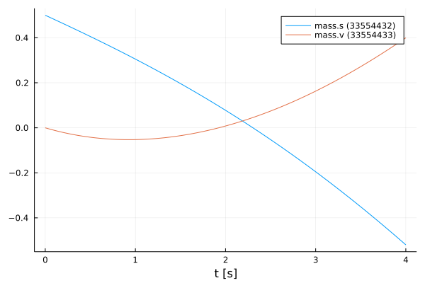
    


#### Training of the NeuralFMU

For the training of the NeuralFMU the parameters are extracted. All parameters of the first layer are set to the absolute value.


```julia
# train
paramsNet = Flux.params(neuralFMU)

for i in 1:length(paramsNet[1])
    if paramsNet[1][i] < 0.0 
        paramsNet[1][i] = -paramsNet[1][i]
    end
end
```

The well-known ADAM optimizer for minimizing the gradient descent is used as further passing parameters. Additionally, the previously defined loss and callback function as well as a one for the number of epochs are passed. Only one epoch is trained so that the NeuralFMU is precompiled.


```julia
optim = ADAM()
Flux.train!(lossSum, paramsNet, Iterators.repeated((), 1), optim; cb=callb) 
```

    ┌ Info:   Loss [1]: 0.38766
    │         Avg displacement in data: 0.62262
    │         Weight/Scale: 1.0009999999789518   Bias/Offset: 0.0009999999760423974
    └ @ Main In[14]:15


Some vectors for collecting data are initialized and the number of runs, epochs and iterations are set.


```julia
solutionAfter = []
solutionAfterMod = []
forces = []
displacements = []

numRuns = 2
numEpochs= 5
numIterations = 500;
```

#### Training loop

The code section shown here represents the training loop. The loop is structured so that it has `numRuns` runs, where each run has `numEpochs` epochs, and the training is performed at each epoch with `numIterations` iterations. In lines 9 and 10, the data for the *neuralFMU* for the default and modified initial states are appended to the corresponding vectors. The plots for the opposition of position and velocity is done in line 13 by calling the function `plot_all_results`. In the following lines the last layers are extracted from the *neuralFMU* and formed into an independent network `netBottom`. The parmaters for the `netBottom` network come from the original architecture and are shared. In line 20, the new network is used to represent the friction model in a graph. An analogous construction of the next part of the training loop, where here the first layer is taken from the *neuralFMU* and converted to its own network `netTop`. This network is used to record the displacement model. The different graphs are generated for each run and can thus be compared. 


```julia
for run in 1:numRuns    
    @time for epoch in 1:numEpochs
        @info "Run: $(run)/$(numRuns)  Epoch: $(epoch)/$(numEpochs)"
        Flux.train!(lossSum, paramsNet, Iterators.repeated((), numIterations), optim; cb=callb)
    end
    flush(stderr)
    flush(stdout)
    
    push!(solutionAfter, neuralFMU(x₀))
    push!(solutionAfterMod, neuralFMU(xMod₀))

    # generate all plots for the position and velocity
    plot_all_results(realSimData, realSimDataMod, simpleSimData, simpleSimDataMod, solutionAfter, solutionAfterMod)
    
    # friction model extraction
    layersBottom = neuralFMU.neuralODE.model.layers[3:5]
    netBottom = Chain(layersBottom...)
    transferParams!(netBottom, paramsNet, 7)
    
    forces = plot_friction_model(realSimData, netBottom, forces) 
    
    # displacement model extraction
    layersTop = neuralFMU.neuralODE.model.layers[1:1]
    netTop = Chain(layersTop...)
    transferParams!(netTop, paramsNet, 1)

    displacements = plot_displacement_model(realSimData, netTop, displacements, tSave, displacement)
end
```

    ┌ Info: Run: 1/2  Epoch: 1/5
    └ @ Main In[26]:3
    ┌ Info:   Loss [51]: 0.27987
    │         Avg displacement in data: 0.52903
    │         Weight/Scale: 1.0227796970116099   Bias/Offset: 0.023591017656889292
    └ @ Main In[14]:15
    ┌ Info:   Loss [101]: 0.23462
    │         Avg displacement in data: 0.48438
    │         Weight/Scale: 1.0072353035877748   Bias/Offset: 0.012056601465167231
    └ @ Main In[14]:15
    ┌ Info:   Loss [151]: 0.07568
    │         Avg displacement in data: 0.27511
    │         Weight/Scale: 1.0255579971281237   Bias/Offset: 0.05412667390444118
    └ @ Main In[14]:15
    ┌ Info:   Loss [201]: 0.03432
    │         Avg displacement in data: 0.18527
    │         Weight/Scale: 1.0514125844849433   Bias/Offset: 0.08365821737196671
    └ @ Main In[14]:15
    ┌ Info:   Loss [251]: 0.03042
    │         Avg displacement in data: 0.17441
    │         Weight/Scale: 1.0527700321022002   Bias/Offset: 0.08237076793717746
    └ @ Main In[14]:15
    ┌ Info:   Loss [301]: 0.02736
    │         Avg displacement in data: 0.16542
    │         Weight/Scale: 1.0527381454180385   Bias/Offset: 0.08007717460345241
    └ @ Main In[14]:15
    ┌ Info:   Loss [351]: 0.02485
    │         Avg displacement in data: 0.15764
    │         Weight/Scale: 1.0518626946447298   Bias/Offset: 0.07736884637113227
    └ @ Main In[14]:15
    ┌ Info:   Loss [401]: 0.02285
    │         Avg displacement in data: 0.15117
    │         Weight/Scale: 1.0504861588807048   Bias/Offset: 0.07499332190165506
    └ @ Main In[14]:15
    ┌ Info:   Loss [451]: 0.02146
    │         Avg displacement in data: 0.14651
    │         Weight/Scale: 1.0485437200334342   Bias/Offset: 0.07268992253146442
    └ @ Main In[14]:15
    ┌ Info:   Loss [501]: 0.02022
    │         Avg displacement in data: 0.14218
    │         Weight/Scale: 1.0464993411814696   Bias/Offset: 0.0710597749499315
    └ @ Main In[14]:15
    ┌ Info: Run: 1/2  Epoch: 2/5
    └ @ Main In[26]:3
    ┌ Info:   Loss [551]: 0.01927
    │         Avg displacement in data: 0.13883
    │         Weight/Scale: 1.0445026665769896   Bias/Offset: 0.06964772281940071
    └ @ Main In[14]:15
    ┌ Info:   Loss [601]: 0.01843
    │         Avg displacement in data: 0.13577
    │         Weight/Scale: 1.042362782468278   Bias/Offset: 0.06834511737360152
    └ @ Main In[14]:15
    ┌ Info:   Loss [651]: 0.01762
    │         Avg displacement in data: 0.13273
    │         Weight/Scale: 1.0402166603294145   Bias/Offset: 0.06751241855189546
    └ @ Main In[14]:15
    ┌ Info:   Loss [701]: 0.01686
    │         Avg displacement in data: 0.12983
    │         Weight/Scale: 1.0379368109983542   Bias/Offset: 0.06662326172929531
    └ @ Main In[14]:15
    ┌ Info:   Loss [751]: 0.01611
    │         Avg displacement in data: 0.12694
    │         Weight/Scale: 1.035831283264552   Bias/Offset: 0.06607780603090957
    └ @ Main In[14]:15
    ┌ Info:   Loss [801]: 0.01535
    │         Avg displacement in data: 0.1239
    │         Weight/Scale: 1.0336720469018137   Bias/Offset: 0.06571875153167815
    └ @ Main In[14]:15
    ┌ Info:   Loss [851]: 0.01451
    │         Avg displacement in data: 0.12046
    │         Weight/Scale: 1.0313786392966608   Bias/Offset: 0.06532773850832199
    └ @ Main In[14]:15
    ┌ Info:   Loss [901]: 0.0136
    │         Avg displacement in data: 0.11661
    │         Weight/Scale: 1.0290240828840826   Bias/Offset: 0.06483837535616906
    └ @ Main In[14]:15
    ┌ Info:   Loss [951]: 0.01267
    │         Avg displacement in data: 0.11256
    │         Weight/Scale: 1.0266723388748362   Bias/Offset: 0.0641415557851245
    └ @ Main In[14]:15
    ┌ Info:   Loss [1001]: 0.01178
    │         Avg displacement in data: 0.10853
    │         Weight/Scale: 1.0246536051746007   Bias/Offset: 0.06367239068663935
    └ @ Main In[14]:15
    ┌ Info: Run: 1/2  Epoch: 3/5
    └ @ Main In[26]:3
    ┌ Info:   Loss [1051]: 0.01093
    │         Avg displacement in data: 0.10453
    │         Weight/Scale: 1.0228152331906621   Bias/Offset: 0.0632383316497583
    └ @ Main In[14]:15
    ┌ Info:   Loss [1101]: 0.01013
    │         Avg displacement in data: 0.10064
    │         Weight/Scale: 1.0213242965645581   Bias/Offset: 0.06310748528194483
    └ @ Main In[14]:15
    ┌ Info:   Loss [1151]: 0.00939
    │         Avg displacement in data: 0.09691
    │         Weight/Scale: 1.0199900087615812   Bias/Offset: 0.06303353961222972
    └ @ Main In[14]:15
    ┌ Info:   Loss [1201]: 0.00871
    │         Avg displacement in data: 0.0933
    │         Weight/Scale: 1.018735783915613   Bias/Offset: 0.06296959770485801
    └ @ Main In[14]:15
    ┌ Info:   Loss [1251]: 0.00805
    │         Avg displacement in data: 0.08974
    │         Weight/Scale: 1.0174877508566056   Bias/Offset: 0.06286443149083883
    └ @ Main In[14]:15
    ┌ Info:   Loss [1301]: 0.00733
    │         Avg displacement in data: 0.08564
    │         Weight/Scale: 1.016123195925189   Bias/Offset: 0.06255384925388463
    └ @ Main In[14]:15
    ┌ Info:   Loss [1351]: 0.00659
    │         Avg displacement in data: 0.08115
    │         Weight/Scale: 1.0148747249212973   Bias/Offset: 0.06220747693093168
    └ @ Main In[14]:15
    ┌ Info:   Loss [1401]: 0.0059
    │         Avg displacement in data: 0.07681
    │         Weight/Scale: 1.0137185951178367   Bias/Offset: 0.06159706715924497
    └ @ Main In[14]:15
    ┌ Info:   Loss [1451]: 0.0054
    │         Avg displacement in data: 0.07347
    │         Weight/Scale: 1.0128123411436896   Bias/Offset: 0.060936288082932645
    └ @ Main In[14]:15
    ┌ Info:   Loss [1501]: 0.00501
    │         Avg displacement in data: 0.0708
    │         Weight/Scale: 1.0121081152716849   Bias/Offset: 0.0603720031528038
    └ @ Main In[14]:15
    ┌ Info: Run: 1/2  Epoch: 4/5
    └ @ Main In[26]:3
    ┌ Info:   Loss [1551]: 0.00469
    │         Avg displacement in data: 0.06846
    │         Weight/Scale: 1.0115234765241998   Bias/Offset: 0.05991284544862315
    └ @ Main In[14]:15
    ┌ Info:   Loss [1601]: 0.0044
    │         Avg displacement in data: 0.06633
    │         Weight/Scale: 1.010998502492852   Bias/Offset: 0.05950500950242054
    └ @ Main In[14]:15
    ┌ Info:   Loss [1651]: 0.00415
    │         Avg displacement in data: 0.06439
    │         Weight/Scale: 1.0105127987984617   Bias/Offset: 0.05912568441980154
    └ @ Main In[14]:15
    ┌ Info:   Loss [1701]: 0.00391
    │         Avg displacement in data: 0.06254
    │         Weight/Scale: 1.010058336563268   Bias/Offset: 0.058766465825774855
    └ @ Main In[14]:15
    ┌ Info:   Loss [1751]: 0.00371
    │         Avg displacement in data: 0.06088
    │         Weight/Scale: 1.0096525333619684   Bias/Offset: 0.05845447065381992
    └ @ Main In[14]:15
    ┌ Info:   Loss [1801]: 0.00352
    │         Avg displacement in data: 0.05936
    │         Weight/Scale: 1.009282243878198   Bias/Offset: 0.058173310127475286
    └ @ Main In[14]:15
    ┌ Info:   Loss [1851]: 0.00335
    │         Avg displacement in data: 0.05791
    │         Weight/Scale: 1.0089047039722547   Bias/Offset: 0.057863984111149624
    └ @ Main In[14]:15
    ┌ Info:   Loss [1901]: 0.0032
    │         Avg displacement in data: 0.05658
    │         Weight/Scale: 1.008529991089291   Bias/Offset: 0.05754133897465104
    └ @ Main In[14]:15
    ┌ Info:   Loss [1951]: 0.00306
    │         Avg displacement in data: 0.05533
    │         Weight/Scale: 1.0081768756205887   Bias/Offset: 0.05723263900361796
    └ @ Main In[14]:15
    ┌ Info:   Loss [2001]: 0.00293
    │         Avg displacement in data: 0.05417
    │         Weight/Scale: 1.0078465071341607   Bias/Offset: 0.05694232136940953
    └ @ Main In[14]:15
    ┌ Info: Run: 1/2  Epoch: 5/5
    └ @ Main In[26]:3
    ┌ Info:   Loss [2051]: 0.00282
    │         Avg displacement in data: 0.05309
    │         Weight/Scale: 1.00753599124054   Bias/Offset: 0.05666855645402224
    └ @ Main In[14]:15
    ┌ Info:   Loss [2101]: 0.00271
    │         Avg displacement in data: 0.05208
    │         Weight/Scale: 1.007242672523073   Bias/Offset: 0.056409183168961256
    └ @ Main In[14]:15
    ┌ Info:   Loss [2151]: 0.00261
    │         Avg displacement in data: 0.05113
    │         Weight/Scale: 1.00696484593406   Bias/Offset: 0.05616300337577483
    └ @ Main In[14]:15
    ┌ Info:   Loss [2201]: 0.00252
    │         Avg displacement in data: 0.05022
    │         Weight/Scale: 1.0067018285264795   Bias/Offset: 0.05593016386077495
    └ @ Main In[14]:15
    ┌ Info:   Loss [2251]: 0.00244
    │         Avg displacement in data: 0.04937
    │         Weight/Scale: 1.0064523167935369   Bias/Offset: 0.05570964603725736
    └ @ Main In[14]:15
    ┌ Info:   Loss [2301]: 0.00236
    │         Avg displacement in data: 0.04856
    │         Weight/Scale: 1.0062144463476186   Bias/Offset: 0.055499106100520834
    └ @ Main In[14]:15
    ┌ Info:   Loss [2351]: 0.00228
    │         Avg displacement in data: 0.04779
    │         Weight/Scale: 1.0059866482617346   Bias/Offset: 0.055296401968044875
    └ @ Main In[14]:15
    ┌ Info:   Loss [2401]: 0.00221
    │         Avg displacement in data: 0.04706
    │         Weight/Scale: 1.0057680560025286   Bias/Offset: 0.055100566644453675
    └ @ Main In[14]:15
    ┌ Info:   Loss [2451]: 0.00215
    │         Avg displacement in data: 0.04636
    │         Weight/Scale: 1.005558093740859   Bias/Offset: 0.054911453690027597
    └ @ Main In[14]:15
    ┌ Info:   Loss [2501]: 0.00209
    │         Avg displacement in data: 0.04569
    │         Weight/Scale: 1.005356172951226   Bias/Offset: 0.05472884847976411
    └ @ Main In[14]:15


     95.790944 seconds (230.56 M allocations: 79.977 GiB, 12.63% gc time, 0.00% compilation time)


    
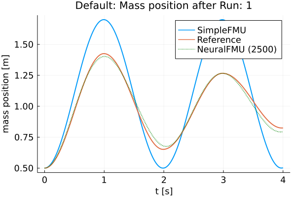
    


    
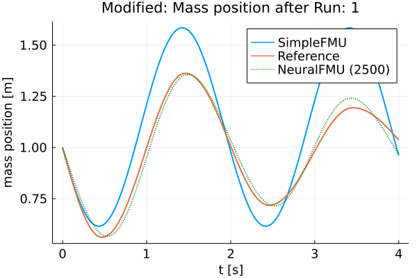
    


    
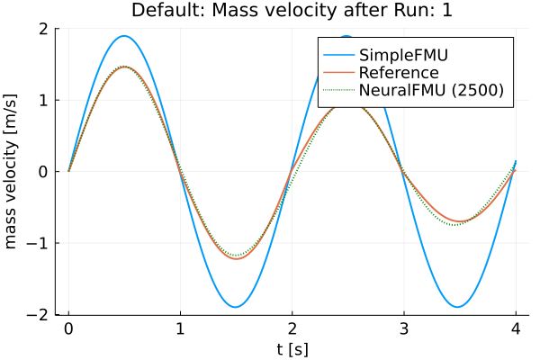
    


    
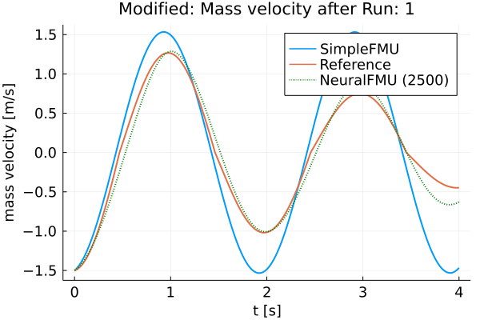
    


    ┌ Info: Friction model 1 mse: 0.5723358977362716
    └ @ Main In[18]:29


    
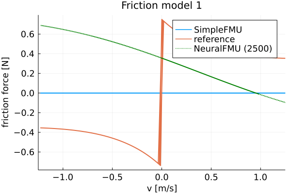
    


    
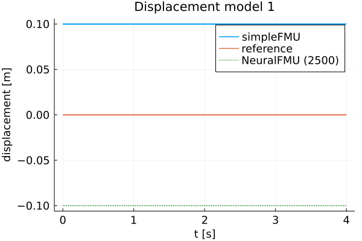
    


    ┌ Info: Run: 2/2  Epoch: 1/5
    └ @ Main In[26]:3
    ┌ Info:   Loss [2551]: 0.00203
    │         Avg displacement in data: 0.04505
    │         Weight/Scale: 1.0051616206455398   Bias/Offset: 0.05455225932063865
    └ @ Main In[14]:15
    ┌ Info:   Loss [2601]: 0.00197
    │         Avg displacement in data: 0.04443
    │         Weight/Scale: 1.0049740403022716   Bias/Offset: 0.054381459151642546
    └ @ Main In[14]:15
    ┌ Info:   Loss [2651]: 0.00192
    │         Avg displacement in data: 0.04384
    │         Weight/Scale: 1.0047929412075365   Bias/Offset: 0.054216050155221754
    └ @ Main In[14]:15
    ┌ Info:   Loss [2701]: 0.00187
    │         Avg displacement in data: 0.04327
    │         Weight/Scale: 1.0046178695423365   Bias/Offset: 0.05405552045592701
    └ @ Main In[14]:15
    ┌ Info:   Loss [2751]: 0.00183
    │         Avg displacement in data: 0.04272
    │         Weight/Scale: 1.0044483541288745   Bias/Offset: 0.053899316164720525
    └ @ Main In[14]:15
    ┌ Info:   Loss [2801]: 0.00178
    │         Avg displacement in data: 0.0422
    │         Weight/Scale: 1.0042838810829895   Bias/Offset: 0.05374672929743489
    └ @ Main In[14]:15
    ┌ Info:   Loss [2851]: 0.00174
    │         Avg displacement in data: 0.04168
    │         Weight/Scale: 1.0041239146850423   Bias/Offset: 0.053596936892076195
    └ @ Main In[14]:15
    ┌ Info:   Loss [2901]: 0.0017
    │         Avg displacement in data: 0.04119
    │         Weight/Scale: 1.003968013058852   Bias/Offset: 0.0534493682166658
    └ @ Main In[14]:15
    ┌ Info:   Loss [2951]: 0.00167
    │         Avg displacement in data: 0.04083
    │         Weight/Scale: 1.003815524276921   Bias/Offset: 0.05332244094052112
    └ @ Main In[14]:15
    ┌ Info:   Loss [3001]: 0.00162
    │         Avg displacement in data: 0.04026
    │         Weight/Scale: 1.0036163643320701   Bias/Offset: 0.05313667739030836
    └ @ Main In[14]:15
    ┌ Info: Run: 2/2  Epoch: 2/5
    └ @ Main In[26]:3
    ┌ Info:   Loss [3051]: 0.00159
    │         Avg displacement in data: 0.03982
    │         Weight/Scale: 1.0034520719862927   Bias/Offset: 0.052971473298982975
    └ @ Main In[14]:15
    ┌ Info:   Loss [3101]: 0.00155
    │         Avg displacement in data: 0.0394
    │         Weight/Scale: 1.0032843539209602   Bias/Offset: 0.05280025318906625
    └ @ Main In[14]:15
    ┌ Info:   Loss [3151]: 0.00152
    │         Avg displacement in data: 0.03899
    │         Weight/Scale: 1.0030865161875566   Bias/Offset: 0.05263145263027608
    └ @ Main In[14]:15
    ┌ Info:   Loss [3201]: 0.00149
    │         Avg displacement in data: 0.03858
    │         Weight/Scale: 1.0028944221903153   Bias/Offset: 0.052431205486207104
    └ @ Main In[14]:15
    ┌ Info:   Loss [3251]: 0.00146
    │         Avg displacement in data: 0.03819
    │         Weight/Scale: 1.0027114257861918   Bias/Offset: 0.05223183673681123
    └ @ Main In[14]:15
    ┌ Info:   Loss [3301]: 0.00156
    │         Avg displacement in data: 0.03944
    │         Weight/Scale: 1.0025707769492662   Bias/Offset: 0.052064542245076076
    └ @ Main In[14]:15
    ┌ Info:   Loss [3351]: 0.0014
    │         Avg displacement in data: 0.03746
    │         Weight/Scale: 1.002281375880808   Bias/Offset: 0.05180840758623968
    └ @ Main In[14]:15
    ┌ Info:   Loss [3401]: 0.00138
    │         Avg displacement in data: 0.0371
    │         Weight/Scale: 1.002074830798313   Bias/Offset: 0.05157309014340691
    └ @ Main In[14]:15
    ┌ Info:   Loss [3451]: 0.00135
    │         Avg displacement in data: 0.03676
    │         Weight/Scale: 1.0018667959712988   Bias/Offset: 0.05133094356659137
    └ @ Main In[14]:15
    ┌ Info:   Loss [3501]: 0.00147
    │         Avg displacement in data: 0.03839
    │         Weight/Scale: 1.0017056732049576   Bias/Offset: 0.05112376482076262
    └ @ Main In[14]:15
    ┌ Info: Run: 2/2  Epoch: 3/5
    └ @ Main In[26]:3
    ┌ Info:   Loss [3551]: 0.0013
    │         Avg displacement in data: 0.0361
    │         Weight/Scale: 1.0013709501776842   Bias/Offset: 0.050816073406702626
    └ @ Main In[14]:15
    ┌ Info:   Loss [3601]: 0.00128
    │         Avg displacement in data: 0.03578
    │         Weight/Scale: 1.0011311493270456   Bias/Offset: 0.05052814200082174
    └ @ Main In[14]:15
    ┌ Info:   Loss [3651]: 0.00126
    │         Avg displacement in data: 0.03547
    │         Weight/Scale: 1.000888885888904   Bias/Offset: 0.050230639351165646
    └ @ Main In[14]:15
    ┌ Info:   Loss [3701]: 0.00124
    │         Avg displacement in data: 0.03523
    │         Weight/Scale: 1.000652870329992   Bias/Offset: 0.049931975480186734
    └ @ Main In[14]:15
    ┌ Info:   Loss [3751]: 0.00122
    │         Avg displacement in data: 0.0349
    │         Weight/Scale: 1.0003255922379026   Bias/Offset: 0.04960868345854441
    └ @ Main In[14]:15
    ┌ Info:   Loss [3801]: 0.0012
    │         Avg displacement in data: 0.03459
    │         Weight/Scale: 1.0000352013896858   Bias/Offset: 0.04925029748966248
    └ @ Main In[14]:15
    ┌ Info:   Loss [3851]: 0.00118
    │         Avg displacement in data: 0.0343
    │         Weight/Scale: 0.9997530892404901   Bias/Offset: 0.048886883773491534
    └ @ Main In[14]:15
    ┌ Info:   Loss [3901]: 0.00116
    │         Avg displacement in data: 0.03402
    │         Weight/Scale: 0.9994631472577084   Bias/Offset: 0.048509144915055286
    └ @ Main In[14]:15
    ┌ Info:   Loss [3951]: 0.00115
    │         Avg displacement in data: 0.03388
    │         Weight/Scale: 0.9990874286685009   Bias/Offset: 0.04811558058342468
    └ @ Main In[14]:15
    ┌ Info:   Loss [4001]: 0.00112
    │         Avg displacement in data: 0.03348
    │         Weight/Scale: 0.9987589569808941   Bias/Offset: 0.04769240843120494
    └ @ Main In[14]:15
    ┌ Info: Run: 2/2  Epoch: 4/5
    └ @ Main In[26]:3
    ┌ Info:   Loss [4051]: 0.0011
    │         Avg displacement in data: 0.03322
    │         Weight/Scale: 0.9984275400776904   Bias/Offset: 0.04724781408152335
    └ @ Main In[14]:15
    ┌ Info:   Loss [4101]: 0.00109
    │         Avg displacement in data: 0.03296
    │         Weight/Scale: 0.9980866183321578   Bias/Offset: 0.04678492822539583
    └ @ Main In[14]:15
    ┌ Info:   Loss [4151]: 0.00112
    │         Avg displacement in data: 0.03349
    │         Weight/Scale: 0.9977449898941172   Bias/Offset: 0.046332981233446535
    └ @ Main In[14]:15
    ┌ Info:   Loss [4201]: 0.00105
    │         Avg displacement in data: 0.03245
    │         Weight/Scale: 0.9972808691563033   Bias/Offset: 0.04578853715084983
    └ @ Main In[14]:15
    ┌ Info:   Loss [4251]: 0.00104
    │         Avg displacement in data: 0.03219
    │         Weight/Scale: 0.9968995284666543   Bias/Offset: 0.04525607322388128
    └ @ Main In[14]:15
    ┌ Info:   Loss [4301]: 0.00102
    │         Avg displacement in data: 0.03194
    │         Weight/Scale: 0.996500732988656   Bias/Offset: 0.044694039363686364
    └ @ Main In[14]:15
    ┌ Info:   Loss [4351]: 0.00102
    │         Avg displacement in data: 0.03191
    │         Weight/Scale: 0.9960803054260948   Bias/Offset: 0.04414058877768438
    └ @ Main In[14]:15
    ┌ Info:   Loss [4401]: 0.00099
    │         Avg displacement in data: 0.03145
    │         Weight/Scale: 0.9955705955868333   Bias/Offset: 0.04348966990247945
    └ @ Main In[14]:15
    ┌ Info:   Loss [4451]: 0.00097
    │         Avg displacement in data: 0.03121
    │         Weight/Scale: 0.9951206736355125   Bias/Offset: 0.042839845106633134
    └ @ Main In[14]:15
    ┌ Info:   Loss [4501]: 0.00096
    │         Avg displacement in data: 0.03097
    │         Weight/Scale: 0.9946540486741952   Bias/Offset: 0.04215905756547574
    └ @ Main In[14]:15
    ┌ Info: Run: 2/2  Epoch: 5/5
    └ @ Main In[26]:3
    ┌ Info:   Loss [4551]: 0.001
    │         Avg displacement in data: 0.0317
    │         Weight/Scale: 0.9941852487157935   Bias/Offset: 0.041494629484814124
    └ @ Main In[14]:15
    ┌ Info:   Loss [4601]: 0.00093
    │         Avg displacement in data: 0.03049
    │         Weight/Scale: 0.993570196699924   Bias/Offset: 0.04070419563393165
    └ @ Main In[14]:15
    ┌ Info:   Loss [4651]: 0.00092
    │         Avg displacement in data: 0.03026
    │         Weight/Scale: 0.9930427225282906   Bias/Offset: 0.03991829463335705
    └ @ Main In[14]:15
    ┌ Info:   Loss [4701]: 0.0009
    │         Avg displacement in data: 0.03002
    │         Weight/Scale: 0.9924963836547215   Bias/Offset: 0.039095232153387206
    └ @ Main In[14]:15
    ┌ Info:   Loss [4751]: 0.00089
    │         Avg displacement in data: 0.02979
    │         Weight/Scale: 0.991931140400883   Bias/Offset: 0.03823660683777828
    └ @ Main In[14]:15
    ┌ Info:   Loss [4801]: 0.00087
    │         Avg displacement in data: 0.02958
    │         Weight/Scale: 0.9912325845850231   Bias/Offset: 0.03733802985846282
    └ @ Main In[14]:15
    ┌ Info:   Loss [4851]: 0.00086
    │         Avg displacement in data: 0.02932
    │         Weight/Scale: 0.9906139853527264   Bias/Offset: 0.03639800370723988
    └ @ Main In[14]:15
    ┌ Info:   Loss [4901]: 0.00085
    │         Avg displacement in data: 0.02909
    │         Weight/Scale: 0.9899771824591959   Bias/Offset: 0.03540875064228088
    └ @ Main In[14]:15
    ┌ Info:   Loss [4951]: 0.00083
    │         Avg displacement in data: 0.02886
    │         Weight/Scale: 0.9893132118177417   Bias/Offset: 0.03437184940411511
    └ @ Main In[14]:15
    ┌ Info:   Loss [5001]: 0.00084
    │         Avg displacement in data: 0.02903
    │         Weight/Scale: 0.9885861128511167   Bias/Offset: 0.033254530063785794
    └ @ Main In[14]:15


     89.257591 seconds (210.43 M allocations: 74.638 GiB, 12.75% gc time)


    
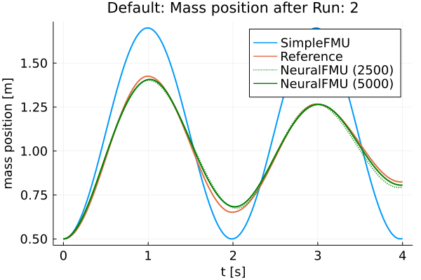
    


    
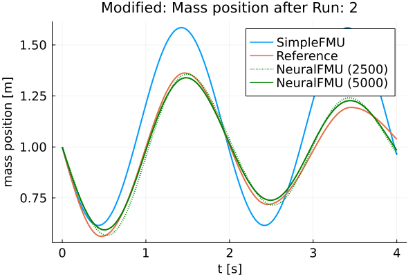
    


    
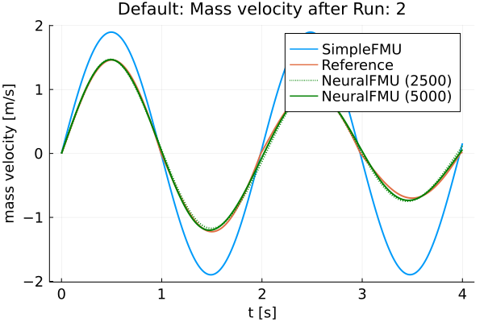
    


    
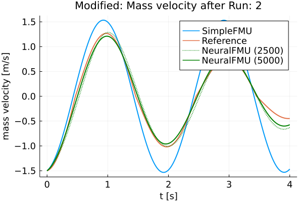
    


    ┌ Info: Friction model 1 mse: 0.5723358977362716
    └ @ Main In[18]:29
    ┌ Info: Friction model 2 mse: 0.7723099874359882
    └ @ Main In[18]:29


    
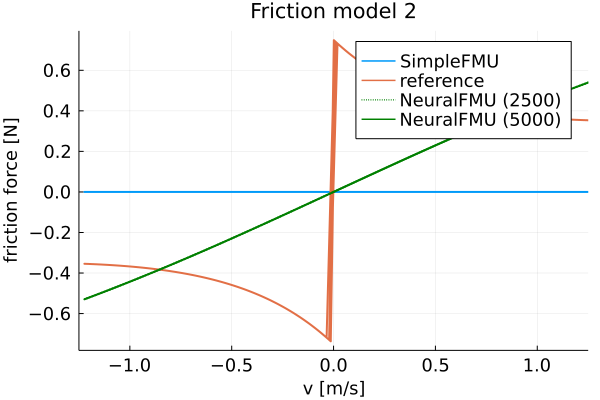
    


    
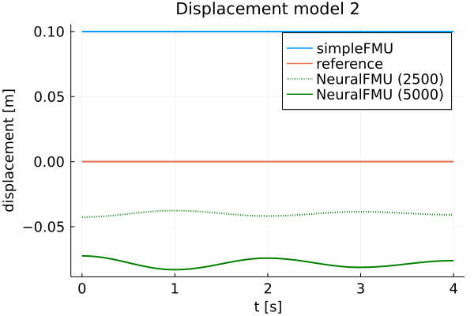
    


Finally, the FMU is cleaned-up.


```julia
fmiUnload(simpleFMU)
```

### Summar

Based on the plots, it can be seen that the curves of the *realFMU* and the *neuralFMU* are very close. The *neuralFMU* is able to learn the friction and displacement model.

### Source

[1] Tobias Thummerer, Lars Mikelsons and Josef Kircher. 2021. **NeuralFMU: towards structural integration of FMUs into neural networks.** Martin Sjölund, Lena Buffoni, Adrian Pop and Lennart Ochel (Ed.). Proceedings of 14th Modelica Conference 2021, Linköping, Sweden, September 20-24, 2021. Linköping University Electronic Press, Linköping (Linköping Electronic Conference Proceedings ; 181), 297-306. [DOI: 10.3384/ecp21181297](https://doi.org/10.3384/ecp21181297)

