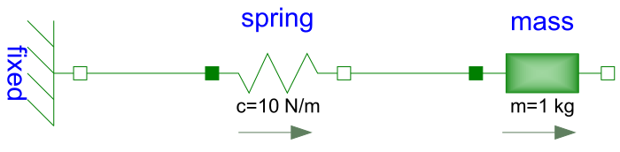
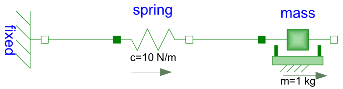
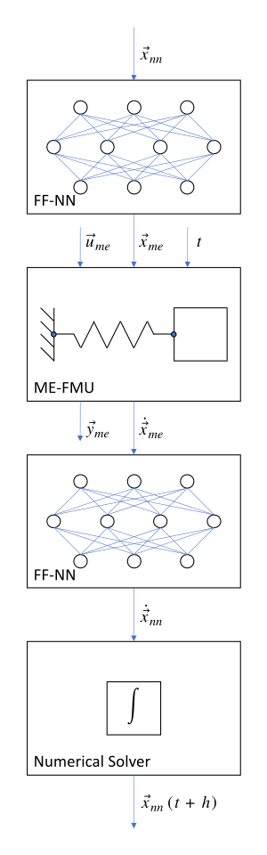

# This example covers creation and training of ME-NeuralFMUs

## Motivation
This Julia Package is motivated by the application of hybrid modeling. This package enables the user to integrate his simulation model between neural networks (NeuralFMU). For this, the simulation model must be exported as FMU (functional mock-up unit), which corresponds to a widely used standard. The big advantage of a hybrid modeling with artificial neural networks is, that effects, that are difficult to model, can be easily learned by the neural networks. For this purpose, the so-called NeuralFMU is trained with measurement data containing the effect. The final product is a simulation with the mapping of complex effects. Another big advantage of the NeuralFMU is that it works with relatively little data, because the FMU already contains the rough functionality of the simulation and only the missing effects are added.


## Introduction to the example
In this example, a simplified modeling of a one-dimensional spring pendulum (without friction) is compared to a model of the same system that includes friction. The FMU with the simplified modeling will be named *simpleFmu* in the following and the modeling with the friction will be named *realFmu*. At the beginning, the actual state of both simulations is shown, whereby clear deviations can be seen in the graphs. The *realFmu* serves as a reference graph. The *simpleFmu* is then integrated into a NeuralFMU architecture and a training of the entire network is performed. After the training the final state is compared again to the *realFmu*. It can be clearly seen that by using the NeuralFMU, learning of the friction process has taken place.  


## Target group
The example is primarily intended for users who work in the field of model building and are interested in hybrid model building. The example wants to show how simple it is to combine FMUs with machine learning and to illustrate the advantages of this approach.


## Other formats
Besides this [Jupyter Notebook](./simple_hybrid_ME.ipynb) there is also a [Julia file](./simple_hybrid_ME.jl) with the same name, which contains only the code cells and for the documentation there is a [Markdown file](./simple_hybrid_ME.md) corresponding to the notebook.  


## License

Copyright (c) 2021 Tobias Thummerer, Lars Mikelsons, Johannes Stoljar

Licensed under the MIT license. See LICENSE file in the project root for details.


## Getting started

### Installation prerequisites
|    | Description                       | Command     |  Alternative  |   
|:--- |:---                               |:---        |:---|
|1.  | Enter Package Manager via         |     ]       |     |
|2.  | Install FMI via                   |   add FMI   | add " https://github.com/ThummeTo/FMI.jl "   |
|3.  | Install FMIFlux via               | add FMIFlux | add " https://github.com/ThummeTo/FMIFlux.jl " |
|4.  | Install Flux via                  |  add Flux   |     |
|5.  | Install DifferentialEquations via | add DifferentialEquations |  |
|6.  | Install Plots via                 | add Plots   |     |

## Code section

To run the example, the previously installed packages must be included. 


```julia
# imports
using FMI
using FMIFlux
using Flux
using DifferentialEquations: Tsit5
import Plots
```

After importing the packages, the path to the FMUs (FMU = functional mock-up unit) is set. The FMU is a model from the Functional Mock-up Interface (FMI) Standard. The FMI is a free standard that defines a container and an interface to exchange dynamic models using a combination of XML files, binaries and C code zipped into a single file. Here the path for the [*SpringPendulum1D*](../model/) and the [*SpringFrictionPendulum1D*](../model/) model is set. The structure of the *SpringPendulum1D* (*simpleFmu*) can be seen in the following graphic and corresponds to a simple modeling.



In contrast, the model *SpringFrictionPendulum1D* (*realFmu*) is somewhat more accurate, because it includes a friction component. 




```julia
simpleFmuPath = joinpath(dirname(@__FILE__), "../model/SpringPendulum1D.fmu")
realFmuPath = joinpath(dirname(@__FILE__), "../model/SpringFrictionPendulum1D.fmu")
println("SimpleFmu path: ", simpleFmuPath)
println("RealFmu path: ", realFmuPath)
```

    SimpleFmu path: ../model/SpringPendulum1D.fmu
    RealFmu path: ../model/SpringFrictionPendulum1D.fmu


Next, the start time and end time of the simulation are set. Finally, a step size is specified to store the results of the simulation at these time steps.


```julia
tStart = 0.0
tStep = 0.01
tStop = 5.0
tSave = collect(tStart:tStep:tStop)
```


    501-element Vector{Float64}:
     0.0
     0.01
     0.02
     0.03
     0.04
     0.05
     0.06
     0.07
     0.08
     0.09
     0.1
     0.11
     0.12
     ⋮
     4.89
     4.9
     4.91
     4.92
     4.93
     4.94
     4.95
     4.96
     4.97
     4.98
     4.99
     5.0


### RealFmu

In the next lines of code the FMU of the *realFMU* model is loaded and instantiated. Both the start and end time are set via the *fmiSetupExperiment()* function.   


```julia
realFmu = fmiLoad(realFmuPath)
fmiInstantiate!(realFmu; loggingOn=false)
fmiInfo(realFmu)
```

    ┌ Info: fmi2Unzip(...): Successfully unzipped 28 files at `C:\Users\JOHANN~1\AppData\Local\Temp\fmijl_dUyONh\SpringFrictionPendulum1D`.
    └ @ FMI C:\Users\Johannes Stoljar\.julia\packages\FMI\l4qPg\src\FMI2.jl:273
    ┌ Info: fmi2Load(...): FMU supports both CS and ME, using CS as default if nothing specified.
    └ @ FMI C:\Users\Johannes Stoljar\.julia\packages\FMI\l4qPg\src\FMI2.jl:376


    #################### Begin information for FMU ####################
    	Model name:			SpringFrictionPendulum1D
    	FMI-Version:			2.0
    	GUID:				{b02421b8-652a-4d48-9ffc-c2b223aa1b94}
    	Generation tool:		Dymola Version 2020x (64-bit), 2019-10-10
    	Generation time:		2021-11-23T13:36:30Z
    	Var. naming conv.:		structured
    	Event indicators:		24
    	Inputs:				0
    	Outputs:			0
    	States:				2


    ┌ Info: fmi2Load(...): FMU resources location is `file:///C:/Users/JOHANN~1/AppData/Local/Temp/fmijl_dUyONh/SpringFrictionPendulum1D/resources`
    └ @ FMI C:\Users\Johannes Stoljar\.julia\packages\FMI\l4qPg\src\FMI2.jl:384


    		33554432 ["mass.s"]
    		33554433 ["mass.v", "mass.v_relfric"]
    	Supports Co-Simulation:		true
    		Model identifier:	SpringFrictionPendulum1D
    		Get/Set State:		true
    		Serialize State:	true
    		Dir. Derivatives:	true
    		Var. com. steps:	true
    		Input interpol.:	true
    		Max order out. der.:	1
    	Supports Model-Exchange:	true
    		Model identifier:	SpringFrictionPendulum1D
    		Get/Set State:		true
    		Serialize State:	true
    		Dir. Derivatives:	true
    ##################### End information for FMU #####################


Here the experiment is initialized to get the information of the continuous states. You can get all continuous states of a FMU by the function *fmiGetContinuousStates()* and this is also done for the *realFmu*. It has two states. The first state is the position of the mass, which here is $0.5m$. The second state is the initial velocity, which is $0\frac{m}{s}$.   


```julia
fmiSetupExperiment(realFmu, tStart, tStop)

fmiEnterInitializationMode(realFmu)
fmiExitInitializationMode(realFmu)

x₀ = fmiGetContinuousStates(realFmu)
```


    2-element Vector{Float64}:
     0.5
     0.0


In the following code block the *realFmu* is simulated, still specifying which variables are included. After the simulation is finished the result of the *realFmu* can be plotted. This plot also serves as a reference for the other model (*simpleFmu*).


```julia
vrs = ["mass.s", "mass.v", "mass.a", "mass.f"]
_, realSimData = fmiSimulate(realFmu, tStart, tStop; recordValues=vrs, saveat=tSave, setup=false, reset=false)
fmiPlot(realFmu, vrs, realSimData)
```


    

    


 After the plots are created, the FMU is unloaded.


```julia
fmiUnload(realFmu)
```

The data from the simualtion of the *realFmu*, are divided into position and velocity data. These data will be needed later. 


```julia
velReal = collect(data[2] for data in realSimData.saveval)
posReal = collect(data[1] for data in realSimData.saveval)
```


    501-element Vector{Float64}:
     0.5
     0.5002147350958549
     0.5008572068150906
     0.5019307343013393
     0.5034377791759037
     0.5053797361931734
     0.507757421354132
     0.5105710760625108
     0.5138202661486302
     0.5175035429290001
     0.5216187663581402
     0.5261643784845171
     0.5311361825547609
     ⋮
     1.0618338496933084
     1.0629441718413108
     1.0639256972572486
     1.0647763670106132
     1.06549412855799
     1.0660771282511987
     1.066523587371857
     1.066831801521633
     1.0670001400125004
     1.0670339828286313
     1.0670339828276312
     1.067033982826631


### SimpleFmu

The following lines also load, instantiate, simulate and plot the *simpleFmu*. The differences can be clearly seen from the plots. In the plots for the *realFmu* it can be seen that the oscillation continues to decrease due to the effect of the friction. If you would simulate here long enough, the oscillation would come to a standstill in a certain time. The oscillation in the *simpleFmu* behaves differently, since the friction was not taken into account here. The oscillation in this model would continue to infinity with the same oscillation amplitude. From this observation the desire of an improvement of this model arises.     


```julia
simpleFmu = fmiLoad(simpleFmuPath)

fmiInstantiate!(simpleFmu; loggingOn=false)
fmiInfo(simpleFmu)

vrs = ["mass.s", "mass.v", "mass.a"]
_, simpleSimData = fmiSimulate(simpleFmu, tStart, tStop; recordValues=vrs, saveat=tSave, reset=false)
fmiPlot(simpleFmu, vrs, simpleSimData)
```

    ┌ Info: fmi2Unzip(...): Successfully unzipped 28 files at `C:\Users\JOHANN~1\AppData\Local\Temp\fmijl_yno3p7\SpringPendulum1D`.
    └ @ FMI C:\Users\Johannes Stoljar\.julia\packages\FMI\l4qPg\src\FMI2.jl:273


    #################### Begin information for FMU ####################
    	Model name:			SpringPendulum1D
    	FMI-Version:			2.0
    	GUID:				{5030e5a4-87c0-42cf-8779-74ebea1906aa}
    	Generation tool:		Dymola Version 2020x (64-bit), 2019-10-10
    	Generation time:		2021-07-21T05:28:53Z
    	Var. naming conv.:		structured
    	Event indicators:		0
    	Inputs:				0
    	Outputs:			0
    	States:				2
    		33554432 ["mass.s"]
    		33554433 ["mass.v"]
    	Supports Co-Simulation:		true
    		Model identifier:	SpringPendulum1D
    		Get/Set State:		true
    		Serialize State:	true
    		Dir. Derivatives:	true
    		Var. com. steps:	true
    		Input interpol.:	true
    		Max order out. der.:	1
    	Supports Model-Exchange:	true
    		Model identifier:	SpringPendulum1D
    		Get/Set State:		true
    		Serialize State:	true
    		Dir. Derivatives:	true
    ##################### End information for FMU #####################


    ┌ Info: fmi2Load(...): FMU supports both CS and ME, using CS as default if nothing specified.
    └ @ FMI C:\Users\Johannes Stoljar\.julia\packages\FMI\l4qPg\src\FMI2.jl:376
    ┌ Info: fmi2Load(...): FMU resources location is `file:///C:/Users/JOHANN~1/AppData/Local/Temp/fmijl_yno3p7/SpringPendulum1D/resources`
    └ @ FMI C:\Users\Johannes Stoljar\.julia\packages\FMI\l4qPg\src\FMI2.jl:384


    

    


The data from the simualtion of the *simpleFmu*, are divided into position and velocity data. These data will be needed later. 


```julia
velSimple = collect(data[2] for data in simpleSimData.saveval)
posSimple = collect(data[1] for data in simpleSimData.saveval)
```


    501-element Vector{Float64}:
     0.5
     0.5003017486819993
     0.5012013738965729
     0.5026995396955733
     0.5047948922822549
     0.5074848828353776
     0.5107669098963398
     0.5146380970115599
     0.5190939866425227
     0.5241313516074874
     0.5297437685244978
     0.5359273025527665
     0.5426739933868466
     ⋮
     1.6817454106640481
     1.6860262621029507
     1.6897211631373532
     1.6928264987575015
     1.6953392775960465
     1.6972564609104965
     1.698576276381512
     1.6992975610979462
     1.6994196580640215
     1.6989425410415007
     1.6978667510389276
     1.6961926527257059


### NeuralFMU

It is not always as easy as in this example to integrate friction into a model. This gave rise to the idea of learning such effects or other effects that are difficult to model by neural networks. The crucial difference is to insert known model knowledge into the neural network in the form of an FMU. This kind of architecture is called NeuralFMU and is shown in the following picture.


<cite>Neural FMU as ME <a href="#Source">[1]</a></cite>


The advantage of such an architecture is that the neural network does not have to learn all correlations, but only the missing effects. Thus it gets along with a small amount of data.


#### Loss function

In order to build such an architecture, a loss function must be implemented. The solver of the NeuralFMU can calculate the gradient descent with the loss function. The gradient descent is needed to adjust the weights in the neural network so that the sum of the error is reduced.

The loss function in this implmentation consists of the mean squared error (mse) from the real position of the *realFmu* simulation (posReal) and the position data of the network (posNet).
$$ mse = \frac{1}{n} \sum\limits_{i=0}^n (posReal[i] - posNet[i])^2 $$

As it is indicated with the comments, one could also additionally consider the mse from the real velocity (velReal) and the velocity from the network (velNet). The error in this case would be calculated from the sum of both errors.  


```julia
# loss function for training
function lossSum()
    solution = neuralFmu(x₀, tStart)

    posNet = collect(data[1] for data in solution.u)
    #velNet = collect(data[2] for data in solution.u)

    Flux.Losses.mse(posReal, posNet) #+ Flux.Losses.mse(velReal, velNet)
end
```


    lossSum (generic function with 1 method)


#### Callback

To output the loss in certain intervals, a callback is implemented as a function in the following. Here a counter is added with each call by one and every tenth pass the loss function is called and the average error is printed out.


```julia
# callback function for training
global counter = 0
function callb()
    global counter += 1

    if counter % 10 == 1
        avgLoss = lossSum()
        @info "Loss [$counter]: $(round(avgLoss, digits=5))   Avg displacement in data: $(round(sqrt(avgLoss), digits=5))"
    end
end
```


    callb (generic function with 1 method)


#### Structure of the NeuralFMU

In the following, the network of the NeuralFMU is constructed. It consists of an input layer, which then leads into the *simpleFmu* model, where only one timestep in the FMU is determined. Following the *simpleFmu* is a dense layer that has exactly as many inputs as the model has states. The output of this layer consists of 16 output nodes and a *tanh* activation function. The next layer has 16 input and output nodes with the same activation function. The last layer is again a dense layer with 16 input nodes and the number of states as outputs. Here it is important that no activation function follows.


```julia
# NeuralFMU setup
numStates = fmiGetNumberOfStates(simpleFmu)

net = Chain(inputs -> fmiDoStepME(simpleFmu, inputs),
            Dense(numStates, 16, tanh),
            Dense(16, 16, tanh),
            Dense(16, numStates))
```


    Chain(
      var"#11#12"(),
      Dense(2, 16, tanh),                   # 48 parameters
      Dense(16, 16, tanh),                  # 272 parameters
      Dense(16, 2),                         # 34 parameters
    )                   # Total: 6 arrays, 354 parameters, 1.758 KiB.


#### Definition of the NeuralFMU

The definition of the Model-Exchange-NeuralFMU is done as a one-liner. The FMU (*simpleFmu*), the structure of the network (net), start and end time, the numerical solver (Tsit5()) and the time steps for saving are specified.


```julia
neuralFmu = ME_NeuralFMU(simpleFmu, net, (tStart, tStop), Tsit5(); saveat=tSave);
```

#### Plot before training

Here the start state of the *simpleFmu* is recorded. It can be observed from later plots the effect of learning.


```julia
solutionBefore = neuralFmu(x₀, tStart)
fmiPlot(simpleFmu, solutionBefore)
```


    

    


#### Training of the NeuralFMU

For the training of the NeuralFMU the parameters are extracted. The known ADAM optimizer for minimizing the gradient descent is used as further passing parameters. In addition, the previously defined loss and callback function, as well as the number of epochs are passed.


```julia
# train
paramsNet = Flux.params(neuralFmu)

optim = ADAM()
Flux.train!(lossSum, paramsNet, Iterators.repeated((), 300), optim; cb=callb) 
```

    ┌ Info: Loss [1]: 0.10395   Avg displacement in data: 0.32241
    └ @ Main In[12]:8
    ┌ Info: Loss [11]: 0.06154   Avg displacement in data: 0.24808
    └ @ Main In[12]:8
    ┌ Info: Loss [21]: 0.04664   Avg displacement in data: 0.21596
    └ @ Main In[12]:8
    ┌ Info: Loss [31]: 0.04218   Avg displacement in data: 0.20537
    └ @ Main In[12]:8
    ┌ Info: Loss [41]: 0.04071   Avg displacement in data: 0.20178
    └ @ Main In[12]:8
    ┌ Info: Loss [51]: 0.04023   Avg displacement in data: 0.20058
    └ @ Main In[12]:8
    ┌ Info: Loss [61]: 0.04003   Avg displacement in data: 0.20007
    └ @ Main In[12]:8
    ┌ Info: Loss [71]: 0.03993   Avg displacement in data: 0.19983
    └ @ Main In[12]:8
    ┌ Info: Loss [81]: 0.03986   Avg displacement in data: 0.19966
    └ @ Main In[12]:8
    ┌ Info: Loss [91]: 0.03981   Avg displacement in data: 0.19952
    └ @ Main In[12]:8
    ┌ Info: Loss [101]: 0.03975   Avg displacement in data: 0.19939
    └ @ Main In[12]:8
    ┌ Info: Loss [111]: 0.0397   Avg displacement in data: 0.19925
    └ @ Main In[12]:8
    ┌ Info: Loss [121]: 0.03965   Avg displacement in data: 0.19911
    └ @ Main In[12]:8
    ┌ Info: Loss [131]: 0.03959   Avg displacement in data: 0.19896
    └ @ Main In[12]:8
    ┌ Info: Loss [141]: 0.03952   Avg displacement in data: 0.19881
    └ @ Main In[12]:8
    ┌ Info: Loss [151]: 0.03945   Avg displacement in data: 0.19862
    └ @ Main In[12]:8
    ┌ Info: Loss [161]: 0.0394   Avg displacement in data: 0.19848
    └ @ Main In[12]:8
    ┌ Info: Loss [171]: 0.03933   Avg displacement in data: 0.19832
    └ @ Main In[12]:8
    ┌ Info: Loss [181]: 0.03926   Avg displacement in data: 0.19814
    └ @ Main In[12]:8
    ┌ Info: Loss [191]: 0.03919   Avg displacement in data: 0.19795
    └ @ Main In[12]:8
    ┌ Info: Loss [201]: 0.03911   Avg displacement in data: 0.19777
    └ @ Main In[12]:8
    ┌ Info: Loss [211]: 0.03904   Avg displacement in data: 0.19758
    └ @ Main In[12]:8
    ┌ Info: Loss [221]: 0.03895   Avg displacement in data: 0.19736
    └ @ Main In[12]:8
    ┌ Info: Loss [231]: 0.03886   Avg displacement in data: 0.19714
    └ @ Main In[12]:8
    ┌ Info: Loss [241]: 0.03878   Avg displacement in data: 0.19692
    └ @ Main In[12]:8
    ┌ Info: Loss [251]: 0.03869   Avg displacement in data: 0.19669
    └ @ Main In[12]:8
    ┌ Info: Loss [261]: 0.03859   Avg displacement in data: 0.19645
    └ @ Main In[12]:8
    ┌ Info: Loss [271]: 0.03849   Avg displacement in data: 0.19619
    └ @ Main In[12]:8
    ┌ Info: Loss [281]: 0.03838   Avg displacement in data: 0.1959
    └ @ Main In[12]:8
    ┌ Info: Loss [291]: 0.03824   Avg displacement in data: 0.19554
    └ @ Main In[12]:8


#### Comparison of the plots

Here three plots are compared with each other and only the position of the mass is considered. The first plot represents the *simpleFmu*, the second represents the *realFmu* (reference) and the third plot represents the result after training the NeuralFMU. 


```julia
# plot results mass.s
solutionAfter = neuralFmu(x₀, tStart)

fig = Plots.plot(xlabel="t [s]", ylabel="mass position [m]", linewidth=2,
                 xtickfontsize=12, ytickfontsize=12,
                 xguidefontsize=12, yguidefontsize=12,
                 legendfontsize=12, legend=:bottomright)

posNeuralFmu = collect(data[1] for data in solutionAfter.u)

Plots.plot!(fig, tSave, posSimple, label="SimpleFMU", linewidth=2)
Plots.plot!(fig, tSave, posReal, label="RealFMU", linewidth=2)
Plots.plot!(fig, tSave, posNeuralFmu, label="NeuralFMU", linewidth=2)
fig 
```


    

    


#### Continue training and plotting

As can be seen from the previous figure, the plot of the NeuralFMU has not yet fully converged against the *realFmu*, so the training of the NeuralFMU is continued. After training, the plot of *NeuralFMU2* is added to the figure. The effect of the longer training is well recognizable, since the plot of the NeuralFMU2 converges. 


```julia
Flux.train!(lossSum, paramsNet, Iterators.repeated((), 700), optim; cb=callb) 
# plot results mass.s
solutionAfter = neuralFmu(x₀, tStart)
posNeuralFmu = collect(data[1] for data in solutionAfter.u)
Plots.plot!(fig, tSave, posNeuralFmu, label="NeuralFMU2", linewidth=2)
fig 
```

    ┌ Info: Loss [301]: 0.03816   Avg displacement in data: 0.19534
    └ @ Main In[12]:8
    ┌ Info: Loss [311]: 0.03804   Avg displacement in data: 0.19504
    └ @ Main In[12]:8
    ┌ Info: Loss [321]: 0.03791   Avg displacement in data: 0.19471
    └ @ Main In[12]:8
    ┌ Info: Loss [331]: 0.03779   Avg displacement in data: 0.19441
    └ @ Main In[12]:8
    ┌ Info: Loss [341]: 0.03769   Avg displacement in data: 0.19413
    └ @ Main In[12]:8
    ┌ Info: Loss [351]: 0.03756   Avg displacement in data: 0.1938
    └ @ Main In[12]:8
    ┌ Info: Loss [361]: 0.03742   Avg displacement in data: 0.19345
    └ @ Main In[12]:8
    ┌ Info: Loss [371]: 0.0373   Avg displacement in data: 0.19313
    └ @ Main In[12]:8
    ┌ Info: Loss [381]: 0.03715   Avg displacement in data: 0.19275
    └ @ Main In[12]:8
    ┌ Info: Loss [391]: 0.03699   Avg displacement in data: 0.19233
    └ @ Main In[12]:8
    ┌ Info: Loss [401]: 0.03682   Avg displacement in data: 0.19187
    └ @ Main In[12]:8
    ┌ Info: Loss [411]: 0.03661   Avg displacement in data: 0.19133
    └ @ Main In[12]:8
    ┌ Info: Loss [421]: 0.03644   Avg displacement in data: 0.1909
    └ @ Main In[12]:8
    ┌ Info: Loss [431]: 0.03624   Avg displacement in data: 0.19037
    └ @ Main In[12]:8
    ┌ Info: Loss [441]: 0.03602   Avg displacement in data: 0.1898
    └ @ Main In[12]:8
    ┌ Info: Loss [451]: 0.03579   Avg displacement in data: 0.18919
    └ @ Main In[12]:8
    ┌ Info: Loss [461]: 0.03554   Avg displacement in data: 0.18852
    └ @ Main In[12]:8
    ┌ Info: Loss [471]: 0.03527   Avg displacement in data: 0.18779
    └ @ Main In[12]:8
    ┌ Info: Loss [481]: 0.03497   Avg displacement in data: 0.187
    └ @ Main In[12]:8
    ┌ Info: Loss [491]: 0.03465   Avg displacement in data: 0.18614
    └ @ Main In[12]:8
    ┌ Info: Loss [501]: 0.03429   Avg displacement in data: 0.18519
    └ @ Main In[12]:8
    ┌ Info: Loss [511]: 0.03391   Avg displacement in data: 0.18414
    └ @ Main In[12]:8
    ┌ Info: Loss [521]: 0.03349   Avg displacement in data: 0.18299
    └ @ Main In[12]:8
    ┌ Info: Loss [531]: 0.03302   Avg displacement in data: 0.18173
    └ @ Main In[12]:8
    ┌ Info: Loss [541]: 0.0325   Avg displacement in data: 0.18029
    └ @ Main In[12]:8
    ┌ Info: Loss [551]: 0.03193   Avg displacement in data: 0.1787
    └ @ Main In[12]:8
    ┌ Info: Loss [561]: 0.0313   Avg displacement in data: 0.17692
    └ @ Main In[12]:8
    ┌ Info: Loss [571]: 0.03059   Avg displacement in data: 0.17491
    └ @ Main In[12]:8
    ┌ Info: Loss [581]: 0.0298   Avg displacement in data: 0.17263
    └ @ Main In[12]:8
    ┌ Info: Loss [591]: 0.02892   Avg displacement in data: 0.17007
    └ @ Main In[12]:8
    ┌ Info: Loss [601]: 0.02796   Avg displacement in data: 0.16722
    └ @ Main In[12]:8
    ┌ Info: Loss [611]: 0.02693   Avg displacement in data: 0.1641
    └ @ Main In[12]:8
    ┌ Info: Loss [621]: 0.02588   Avg displacement in data: 0.16088
    └ @ Main In[12]:8
    ┌ Info: Loss [631]: 0.02488   Avg displacement in data: 0.15774
    └ @ Main In[12]:8
    ┌ Info: Loss [641]: 0.02402   Avg displacement in data: 0.15499
    └ @ Main In[12]:8
    ┌ Info: Loss [651]: 0.02307   Avg displacement in data: 0.15189
    └ @ Main In[12]:8
    ┌ Info: Loss [661]: 0.0223   Avg displacement in data: 0.14932
    └ @ Main In[12]:8
    ┌ Info: Loss [671]: 0.02182   Avg displacement in data: 0.14772
    └ @ Main In[12]:8
    ┌ Info: Loss [681]: 0.02102   Avg displacement in data: 0.14497
    └ @ Main In[12]:8
    ┌ Info: Loss [691]: 0.02053   Avg displacement in data: 0.1433
    └ @ Main In[12]:8
    ┌ Info: Loss [701]: 0.02061   Avg displacement in data: 0.14355
    └ @ Main In[12]:8
    ┌ Info: Loss [711]: 0.02597   Avg displacement in data: 0.16114
    └ @ Main In[12]:8
    ┌ Info: Loss [721]: 0.04113   Avg displacement in data: 0.2028
    └ @ Main In[12]:8
    ┌ Info: Loss [731]: 0.03791   Avg displacement in data: 0.19472
    └ @ Main In[12]:8
    ┌ Info: Loss [741]: 0.03271   Avg displacement in data: 0.18087
    └ @ Main In[12]:8
    ┌ Info: Loss [751]: 0.02408   Avg displacement in data: 0.15516
    └ @ Main In[12]:8
    ┌ Info: Loss [761]: 0.02272   Avg displacement in data: 0.15074
    └ @ Main In[12]:8
    ┌ Info: Loss [771]: 0.02196   Avg displacement in data: 0.14818
    └ @ Main In[12]:8
    ┌ Info: Loss [781]: 0.02128   Avg displacement in data: 0.14588
    └ @ Main In[12]:8
    ┌ Info: Loss [791]: 0.02081   Avg displacement in data: 0.14427
    └ @ Main In[12]:8
    ┌ Info: Loss [801]: 0.02032   Avg displacement in data: 0.14254
    └ @ Main In[12]:8
    ┌ Info: Loss [811]: 0.01993   Avg displacement in data: 0.14119
    └ @ Main In[12]:8
    ┌ Info: Loss [821]: 0.01958   Avg displacement in data: 0.13993
    └ @ Main In[12]:8
    ┌ Info: Loss [831]: 0.01925   Avg displacement in data: 0.13873
    └ @ Main In[12]:8
    ┌ Info: Loss [841]: 0.01892   Avg displacement in data: 0.13757
    └ @ Main In[12]:8
    ┌ Info: Loss [851]: 0.01861   Avg displacement in data: 0.13643
    └ @ Main In[12]:8
    ┌ Info: Loss [861]: 0.0183   Avg displacement in data: 0.13529
    └ @ Main In[12]:8
    ┌ Info: Loss [871]: 0.018   Avg displacement in data: 0.13415
    └ @ Main In[12]:8
    ┌ Info: Loss [881]: 0.01769   Avg displacement in data: 0.133
    └ @ Main In[12]:8
    ┌ Info: Loss [891]: 0.01738   Avg displacement in data: 0.13183
    └ @ Main In[12]:8
    ┌ Info: Loss [901]: 0.01708   Avg displacement in data: 0.13069
    └ @ Main In[12]:8
    ┌ Info: Loss [911]: 0.01674   Avg displacement in data: 0.1294
    └ @ Main In[12]:8
    ┌ Info: Loss [921]: 0.01641   Avg displacement in data: 0.12812
    └ @ Main In[12]:8
    ┌ Info: Loss [931]: 0.01609   Avg displacement in data: 0.12684
    └ @ Main In[12]:8
    ┌ Info: Loss [941]: 0.01577   Avg displacement in data: 0.12557
    └ @ Main In[12]:8
    ┌ Info: Loss [951]: 0.01544   Avg displacement in data: 0.12424
    └ @ Main In[12]:8
    ┌ Info: Loss [961]: 0.01509   Avg displacement in data: 0.12283
    └ @ Main In[12]:8
    ┌ Info: Loss [971]: 0.01481   Avg displacement in data: 0.12168
    └ @ Main In[12]:8
    ┌ Info: Loss [981]: 0.01468   Avg displacement in data: 0.12118
    └ @ Main In[12]:8
    ┌ Info: Loss [991]: 0.01552   Avg displacement in data: 0.12457
    └ @ Main In[12]:8


    

    


```julia
fmiUnload(simpleFmu)
```

### Summary

Based on the plots, it can be seen clearly that the NeuralFMU is able to learn the friction from the *realFmu*. After 300 runs, the curves do not exactly overlap, but this can be achieved by longer training.

### Source

[1] Tobias Thummerer, Josef Kircher and Lars Mikelsons. "NeuralFMU: Towards Structural Integration of FMUs into Neural Networks". In: CoRR abs/2109.04351 (2021). [arXiv](https://arxiv.org/abs/2109.04351)

