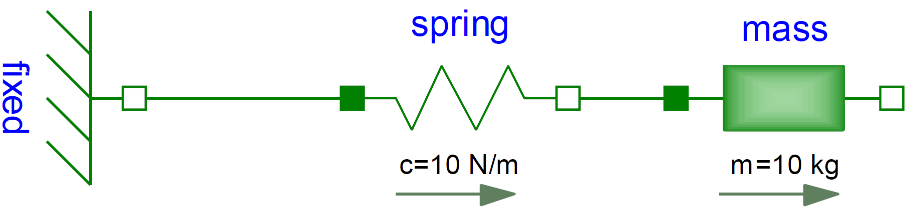
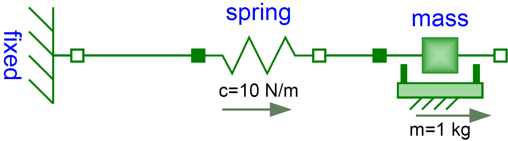
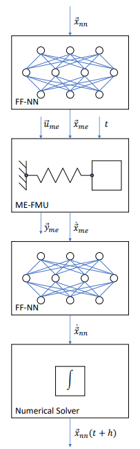

# This example covers creation and training of ME-NeuralFMUs

## Motivation
This Julia Package is motivated by the application of hybrid modeling. This package enables the user to integrate his simulation model between neural networks (NeuralFMU). For this, the simulation model must be exported as FMU (functional mock-up unit), which corresponds to a widely used standard. The big advantage of a hybrid modeling with artificial neural networks is, that effects, that are difficult to model, can be easily learned by the neural networks. For this purpose, the so-called NeuralFMU is trained with measurement data containing the effect. The final product is a simulation with the mapping of complex effects. Another big advantage of the NeuralFMU is that it works with relatively little data, because the FMU already contains the rough functionality of the simulation and only the missing effects are added.


## Introduction to the example
In this example, a simplified modeling of a one-dimensional spring pendulum (without friction) is compared to a model of the same system that includes friction. The FMU with the simplified modeling will be named *simpleFmu* in the following and the modeling with the friction will be named *realFmu*. At the beginning, the actual state of both simulations is shown, whereby clear deviations can be seen in the graphs. The *realFmu* serves as a reference graph. The *simpleFmu* is then integrated into a NeuralFMU architecture and a training of the entire network is performed. After the training the final state is compared again to the *realFmu*. It can be clearly seen that by using the NeuralFMU, learning of the friction process has taken place.  


## Target group
The example is primarily intended for users who work in the field of model building and are interested in hybrid model building. The example wants to show how simple it is to combine FMUs with machine learning and to illustrate the advantages of this approach.


## License

Copyright (c) 2021 Tobias Thummerer, Lars Mikelsons, Johannes Stoljar

Licensed under the MIT license. See LICENSE file in the project root for details.


## Getting started

### Installation prerequisites
|    | Description                       | Command     |  Alternative  |   
|:--- |:---                               |:---        |:---|
|1.  | Enter Package Manager via         |     ]       |     |
|2.  | Install FMI via                   |   add FMI   | add " https://github.com/ThummeTo/FMI.jl "   |
|3.  | Install FMIFlux via               | add FMIFlux | add " https://github.com/ThummeTo/FMIFlux.jl " |
|4.  | Install Flux via                  |  add Flux   |     |
|5.  | Install DifferentialEquations via | add DifferentialEquations |  |
|6.  | Install Plots via                 | add Plots   |     |

## Code section

To run the example, the previously installed packages must be included. 


```julia
# imports
using FMI
using FMIFlux
using Flux
using DifferentialEquations: Tsit5
import Plots
```

After importing the packages, the path to the FMUs (FMU = functional mock-up unit) is set. The FMU is a model from the Functional Mock-up Interface (FMI) Standard. The FMI is a free standard that defines a container and an interface to exchange dynamic models using a combination of XML files, binaries and C code zipped into a single file. Here the path for the [*SpringPendulum1D*](../model/) and the [*SpringFrictionPendulum1D*](../model/) model is set. The structure of the *SpringPendulum1D* (*simpleFmu*) can be seen in the following graphic and corresponds to a simple modeling.




In contrast, the model *SpringFrictionPendulum1D* (*realFmu*) is somewhat more accurate, because it includes a friction component. 




```julia
simpleFmuPath = joinpath(dirname(@__FILE__), "../model/SpringPendulum1D.fmu")
realFmuPath = joinpath(dirname(@__FILE__), "../model/SpringFrictionPendulum1D.fmu")
println("SimpleFmu path: ", simpleFmuPath)
println("RealFmu path: ", realFmuPath)
```

Next, the start time and end time of the simulation are set. Finally, a step size is specified to store the results of the simulation at these time steps.


```julia
tStart = 0.0
tStep = 0.01
tStop = 5.0
tSave = collect(tStart:tStep:tStop)
```

### RealFmu

In the next lines of code the FMU of the *realFMU* model is loaded and instantiated. Both the start and end time are set via the *fmiSetupExperiment()* function.   


```julia
realFmu = fmiLoad(realFmuPath)
fmiInstantiate!(realFmu; loggingOn=false)
nothing
```

# Ask Tobi !!


```julia
fmiSetupExperiment(realFmu, tStart, tStop)

fmiEnterInitializationMode(realFmu)
fmiExitInitializationMode(realFmu)
```

You can get all continuous states of a FMU by the function *fmiGetContinuousStates()* and this is also done for the *realFmu*. It has two states. The first state is the position of the mass, which here is $0.5m$. The second state is the initial velocity, which is $0\frac{m}{s}$.   


```julia
x₀ = fmiGetContinuousStates(realFmu)
```

In the following code block the *realFmu* is simulated, still specifying which variables are included. After the simulation is finished the result of the *realFmu* can be plotted. This plot also serves as a reference for the other model (*simpleFmu*).


```julia
vrs = ["mass.s", "mass.v", "mass.a", "mass.f"]
_, realSimData = fmiSimulate(realFmu, tStart, tStop; recordValues=vrs, saveat=tSave, setup=false, reset=false)
fmiPlot(realFmu, vrs, realSimData)
```

 After the plots are created, the FMU is unloaded.


```julia
fmiUnload(realFmu)
```

The data from the simualtion of the *realFmu*, are divided into position and velocity data. These data will be needed later. 


```julia
velReal = collect(data[2] for data in realSimData.saveval)
posReal = collect(data[1] for data in realSimData.saveval)
```

### SimpleFmu

The following lines also load, instantiate, simulate and plot the *simpleFmu*. The differences can be clearly seen from the plots. In the plots for the *realFmu* it can be seen that the oscillation continues to decrease due to the effect of the friction. If you would simulate here long enough, the oscillation would come to a standstill in a certain time. The oscillation in the *simpleFmu* behaves differently, since the friction was not taken into account here. The oscillation in this model would continue to infinity with the same oscillation amplitude. From this observation the desire of an improvement of this model arises.     


```julia
simpleFmu = fmiLoad(simpleFmuPath)

fmiInstantiate!(simpleFmu; loggingOn=false)

vrs = ["mass.s", "mass.v", "mass.a"]
_, simpleSimData = fmiSimulate(simpleFmu, tStart, tStop; recordValues=vrs, saveat=tSave, reset=false)
fmiPlot(simpleFmu, vrs, simpleSimData)
```

The data from the simualtion of the *simpleFmu*, are divided into position and velocity data. These data will be needed later. 


```julia
velSimple = collect(data[2] for data in simpleSimData.saveval)
posSimple = collect(data[1] for data in simpleSimData.saveval)
```

### NeuralFMU

It is not always as easy as in this example to integrate friction into a model. This gave rise to the idea of learning such effects or other effects that are difficult to model by neural networks. The crucial difference is to insert known model knowledge into the neural network in the form of an FMU. This kind of architecture is called NeuralFMU and is shown in the following picture.



The advantage of such an architecture is that the neural network does not have to learn all correlations, but only the missing effects. Thus it gets along with a small amount of data.


#### Loss function

In order to build such an architecture, a loss function must be implemented. The solver of the NeuralFMU can calculate the gradient descent with the loss function. The gradient descent is needed to adjust the weights in the neural network so that the sum of the error is reduced.

The loss function in this implmentation consists of the mean squared error (mse) from the real position of the *realFmu* simulation (posReal) and the position data of the network (posNet).
$$ mse = \frac{1}{n} \sum\limits_{i=0}^n (posReal[i] - posNet[i])^2 $$

As it is indicated with the comments, one could also additionally consider the mse from the real velocity (velReal) and the velocity from the network (velNet). The error in this case would be calculated from the sum of both errors.  


```julia
# loss function for training
function lossSum()
    solution = neuralFmu(x₀, tStart)

    posNet = collect(data[1] for data in solution.u)
    #velNet = collect(data[2] for data in solution.u)

    Flux.Losses.mse(posReal, posNet) #+ Flux.Losses.mse(velReal, velNet)
end
```

#### Callback

To output the loss in certain intervals, a callback is implemented as a function in the following. Here a counter is added with each call by one and every tenth pass the loss function is called and the average error is printed out.


```julia
# callback function for training
global counter = 0
function callb()
    global counter += 1

    if counter % 10 == 1
        avgLoss = lossSum()
        @info "Loss [$counter]: $(round(avgLoss, digits=5))   Avg displacement in data: $(round(sqrt(avgLoss), digits=5))"
    end
end
```

#### Structure of the NeuralFMU

In the following, the network of the NeuralFMU is constructed. It consists of an input layer, which then leads into the *simpleFmu* model, where only one timestep in the FMU is determined. Following the *simpleFmu* is a dense layer that has exactly as many inputs as the model has states. The output of this layer consists of 16 output nodes and a *tanh* activation function. The next layer has 16 input and output nodes with the same activation function. The last layer is again a dense layer with 16 input nodes and the number of states as outputs. Here it is important that no activation function follows.


```julia
# NeuralFMU setup
numStates = fmiGetNumberOfStates(simpleFmu)

net = Chain(inputs -> fmiDoStepME(simpleFmu, inputs),
            Dense(numStates, 16, tanh),
            Dense(16, 16, tanh),
            Dense(16, numStates))
```

#### Definition of the NeuralFMU

The definition of the Model-Exchange-NeuralFMU is done as a one-liner. The FMU (*simpleFmu*), the structure of the network (net), start and end time, the numerical solver (Tsit5()) and the time steps for saving are specified.


```julia
neuralFmu = ME_NeuralFMU(simpleFmu, net, (tStart, tStop), Tsit5(); saveat=tSave)
nothing
```

#### Plot before training

Here the start state of the *simpleFmu* is plotted to compare it later with the plot after the training.


```julia
solutionBefore = neuralFmu(x₀, tStart)
fmiPlot(simpleFmu, solutionBefore)
```

#### Training of the NeuralFMU

For the training of the NeuralFMU the parameters are extracted. The known ADAM optimizer for minimizing the gradient descent is used as further passing parameters. In addition, the previously defined loss and callback function, as well as the number of epochs are passed.


```julia
# train it ...
paramsNet = Flux.params(neuralFmu)

optim = ADAM()
# Feel free to increase training steps or epochs for better results
Flux.train!(lossSum, paramsNet, Iterators.repeated((), 300), optim; cb=callb) 
```

#### Comparison of the plots

Here three plots are compared with each other and only the position of the mass is considered. The first plot represents the *simpleFmu*, the second represents the *realFmu* (reference) and the third plot represents the result after training the NeuralFMU. 


```julia
###### plot results mass.s
solutionAfter = neuralFmu(x₀, tStart)

fig = Plots.plot(xlabel="t [s]", ylabel="mass position [m]", linewidth=2,
                 xtickfontsize=12, ytickfontsize=12,
                 xguidefontsize=12, yguidefontsize=12,
                 legendfontsize=12, legend=:bottomright)

posNeuralFmu = collect(data[1] for data in solutionAfter.u)

Plots.plot!(fig, tSave, posSimple, label="SimpleFMU", linewidth=2)
Plots.plot!(fig, tSave, posReal, label="RealFMU", linewidth=2)
Plots.plot!(fig, tSave, posNeuralFmu, label="NeuralFMU", linewidth=2)
# Plots.savefig(fig, "exampleResult_s.pdf")
fig 
```


```julia
fmiUnload(simpleFmu)
```

### Summary

Based on the plots, it can be seen clearly that the NeuralFMU is able to learn the friction from the *realFmu*. After 300 runs, the curves do not exactly overlap, but this can be achieved by longer training.
