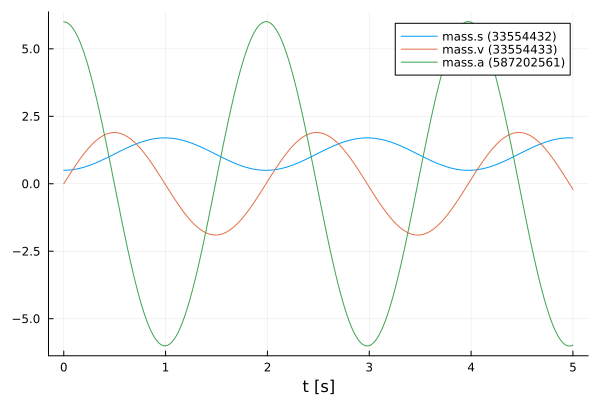
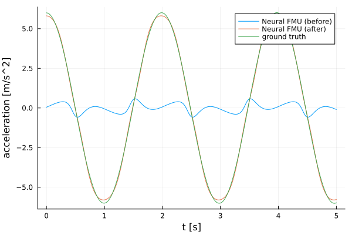

# Neural FMUs in co simulation (CS) mode
Tutorial by Tobias Thummerer

*Last edit: 03.09.2024*

## License


```julia
# Copyright (c) 2021 Tobias Thummerer, Lars Mikelsons
# Licensed under the MIT license. 
# See LICENSE (https://github.com/thummeto/FMIFlux.jl/blob/main/LICENSE) file in the project root for details.
```

## Introduction
Functional mock-up units (FMUs) can easily be seen as containers for simulation models. 

This example shows how to build a very easy neural FMU by combining a co simulation (CS) FMU and an artificial neural network (ANN).
The goal is, to train the hybrid model based on a very simple simulation model.

## Packages
First, import the packages needed:


```julia
# imports
using FMI                       # for importing and simulating FMUs
using FMIFlux                   # for building neural FMUs
using FMIFlux.Flux              # the default machine learning library in Julia
using FMIZoo                    # a collection of demo FMUs
using Plots                     # for plotting some results

import Random                   # for random variables (and random initialization)
Random.seed!(1234)              # makes our program deterministic
```

    ┌ Warning: Error requiring `Enzyme` from `LinearSolve`
    │   exception =
    │    LoadError: ArgumentError: Package LinearSolve does not have Enzyme in its dependencies:
    │    - You may have a partially installed environment. Try `Pkg.instantiate()`
    │      to ensure all packages in the environment are installed.
    │    - Or, if you have LinearSolve checked out for development and have
    │      added Enzyme as a dependency but haven't updated your primary
    │      environment's manifest file, try `Pkg.resolve()`.
    │    - Otherwise you may need to report an issue with LinearSolve
    │    Stacktrace:
    │      [1] macro expansion
    │        @ .\loading.jl:1167 [inlined]
    │      [2] macro expansion
    │        @ .\lock.jl:223 [inlined]
    │      [3] require(into::Module, mod::Symbol)
    │        @ Base .\loading.jl:1144
    │      [4] include(mod::Module, _path::String)
    │        @ Base .\Base.jl:419
    │      [5] include(x::String)
    │        @ LinearSolve C:\Users\runneradmin\.julia\packages\LinearSolve\qCLK7\src\LinearSolve.jl:1
    │      [6] macro expansion
    │        @ C:\Users\runneradmin\.julia\packages\Requires\Z8rfN\src\Requires.jl:40 [inlined]
    │      [7] top-level scope
    │        @ C:\Users\runneradmin\.julia\packages\LinearSolve\qCLK7\src\init.jl:16
    │      [8] eval
    │        @ .\boot.jl:368 [inlined]
    │      [9] eval
    │        @ C:\Users\runneradmin\.julia\packages\LinearSolve\qCLK7\src\LinearSolve.jl:1 [inlined]
    │     [10] (::LinearSolve.var"#88#97")()
    │        @ LinearSolve C:\Users\runneradmin\.julia\packages\Requires\Z8rfN\src\require.jl:101
    │     [11] macro expansion
    │        @ timing.jl:382 [inlined]
    │     [12] err(f::Any, listener::Module, modname::String, file::String, line::Any)
    │        @ Requires C:\Users\runneradmin\.julia\packages\Requires\Z8rfN\src\require.jl:47
    │     [13] (::LinearSolve.var"#87#96")()
    │        @ LinearSolve C:\Users\runneradmin\.julia\packages\Requires\Z8rfN\src\require.jl:100
    │     [14] withpath(f::Any, path::String)
    │        @ Requires C:\Users\runneradmin\.julia\packages\Requires\Z8rfN\src\require.jl:37
    │     [15] (::LinearSolve.var"#86#95")()
    │        @ LinearSolve C:\Users\runneradmin\.julia\packages\Requires\Z8rfN\src\require.jl:99
    │     [16] #invokelatest#2
    │        @ .\essentials.jl:729 [inlined]
    │     [17] invokelatest
    │        @ .\essentials.jl:726 [inlined]
    │     [18] foreach(f::typeof(Base.invokelatest), itr::Vector{Function})
    │        @ Base .\abstractarray.jl:2774
    │     [19] loadpkg(pkg::Base.PkgId)
    │        @ Requires C:\Users\runneradmin\.julia\packages\Requires\Z8rfN\src\require.jl:27
    │     [20] #invokelatest#2
    │        @ .\essentials.jl:729 [inlined]
    │     [21] invokelatest
    │        @ .\essentials.jl:726 [inlined]
    │     [22] run_package_callbacks(modkey::Base.PkgId)
    │        @ Base .\loading.jl:869
    │     [23] _tryrequire_from_serialized(modkey::Base.PkgId, path::String, sourcepath::String, depmods::Vector{Any})
    │        @ Base .\loading.jl:944
    │     [24] _require_search_from_serialized(pkg::Base.PkgId, sourcepath::String, build_id::UInt64)
    │        @ Base .\loading.jl:1028
    │     [25] _require(pkg::Base.PkgId)
    │        @ Base .\loading.jl:1315
    │     [26] _require_prelocked(uuidkey::Base.PkgId)
    │        @ Base .\loading.jl:1200
    │     [27] macro expansion
    │        @ .\loading.jl:1180 [inlined]
    │     [28] macro expansion
    │        @ .\lock.jl:223 [inlined]
    │     [29] require(into::Module, mod::Symbol)
    │        @ Base .\loading.jl:1144
    │     [30] eval
    │        @ .\boot.jl:368 [inlined]
    │     [31] include_string(mapexpr::typeof(REPL.softscope), mod::Module, code::String, filename::String)
    │        @ Base .\loading.jl:1428
    │     [32] softscope_include_string(m::Module, code::String, filename::String)
    │        @ SoftGlobalScope C:\Users\runneradmin\.julia\packages\SoftGlobalScope\u4UzH\src\SoftGlobalScope.jl:65
    │     [33] execute_request(socket::ZMQ.Socket, msg::IJulia.Msg)
    │        @ IJulia C:\Users\runneradmin\.julia\packages\IJulia\bHdNn\src\execute_request.jl:67
    │     [34] #invokelatest#2
    │        @ .\essentials.jl:729 [inlined]
    │     [35] invokelatest
    │        @ .\essentials.jl:726 [inlined]
    │     [36] eventloop(socket::ZMQ.Socket)
    │        @ IJulia C:\Users\runneradmin\.julia\packages\IJulia\bHdNn\src\eventloop.jl:8
    │     [37] (::IJulia.var"#15#18")()
    │        @ IJulia .\task.jl:484
    │    in expression starting at C:\Users\runneradmin\.julia\packages\LinearSolve\qCLK7\ext\LinearSolveEnzymeExt.jl:1
    └ @ Requires C:\Users\runneradmin\.julia\packages\Requires\Z8rfN\src\require.jl:51
    


    Random.TaskLocalRNG()


## Code
Next, start and stop time are set for the simulation, as well as some intermediate time points `tSave` to record simulation results.


```julia
tStart = 0.0
tStep = 0.01
tStop = 5.0
tSave = collect(tStart:tStep:tStop)
```


    501-element Vector{Float64}:
     0.0
     0.01
     0.02
     0.03
     0.04
     0.05
     0.06
     0.07
     0.08
     0.09
     0.1
     0.11
     0.12
     ⋮
     4.89
     4.9
     4.91
     4.92
     4.93
     4.94
     4.95
     4.96
     4.97
     4.98
     4.99
     5.0


### Complex FMU (ground truth training data)
First, let's load a model from the *FMIZoo.jl*, an easy pendulum including some friction. We will use that to generate training data.


```julia
# let's load the FMU in CS-mode (some FMUs support multiple simulation modes)
fmu_gt = loadFMU("SpringPendulum1D", "Dymola", "2022x"; type=:CS)  

# and print some info
info(fmu_gt)   
```

    #################### Begin information for FMU ####################
    	Model name:			SpringPendulum1D
    	FMI-Version:			2.0
    	GUID:				{fc15d8c4-758b-48e6-b00e-5bf47b8b14e5}
    	Generation tool:		Dymola Version 2022x (64-bit), 2021-10-08
    	Generation time:		2022-05-19T06:54:23Z
    	Var. naming conv.:		structured
    	Event indicators:		0
    	Inputs:				0
    	Outputs:			0
    	States:				2
    		33554432 ["mass.s"]
    		33554433 ["mass.v"]
    	Parameters:			7
    		16777216 ["mass_s0"]
    		16777217 ["mass_v0"]
    		16777218 ["fixed.s0"]
    		16777219 ["spring.c"]
    		16777220 ["spring.s_rel0"]
    		16777221 ["mass.m"]
    		16777222 ["mass.L"]
    	Supports Co-Simulation:		true
    		Model identifier:	SpringPendulum1D
    		Get/Set State:		true
    		Serialize State:	true
    		Dir. Derivatives:	true
    		Var. com. steps:	true
    		Input interpol.:	true
    		Max order out. der.:	1
    	Supports Model-Exchange:	true
    		Model identifier:	SpringPendulum1D
    		Get/Set State:		true
    		Serialize State:	true
    		Dir. Derivatives:	true
    ##################### End information for FMU #####################
    

Next, some variables to be recorded `vrs` are defined (they are identified by the names that where used during export of the FMU). The FMU is simulated and the results are plotted.


```julia
# the initial state we start our simulation with, position (0.5 m) and velocity (0.0 m/s) of the pendulum
x0 = [0.5, 0.0] 

# some variables we are interested in, so let's record them: position, velocity and acceleration
vrs = ["mass.s", "mass.v", "mass.a"]  

# set the start state via parameters 
parameters = Dict("mass_s0" => x0[1], "mass_v0" => x0[2]) 

# simulate the FMU ...
sol_gt = simulate(fmu_gt, (tStart, tStop); recordValues=vrs, saveat=tSave, parameters=parameters)    

# ... and plot it!
plot(sol_gt)                                                                    
```

    

Sim. CS-FMU ...   0%|█                                   |  ETA: N/A

    

Sim. CS-FMU ... 100%|████████████████████████████████████| Time: 0:00:02
    


    

    


After the simulation, specific variables can be extracted. We will use them for the later training - as training data!


```julia
vel_gt = getValue(sol_gt, "mass.v")
acc_gt = getValue(sol_gt, "mass.a")
```


    501-element Vector{Float64}:
      6.0
      5.996872980925033
      5.987824566254761
      5.9728274953129645
      5.95187583433241
      5.9249872805026715
      5.892169834645022
      5.853465119227542
      5.808892969264781
      5.75851573503067
      5.702370188387734
      5.640527685538739
      5.573049035471661
      ⋮
     -5.842615646003006
     -5.884869953422783
     -5.921224800662572
     -5.9516502108284985
     -5.976144547672481
     -5.994659284032171
     -6.007174453690571
     -6.013675684067705
     -6.014154196220591
     -6.008606804843264
     -5.997055285530499
     -5.979508813705998


Now, we can release the FMU again - we don't need it anymore.


```julia
unloadFMU(fmu_gt)
```

### Simple FMU
Now, we load an even more simple system, that we use as *core* for our neural FMU: A pendulum *without* friction. Again, we load, simulate and plot the FMU and its results.


```julia
fmu = loadFMU("SpringPendulumExtForce1D", "Dymola", "2022x"; type=:CS)
info(fmu)

# set the start state via parameters 
parameters = Dict("mass_s0" => x0[1], "mass.v" => x0[2])

sol_fmu = simulate(fmu, (tStart, tStop); recordValues=vrs, saveat=tSave, parameters=parameters)
plot(sol_fmu)
```

    #################### Begin information for FMU ####################
    	Model name:			SpringPendulumExtForce1D
    	FMI-Version:			2.0
    	GUID:				{df5ebe46-3c86-42a5-a68a-7d008395a7a3}
    	Generation tool:		Dymola Version 2022x (64-bit), 2021-10-08
    	Generation time:		2022-05-19T06:54:33Z
    	Var. naming conv.:		structured
    	Event indicators:		0
    	Inputs:				1
    		352321536 ["extForce"]
    	Outputs:			2
    		335544320 ["accSensor.v", "der(accSensor.flange.s)", "v", "der(speedSensor.flange.s)", "speedSensor.v"]
    		335544321 ["der(accSensor.v)", "a", "accSensor.a"]
    	States:				2
    		33554432 ["mass.s"]
    		33554433 ["mass.v"]
    	Parameters:			6
    		16777216 ["mass_s0"]
    		16777217 ["fixed.s0"]
    		16777218 ["spring.c"]
    		16777219 ["spring.s_rel0"]
    		16777220 ["mass.m"]
    		16777221 ["mass.L"]
    	Supports Co-Simulation:		true
    		Model identifier:	SpringPendulumExtForce1D
    		Get/Set State:		true
    		Serialize State:	true
    		Dir. Derivatives:	true
    		Var. com. steps:	true
    		Input interpol.:	true
    		Max order out. der.:	1
    	Supports Model-Exchange:	true
    		Model identifier:	SpringPendulumExtForce1D
    		Get/Set State:		true
    		Serialize State:	true
    		Dir. Derivatives:	true
    ##################### End information for FMU #####################
    


    

    


### Neural FMU
First, let's check the inputs and outputs of our CS FMU.


```julia
# outputs
println("Outputs:")
y_refs = fmu.modelDescription.outputValueReferences 
numOutputs = length(y_refs)
for y_ref in y_refs 
    name = valueReferenceToString(fmu, y_ref)
    println("$(y_ref) -> $(name)")
end

# inputs
println("\nInputs:")
u_refs = fmu.modelDescription.inputValueReferences 
numInputs = length(u_refs)
for u_ref in u_refs 
    name = valueReferenceToString(fmu, u_ref)
    println("$(u_ref) -> $(name)")
end
```

    Outputs:
    335544320 -> ["accSensor.v", "der(accSensor.flange.s)", "v", "der(speedSensor.flange.s)", "speedSensor.v"]
    335544321 -> ["der(accSensor.v)", "a", "accSensor.a"]
    
    Inputs:
    352321536 -> ["extForce"]
    

Now the fun begins, let's combine the loaded FMU and the ANN! 


```julia
net = Chain(u -> fmu(;u_refs=u_refs, u=u, y_refs=y_refs),   # we can use the FMU just like any other neural network layer!
            Dense(numOutputs, 16, tanh),                    # some additional dense layers ...
            Dense(16, 16, tanh),
            Dense(16, numOutputs))

# the neural FMU is constructed by providing the FMU, the net topology, start and stop time
neuralFMU = CS_NeuralFMU(fmu, net, (tStart, tStop));
```

Before we can check that neural FMU, we need to define a input function, because the neural FMU - as well as the original FMU - has inputs.


```julia
function extForce(t)
    return [0.0]
end 
```


    extForce (generic function with 1 method)


Now, we can check how the neural FMU performs before the actual training!


```julia
solutionBefore = neuralFMU(extForce, tStep, (tStart, tStop); parameters=parameters)
plot(solutionBefore)
```


    

    


Not that ideal... let's add our ground truth data to compare!


```julia
plot!(sol_gt)
```


    

    


Ufff... training seems a good idea here!

### Loss function
Before we can train the neural FMU, we need to define a loss function. We use the common mean-squared-error (MSE) here.


```julia
function loss(p)
    # simulate the neural FMU by calling it
    sol_nfmu = neuralFMU(extForce, tStep, (tStart, tStop); parameters=parameters, p=p)

    # we use the second value, because we know that's the acceleration
    acc_nfmu = getValue(sol_nfmu, 2; isIndex=true)
    
    # we could also identify the position state by its name
    #acc_nfmu = getValue(sol_nfmu, "mass.a")
    
    FMIFlux.Losses.mse(acc_gt, acc_nfmu) 
end
```


    loss (generic function with 1 method)


### Callback
Further, we define a simple logging function for our training.


```julia
global counter = 0
function callback(p)
    global counter += 1
    if counter % 20 == 1
        lossVal = loss(p[1])
        @info "Loss [$(counter)]: $(round(lossVal, digits=6))"
    end
end
```


    callback (generic function with 1 method)


### Training
For training, we only need to extract the parameters to optimize and pass it to a pre-build train command `FMIFlux.train!`.


```julia
optim = Adam()

p = FMIFlux.params(neuralFMU)

FMIFlux.train!(
    loss, 
    neuralFMU,
    Iterators.repeated((), 500), 
    optim; 
    cb=()->callback(p)
) 
```

    [ Info: Loss [1]: 16.874727
    

    [ Info: Loss [21]: 10.452957
    

    [ Info: Loss [41]: 6.017093
    

    [ Info: Loss [61]: 3.327601
    

    [ Info: Loss [81]: 1.87555
    

    [ Info: Loss [101]: 1.162226
    

    [ Info: Loss [121]: 0.818483
    

    [ Info: Loss [141]: 0.625927
    

    [ Info: Loss [161]: 0.487464
    

    [ Info: Loss [181]: 0.373996
    

    [ Info: Loss [201]: 0.28081
    

    [ Info: Loss [221]: 0.207289
    

    [ Info: Loss [241]: 0.151647
    

    [ Info: Loss [261]: 0.110905
    

    [ Info: Loss [281]: 0.081792
    

    [ Info: Loss [301]: 0.061356
    

    [ Info: Loss [321]: 0.047178
    

    [ Info: Loss [341]: 0.037386
    

    [ Info: Loss [361]: 0.030586
    

    [ Info: Loss [381]: 0.025778
    

    [ Info: Loss [401]: 0.02227
    

    [ Info: Loss [421]: 0.019598
    

    [ Info: Loss [441]: 0.017464
    

    [ Info: Loss [461]: 0.015685
    

    [ Info: Loss [481]: 0.014149
    

## Results
Finally, we can compare the results before and after training, as well as the ground truth data:


```julia
solutionAfter = neuralFMU(extForce, tStep, (tStart, tStop); parameters=parameters)

fig = plot(solutionBefore; valueIndices=2:2, label="Neural FMU (before)", ylabel="acceleration [m/s^2]")
plot!(fig, solutionAfter; valueIndices=2:2, label="Neural FMU (after)")
plot!(fig, tSave, acc_gt; label="ground truth")
fig
```


    

    


Finally, the FMU is unloaded and memory released.


```julia
unloadFMU(fmu)
```

### Source

[1] Tobias Thummerer, Lars Mikelsons and Josef Kircher. 2021. **NeuralFMU: towards structural integration of FMUs into neural networks.** Martin Sjölund, Lena Buffoni, Adrian Pop and Lennart Ochel (Ed.). Proceedings of 14th Modelica Conference 2021, Linköping, Sweden, September 20-24, 2021. Linköping University Electronic Press, Linköping (Linköping Electronic Conference Proceedings ; 181), 297-306. [DOI: 10.3384/ecp21181297](https://doi.org/10.3384/ecp21181297)


## Build information


```julia
# check package build information for reproducibility
import Pkg; Pkg.status()
```

    Status `D:\a\FMIFlux.jl\FMIFlux.jl\examples\Project.toml`
    ⌅ [0c46a032] DifferentialEquations v7.10.0
      [14a09403] FMI v0.14.0
      [fabad875] FMIFlux v0.13.0 `D:\a\FMIFlux.jl\FMIFlux.jl`
      [9fcbc62e] FMIImport v1.0.5
      [724179cf] FMIZoo v1.1.0
    ⌅ [587475ba] Flux v0.13.17
      [7073ff75] IJulia v1.25.0
      [033835bb] JLD2 v0.4.53
      [b964fa9f] LaTeXStrings v1.3.1
      [f0f68f2c] PlotlyJS v0.18.13
      [91a5bcdd] Plots v1.40.8
      [9a3f8284] Random
    Info Packages marked with ⌅ have new versions available but compatibility constraints restrict them from upgrading. To see why use `status --outdated`
    
