# ME-NeuralFMU from the Modelica Conference 2021
Tutorial by Johannes Stoljar, Tobias Thummerer

## License


```julia
# Copyright (c) 2021 Tobias Thummerer, Lars Mikelsons, Johannes Stoljar
# Licensed under the MIT license. 
# See LICENSE (https://github.com/thummeto/FMIFlux.jl/blob/main/LICENSE) file in the project root for details.
```

## Motivation
The Julia Package *FMIFlux.jl* is motivated by the application of hybrid modeling. This package enables the user to integrate his simulation model between neural networks (NeuralFMU). For this, the simulation model must be exported as FMU (functional mock-up unit), which corresponds to a widely used standard. The big advantage of hybrid modeling with artificial neural networks is, that the effects that are difficult to model (because they might be unknown) can be easily learned by the neural networks. For this purpose, the NeuralFMU is trained with measurement data containing the not modeled physical effect. The final product is a simulation model including the originally not modeled effects. Another big advantage of the NeuralFMU is that it works with little data, because the FMU already contains the characteristic functionality of the simulation and only the missing effects are added.

NeuralFMUs do not need to be as easy as in this example. Basically a NeuralFMU can combine different ANN topologies that manipulate any FMU-input (system state, system inputs, time) and any FMU-output (system state derivative, system outputs, other system variables). However, for this example a NeuralFMU topology as shown in the following picture is used.


*NeuralFMU (ME) from* [[1]](#Source).

## Introduction to the example
In this example, simplified modeling of a one-dimensional spring pendulum (without friction) is compared to a model of the same system that includes a nonlinear friction model. The FMU with the simplified model will be named *simpleFMU* in the following and the model with the friction will be named *realFMU*. At the beginning, the actual state of both simulations is shown, whereby clear deviations can be seen in the graphs. In addition, the initial states are changed for both models and these graphs are also contrasted, and the differences can again be clearly seen. The *realFMU* serves as a reference graph. The *simpleFMU* is then integrated into a NeuralFMU architecture and a training of the entire network is performed. After the training the final state is compared again to the *realFMU*. It can be clearly seen that by using the NeuralFMU, learning of the friction process has taken place.  


## Target group
The example is primarily intended for users who work in the field of first principle and/or hybrid modeling and are further interested in hybrid model building. The example wants to show how simple it is to combine FMUs with machine learning and to illustrate the advantages of this approach.


## Other formats
Besides, this [Jupyter Notebook](https://github.com/thummeto/FMIFlux.jl/blob/examples/examples/modelica_conference_2021.ipynb) there is also a [Julia file](https://github.com/thummeto/FMIFlux.jl/blob/examples/examples/modelica_conference_2021.jl) with the same name, which contains only the code cells. For the documentation there is a [Markdown file](https://github.com/thummeto/FMIFlux.jl/blob/examples/examples/modelica_conference_2021.md) corresponding to the notebook.  


## Getting started

### Installation prerequisites
|     | Description                       | Command                   | Alternative                                    |   
|:----|:----------------------------------|:--------------------------|:-----------------------------------------------|
| 1.  | Enter Package Manager via         | ]                         |                                                |
| 2.  | Install FMI via                   | add FMI                   | add " https://github.com/ThummeTo/FMI.jl "     |
| 3.  | Install FMIFlux via               | add FMIFlux               | add " https://github.com/ThummeTo/FMIFlux.jl " |
| 4.  | Install FMIZoo via                | add FMIZoo                | add " https://github.com/ThummeTo/FMIZoo.jl "  |
| 5.  | Install Flux via                  | add Flux                  |                                                |
| 6.  | Install DifferentialEquations via | add DifferentialEquations |                                                |
| 7.  | Install Plots via                 | add Plots                 |                                                |
| 8.  | Install Random via                | add Random                |                                                |

## Code section

To run the example, the previously installed packages must be included. 


```julia
# imports
using FMI
using FMIFlux
using FMIZoo
using Flux
using DifferentialEquations: Tsit5
import Plots

# set seed
import Random
Random.seed!(1234);
```

After importing the packages, the path to the *Functional Mock-up Units* (FMUs) is set. The exported FMU is a model meeting the *Functional Mock-up Interface* (FMI) Standard. The FMI is a free standard ([fmi-standard.org](http://fmi-standard.org/)) that defines a container and an interface to exchange dynamic models using a combination of XML files, binaries and C code zipped into a single file. 

The object-orientated structure of the *SpringPendulum1D* (*simpleFMU*) can be seen in the following graphic and corresponds to a simple modeling.


In contrast, the model *SpringFrictionPendulum1D* (*realFMU*) is somewhat more accurate, because it includes a friction component. 


Next, the start time and end time of the simulation are set. Finally, a step size is specified to store the results of the simulation at these time steps.


```julia
tStart = 0.0
tStep = 0.01
tStop = 4.0
tSave = collect(tStart:tStep:tStop)
```


    401-element Vector{Float64}:
     0.0
     0.01
     0.02
     0.03
     0.04
     0.05
     0.06
     0.07
     0.08
     0.09
     0.1
     0.11
     0.12
     ⋮
     3.89
     3.9
     3.91
     3.92
     3.93
     3.94
     3.95
     3.96
     3.97
     3.98
     3.99
     4.0


### RealFMU

In the next lines of code the FMU of the *realFMU* model from *FMIZoo.jl* is loaded and the information about the FMU is shown.  


```julia
realFMU = fmiLoad("SpringFrictionPendulum1D", "Dymola", "2022x")
fmiInfo(realFMU)
```

    ┌ Info: fmi2Unzip(...): Successfully unzipped 153 files at `/tmp/fmijl_c9Hkdc/SpringFrictionPendulum1D`.
    └ @ FMIImport /home/runner/.julia/packages/FMIImport/1Yngw/src/FMI2_ext.jl:90
    ┌ Info: fmi2Load(...): FMU resources location is `file:////tmp/fmijl_c9Hkdc/SpringFrictionPendulum1D/resources`
    └ @ FMIImport /home/runner/.julia/packages/FMIImport/1Yngw/src/FMI2_ext.jl:221
    ┌ Info: fmi2Load(...): FMU supports both CS and ME, using CS as default if nothing specified.
    └ @ FMIImport /home/runner/.julia/packages/FMIImport/1Yngw/src/FMI2_ext.jl:224


    #################### Begin information for FMU ####################
    	Model name:			SpringFrictionPendulum1D
    	FMI-Version:			2.0
    	GUID:				{2e178ad3-5e9b-48ec-a7b2-baa5669efc0c}
    	Generation tool:		Dymola Version 2022x (64-bit), 2021-10-08
    	Generation time:		2022-05-19T06:54:12Z
    	Var. naming conv.:		structured
    	Event indicators:		24
    	Inputs:				0
    	Outputs:			0
    	States:				2
    		33554432 ["mass.s"]
    		33554433 ["mass.v", "mass.v_relfric"]
    	Supports Co-Simulation:		true
    		Model identifier:	SpringFrictionPendulum1D
    		Get/Set State:		true
    		Serialize State:	true
    		Dir. Derivatives:	true
    		Var. com. steps:	true
    		Input interpol.:	true
    		Max order out. der.:	1
    	Supports Model-Exchange:	true
    		Model identifier:	SpringFrictionPendulum1D
    		Get/Set State:		true
    		Serialize State:	true
    		Dir. Derivatives:	true
    ##################### End information for FMU #####################


In the following two subsections, the *realFMU* is simulated twice with different initial states to show what effect the choice of initial states has.

#### Default initial states

In the next steps the parameters are defined. The first parameter is the initial position of the mass, which is initialized with $0.5m$, the second parameter is the initial velocity, which is initialized with $0\frac{m}{s}$. In the function `fmiSimulate()` the *realFMU* is simulated, still specifying the start and end time, the parameters and which variables are recorded. After the simulation is finished the result of the *realFMU* can be plotted. This plot also serves as a reference for the other model (*simpleFMU*). The extracted data will still be needed later on.


```julia
initStates = ["s0", "v0"]
x₀ = [0.5, 0.0]
params = Dict(zip(initStates, x₀))
vrs = ["mass.s", "mass.v", "mass.a", "mass.f"]

realSimData = fmiSimulate(realFMU, tStart, tStop; parameters=params, recordValues=vrs, saveat=tSave)
posReal = fmi2GetSolutionValue(realSimData, "mass.s")
velReal = fmi2GetSolutionValue(realSimData, "mass.v")
fmiPlot(realSimData)
```


    

    


#### Define functions

The structure of the previous code section is used more often in the further sections, so for clarity the previously explained code section for setting the paramters and simulating are combined into one function `simulate()`.


```julia
function simulate(FMU, initStates, x₀, variables, tStart, tStop, tSave)
    params = Dict(zip(initStates, x₀))
    return fmiSimulate(FMU, tStart, tStop; parameters=params, recordValues=variables, saveat=tSave)
end
```


    simulate (generic function with 1 method)


Also, a function to extract the position and velocity from the simulation data is created.


```julia
function extractPosVel(simData)
    if simData.states === nothing
        posData = fmi2GetSolutionValue(simData, "mass.s")
        velData = fmi2GetSolutionValue(simData, "mass.v")
    else
        posData = fmi2GetSolutionState(simData, 1; isIndex=true)
        velData = fmi2GetSolutionState(simData, 2; isIndex=true)
    end

    return posData, velData
end
```


    extractPosVel (generic function with 1 method)


#### Modified initial states

In contrast to the previous section, other initial states are selected. The position of the mass is initialized with $1.0m$ and the velocity is initialized with $-1.5\frac{m}{s}$. With the modified initial states the *realFMU* is simulated and a graph is generated.


```julia
xMod₀ = [1.0, -1.5]
realSimDataMod = simulate(realFMU, initStates, xMod₀, vrs, tStart, tStop, tSave)
fmiPlot(realSimDataMod)
```


    
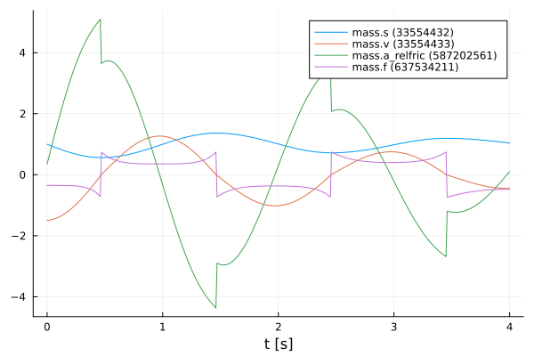
    


 After the plots are created, the FMU is unloaded.


```julia
fmiUnload(realFMU)
```

### SimpleFMU

The following lines load the *simpleFMU* from *FMIZoo.jl*. 


```julia
simpleFMU = fmiLoad("SpringPendulum1D", "Dymola", "2022x")
fmiInfo(simpleFMU)
```

    #################### Begin information for FMU ####################
    	Model name:			SpringPendulum1D
    	FMI-Version:			2.0
    	GUID:				{fc15d8c4-758b-48e6-b00e-5bf47b8b14e5}
    	Generation tool:		Dymola Version 2022x (64-bit), 2021-10-08
    	Generation time:		2022-05-19T06:54:23Z
    	Var. naming conv.:		structured
    	Event indicators:		0
    	Inputs:				0
    	Outputs:			0
    	States:				2
    		33554432 ["mass.s"]
    		33554433 ["mass.v"]
    	Supports Co-Simulation:		true
    		Model identifier:	SpringPendulum1D
    		Get/Set State:		true
    		Serialize State:	true
    		Dir. Derivatives:	true
    		Var. com. steps:	true
    		Input interpol.:	true
    		Max order out. der.:	1
    	Supports Model-Exchange:	true
    		Model identifier:	SpringPendulum1D
    		Get/Set State:		true
    		Serialize State:	true
    		Dir. Derivatives:	true
    ##################### End information for FMU #####################


    ┌ Info: fmi2Unzip(...): Successfully unzipped 153 files at `/tmp/fmijl_eVEudg/SpringPendulum1D`.
    └ @ FMIImport /home/runner/.julia/packages/FMIImport/1Yngw/src/FMI2_ext.jl:90
    ┌ Info: fmi2Load(...): FMU resources location is `file:////tmp/fmijl_eVEudg/SpringPendulum1D/resources`
    └ @ FMIImport /home/runner/.julia/packages/FMIImport/1Yngw/src/FMI2_ext.jl:221
    ┌ Info: fmi2Load(...): FMU supports both CS and ME, using CS as default if nothing specified.
    └ @ FMIImport /home/runner/.julia/packages/FMIImport/1Yngw/src/FMI2_ext.jl:224


The differences between both systems can be clearly seen from the plots in the subchapters. In the plot for the *realFMU* it can be seen that the oscillation continues to decrease due to the effect of the friction. If you simulate long enough, the oscillation would come to a standstill in a certain time. The oscillation in the *simpleFMU* behaves differently, since the friction was not taken into account here. The oscillation in this model would continue to infinity with the same oscillation amplitude. From this observation the desire of an improvement of this model arises.     


In the following two subsections, the *simpleFMU* is simulated twice with different initial states to show what effect the choice of initial states has.

#### Default initial states

Similar to the simulation of the *realFMU*, the *simpleFMU* is also simulated with the default values for the position and velocity of the mass and then plotted. There is one difference, however, as another state representing a fixed displacement is set. In addition, the last variable is also removed from the variables to be plotted.


```julia
initStates = ["mass_s0", "mass_v0", "fixed.s0"]
displacement = 0.1
xSimple₀ = vcat(x₀, displacement)
vrs = vrs[1:end-1]

simpleSimData = simulate(simpleFMU, initStates, xSimple₀, vrs, tStart, tStop, tSave)
fmiPlot(simpleSimData)
```


    
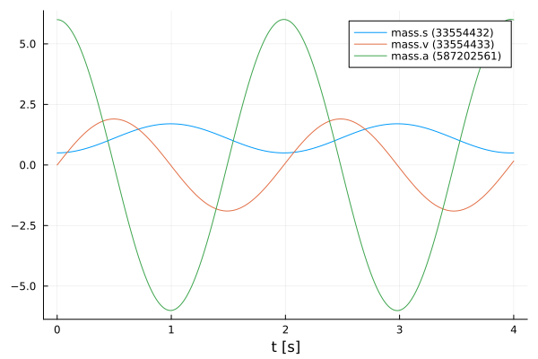
    


#### Modified initial states

The same values for the initial states are used for this simulation as for the simulation from the *realFMU* with the modified initial states.


```julia
xSimpleMod₀ = vcat(xMod₀, displacement)

simpleSimDataMod = simulate(simpleFMU, initStates, xSimpleMod₀, vrs, tStart, tStop, tSave)
fmiPlot(simpleSimDataMod)
```


    
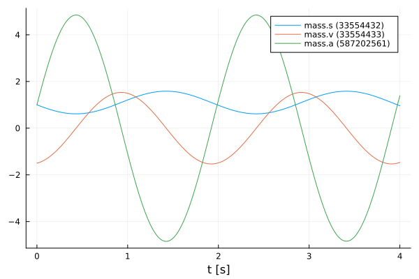
    


## NeuralFMU

#### Loss function

In order to train our model, a loss function must be implemented. The solver of the NeuralFMU can calculate the gradient of the loss function. The gradient descent is needed to adjust the weights in the neural network so that the sum of the error is reduced and the model becomes more accurate.

The error function in this implementation consists of the mean of the mean squared errors. The first part of the addition is the deviation of the position and the second part is the deviation of the velocity. The mean squared error (mse) for the position consists from the real position of the *realFMU* simulation (posReal) and the position data of the network (posNet). The mean squared error for the velocity consists of the real velocity of the *realFMU* simulation (velReal) and the velocity data of the network (velNet).
$$ loss = \frac{1}{2} \Bigl[ \frac{1}{n} \sum\limits_{i=0}^n (posReal[i] - posNet[i])^2 + \frac{1}{n} \sum\limits_{i=0}^n (velReal[i] - velNet[i])^2 \Bigr]$$


```julia
# loss function for training
function lossSum(p)
    global x₀
    solution = neuralFMU(x₀; p=p)

    posNet, velNet = extractPosVel(solution)

    (Flux.Losses.mse(posReal, posNet) + Flux.Losses.mse(velReal, velNet)) / 2.0
end
```


    lossSum (generic function with 1 method)


#### Callback

To output the loss in certain time intervals, a callback is implemented as a function in the following. Here a counter is incremented, every fiftieth pass the loss function is called and the average error is printed out. Also, the parameters for the velocity in the first layer are kept to a fixed value.


```julia
# callback function for training
global counter = 0
function callb(p)
    global counter
    counter += 1

    # freeze first layer parameters (2,4,6) for velocity -> (static) direct feed trough for velocity
    # parameters for position (1,3,5) are learned
    p[1][2] = 0.0
    p[1][4] = 1.0
    p[1][6] = 0.0

    if counter % 50 == 1
        avgLoss = lossSum(p[1])
        @info "  Loss [$counter]: $(round(avgLoss, digits=5))
        Avg displacement in data: $(round(sqrt(avgLoss), digits=5))
        Weight/Scale: $(paramsNet[1][1])   Bias/Offset: $(paramsNet[1][5])"
    end
end
```


    callb (generic function with 1 method)


#### Functions for plotting

In this section some important functions for plotting are defined. The function `generate_figure()` creates a new figure object and sets some attributes.


```julia
function generate_figure(title, xLabel, yLabel, xlim=:auto)
    Plots.plot(
        title=title, xlabel=xLabel, ylabel=yLabel, linewidth=2,
        xtickfontsize=12, ytickfontsize=12, xguidefontsize=12, yguidefontsize=12,
        legendfontsize=12, legend=:topright, xlim=xlim)
end
```


    generate_figure (generic function with 2 methods)


In the following function, the data of the *realFMU*, *simpleFMU* and *neuralFMU* are summarized and displayed in a graph.


```julia
function plot_results(title, xLabel, yLabel, interval, realData, simpleData, neuralData)
    linestyles = [:dot, :solid]
    
    fig = generate_figure(title, xLabel, yLabel)
    Plots.plot!(fig, interval, simpleData, label="SimpleFMU", linewidth=2)
    Plots.plot!(fig, interval, realData, label="Reference", linewidth=2)
    for i in 1:length(neuralData)
        Plots.plot!(fig, neuralData[i][1], neuralData[i][2], label="NeuralFMU ($(i*2500))", 
                    linewidth=2, linestyle=linestyles[i], linecolor=:green)
    end
    Plots.display(fig)
end
```


    plot_results (generic function with 1 method)


This is the superordinate function, which at the beginning extracts the position and velocity from the simulation data (`realSimData`, `realSimDataMod`, `simpleSimData`,..., `solutionAfterMod`). Four graphs are then generated, each comparing the corresponding data from the *realFMU*, *simpleFMU*, and *neuralFMU*. The comparison is made with the simulation data from the simulation with the default and modified initial states. According to the data, the designation of the title and the naming of the axes is adapted.


```julia
function plot_all_results(realSimData, realSimDataMod, simpleSimData, 
        simpleSimDataMod, solutionAfter, solutionAfterMod)    
    # collect all data
    posReal, velReal = extractPosVel(realSimData)
    posRealMod, velRealMod = extractPosVel(realSimDataMod)
    posSimple, velSimple = extractPosVel(simpleSimData)
    posSimpleMod, velSimpleMod = extractPosVel(simpleSimDataMod)
    
    run = length(solutionAfter)
    
    posNeural, velNeural = [], []
    posNeuralMod, velNeuralMod = [], []
    for i in 1:run
        dataNeural = extractPosVel(solutionAfter[i])
        time = fmi2GetSolutionTime(solutionAfter[i])

        push!(posNeural, (time, dataNeural[1]))
        push!(velNeural, (time, dataNeural[2]))
        
        dataNeuralMod = extractPosVel(solutionAfterMod[i])
        time = fmi2GetSolutionTime(solutionAfterMod[i])
        push!(posNeuralMod, (time, dataNeuralMod[1]))
        push!(velNeuralMod, (time, dataNeuralMod[2]))
    end
         
    # plot results s (default initial states)
    xLabel="t [s]"
    yLabel="mass position [m]"
    title = "Default: Mass position after Run: $(run)"
    plot_results(title, xLabel, yLabel, tSave, posReal, posSimple, posNeural)

    # plot results s (modified initial states)
    title = "Modified: Mass position after Run: $(run)"
    plot_results(title, xLabel, yLabel, tSave, posRealMod, posSimpleMod, posNeuralMod)

    # plot results v (default initial states)
    yLabel="mass velocity [m/s]"
    title = "Default: Mass velocity after Run: $(run)"
    plot_results(title, xLabel, yLabel, tSave, velReal, velSimple, velNeural)

    # plot results v (modified initial states)    
    title = "Modified: Mass velocity after Run: $(run)"
    plot_results(title, xLabel, yLabel, tSave, velRealMod, velSimpleMod, velNeuralMod)
end
```


    plot_all_results (generic function with 1 method)


The function `plot_friction_model()` compares the friction model of the *realFMU*, *simpleFMU* and *neuralFMU*. For this, the velocity and force from the simulation data of the *realFMU* is needed. The force data is calculated with the extracted last layer of the *neuralFMU* to the real velocity in line 9 by iterating over the vector `velReal`. In the next rows, the velocity and force data (if available) for each of the three FMUs are combined into a matrix. The first row of the matrix corresponds to the later x-axis and here the velocity is plotted. The second row corresponds to the y-axis and here the force is plotted. This matrix is sorted and plotted by the first entries (velocity) with the function `sortperm()`. The graph with at least three graphs is plotted in line 33. As output this function has the forces of the *neuralFMU*.


```julia
function plot_friction_model(realSimData, netBottom, forces)    
    linestyles = [:dot, :solid]
    
    velReal = fmi2GetSolutionValue(realSimData, "mass.v")
    forceReal = fmi2GetSolutionValue(realSimData, "mass.f")

    push!(forces, zeros(length(velReal)))
    for i in 1:length(velReal)
        forces[end][i] = -netBottom([velReal[i], 0.0])[2]
    end

    run = length(forces) 
    
    fig = generate_figure("Friction model $(run)", "v [m/s]", "friction force [N]", (-1.25, 1.25))

    fricSimple = hcat(velReal, zeros(length(velReal)))
    fricSimple[sortperm(fricSimple[:, 1]), :]
    Plots.plot!(fig, fricSimple[:,1], fricSimple[:,2], label="SimpleFMU", linewidth=2)

    fricReal = hcat(velReal, forceReal)
    fricReal[sortperm(fricReal[:, 1]), :]
    Plots.plot!(fig, fricReal[:,1], fricReal[:,2], label="reference", linewidth=2)

    for i in 1:run
        fricNeural = hcat(velReal, forces[i])
        fricNeural[sortperm(fricNeural[:, 1]), :]
        Plots.plot!(fig, fricNeural[:,1], fricNeural[:,2], label="NeuralFMU ($(i*2500))", 
                    linewidth=2, linestyle=linestyles[i], linecolor=:green)
        @info "Friction model $i mse: $(Flux.Losses.mse(fricNeural[:,2], fricReal[:,2]))"
    end
    flush(stderr)

    Plots.display(fig)
    
    return forces   
end
```


    plot_friction_model (generic function with 1 method)


The following function is used to display the different displacement modells of the *realFMU*, *simpleFMU* and *neuralFMU*. The displacement of the *realFMU* and *simpleFMU* is very trivial and is only a constant. The position data of the *realFMU* is needed to calculate the displacement. The displacement for the *neuralFMU* is calculated using the first extracted layer of the neural network, subtracting the real position and the displacement of the *simpleFMU*. Also in this function, the graphs of the three FMUs are compared in a plot.


```julia
function plot_displacement_model(realSimData, netTop, displacements, tSave, displacement)
    linestyles = [:dot, :solid]
    
    posReal = fmi2GetSolutionValue(realSimData, "mass.s")
    
    push!(displacements, zeros(length(posReal)))
    for i in 1:length(posReal)
        displacements[end][i] = netTop([posReal[i], 0.0])[1] - posReal[i] - displacement
    end

    run = length(displacements)
    fig = generate_figure("Displacement model $(run)", "t [s]", "displacement [m]")
    Plots.plot!(fig, [tSave[1], tSave[end]], [displacement, displacement], label="simpleFMU", linewidth=2)
    Plots.plot!(fig, [tSave[1], tSave[end]], [0.0, 0.0], label="reference", linewidth=2)
    for i in 1:run
        Plots.plot!(fig, tSave, displacements[i], label="NeuralFMU ($(i*2500))", 
                    linewidth=2, linestyle=linestyles[i], linecolor=:green)
    end

    Plots.display(fig)
    
    return displacements
end
```


    plot_displacement_model (generic function with 1 method)


#### Structure of the NeuralFMU

In the following, the topology of the NeuralFMU is constructed. It consists of a dense layer that has exactly as many inputs and outputs as the model has states `numStates` (and therefore state derivatives). It also sets the initial weights and offsets for the first dense layer, as well as the activation function, which consists of the identity. An input layer follows, which then leads into the *simpleFMU* model. The ME-FMU computes the state derivatives for a given system state. Following the *simpleFMU* is a dense layer that has `numStates` states. The output of this layer consists of 8 output nodes and a *identity* activation function. The next layer has 8 input and output nodes with a *tanh* activation function. The last layer is again a dense layer with 8 input nodes and the number of states as outputs. Here, it is important that no *tanh*-activation function follows, because otherwise the pendulums state values would be limited to the interval $[-1;1]$.


```julia
# NeuralFMU setup
numStates = fmiGetNumberOfStates(simpleFMU)

# diagonal matrix 
initW = zeros(numStates, numStates)
for i in 1:numStates
    initW[i,i] = 1
end

net = Chain(# Dense(initW, zeros(numStates),  identity),
            Dense(numStates, numStates,  identity),
            inputs -> fmiEvaluateME(simpleFMU, inputs),
            Dense(numStates, 8, identity),
            Dense(8, 8, tanh),
            Dense(8, numStates))
```


    Chain(
      Dense(2 => 2),                        # 6 parameters
      var"#1#2"(),
      Dense(2 => 8),                        # 24 parameters
      Dense(8 => 8, tanh),                  # 72 parameters
      Dense(8 => 2),                        # 18 parameters
    )                   # Total: 8 arrays, 120 parameters, 992 bytes.


#### Definition of the NeuralFMU

The instantiation of the ME-NeuralFMU is done as a one-liner. The FMU (*simpleFMU*), the structure of the network `net`, start `tStart` and end time `tStop`, the numerical solver `Tsit5()` and the time steps `tSave` for saving are specified.


```julia
neuralFMU = ME_NeuralFMU(simpleFMU, net, (tStart, tStop), Tsit5(); saveat=tSave);
```

    ┌ Info: ME_NeuralFMU(...): Succesfully converted layer of type `Dense{typeof(identity), Matrix{Float32}, Vector{Float32}}` to `Dense{typeof(identity), Matrix{Float64}, Vector{Float64}}`.
    └ @ FMIFlux /home/runner/.julia/packages/FMIFlux/WeryT/src/FMI_neural.jl:1089
    ┌ Info: ME_NeuralFMU(...): Succesfully converted layer of type `Dense{typeof(identity), Matrix{Float32}, Vector{Float32}}` to `Dense{typeof(identity), Matrix{Float64}, Vector{Float64}}`.
    └ @ FMIFlux /home/runner/.julia/packages/FMIFlux/WeryT/src/FMI_neural.jl:1089
    ┌ Info: ME_NeuralFMU(...): Succesfully converted layer of type `Dense{typeof(tanh), Matrix{Float32}, Vector{Float32}}` to `Dense{typeof(tanh), Matrix{Float64}, Vector{Float64}}`.
    └ @ FMIFlux /home/runner/.julia/packages/FMIFlux/WeryT/src/FMI_neural.jl:1089
    ┌ Info: ME_NeuralFMU(...): Succesfully converted layer of type `Dense{typeof(identity), Matrix{Float32}, Vector{Float32}}` to `Dense{typeof(identity), Matrix{Float64}, Vector{Float64}}`.
    └ @ FMIFlux /home/runner/.julia/packages/FMIFlux/WeryT/src/FMI_neural.jl:1089
    ┌ Info: ME_NeuralFMU(...): Succesfully converted model to Float64.
    └ @ FMIFlux /home/runner/.julia/packages/FMIFlux/WeryT/src/FMI_neural.jl:1103


#### Plot before training

Here the state trajectory of the *simpleFMU* is recorded. Doesn't really look like a pendulum yet, but the system is random initialized by default. In the plots later on, the effect of learning can be seen.


```julia
solutionBefore = neuralFMU(x₀)
fmiPlot(solutionBefore)
```

    Simulating ME-NeuralFMU ... 100%|████████████████████████| Time: 0:00:19


    
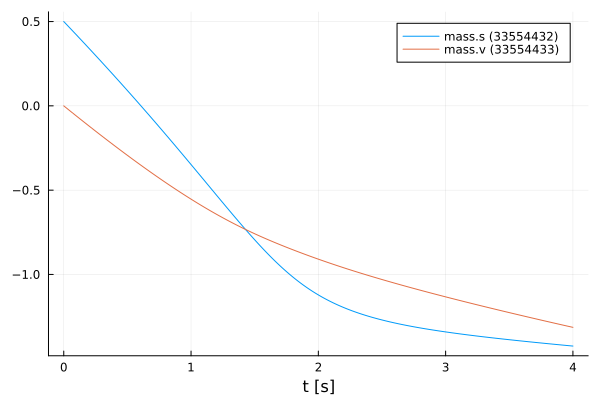
    


#### Training of the NeuralFMU

For the training of the NeuralFMU the parameters are extracted. All parameters of the first layer are set to the absolute value.


```julia
# train
paramsNet = Flux.params(neuralFMU)

for i in 1:length(paramsNet[1])
    if paramsNet[1][i] < 0.0 
        paramsNet[1][i] = -paramsNet[1][i]
    end
end
```

The well-known ADAM optimizer for minimizing the gradient descent is used as further passing parameters. Additionally, the previously defined loss and callback function as well as a one for the number of epochs are passed. Only one epoch is trained so that the NeuralFMU is precompiled.


```julia
optim = ADAM()
FMIFlux.train!(lossSum, paramsNet, Iterators.repeated((), 1), optim; cb=()->callb(paramsNet)) 
```

    Simulating ME-NeuralFMU ... 100%|████████████████████████| Time: 0:00:30
    ┌ Info:   Loss [1]: 0.35233
    │         Avg displacement in data: 0.59357
    │         Weight/Scale: 1.1993630640973756   Bias/Offset: 0.0009999976539634642
    └ @ Main In[14]:15


Some vectors for collecting data are initialized and the number of runs, epochs and iterations are set.


```julia
solutionAfter = []
solutionAfterMod = []
forces = []
displacements = []

numRuns = 2
numEpochs= 5
numIterations = 500;
```

#### Training loop

The code section shown here represents the training loop. The loop is structured so that it has `numRuns` runs, where each run has `numEpochs` epochs, and the training is performed at each epoch with `numIterations` iterations. In lines 9 and 10, the data for the *neuralFMU* for the default and modified initial states are appended to the corresponding vectors. The plots for the opposition of position and velocity is done in line 13 by calling the function `plot_all_results`. In the following lines the last layers are extracted from the *neuralFMU* and formed into an independent network `netBottom`. The parameters for the `netBottom` network come from the original architecture and are shared. In line 20, the new network is used to represent the friction model in a graph. An analogous construction of the next part of the training loop, where here the first layer is taken from the *neuralFMU* and converted to its own network `netTop`. This network is used to record the displacement model. The different graphs are generated for each run and can thus be compared. 


```julia
for run in 1:numRuns
    @time for epoch in 1:numEpochs
        @info "Run: $(run)/$(numRuns)  Epoch: $(epoch)/$(numEpochs)"
        FMIFlux.train!(lossSum, paramsNet, Iterators.repeated((), numIterations), optim; cb=()->callb(paramsNet))
    end
    flush(stderr)
    flush(stdout)
    
    push!(solutionAfter, neuralFMU(x₀))
    push!(solutionAfterMod, neuralFMU(xMod₀))

    # generate all plots for the position and velocity
    plot_all_results(realSimData, realSimDataMod, simpleSimData, simpleSimDataMod, solutionAfter, solutionAfterMod)
    
    # friction model extraction
    layersBottom = neuralFMU.neuralODE.model.layers[3:5]
    netBottom = Chain(layersBottom...)
    transferFlatParams!(netBottom, paramsNet, 7)
    
    forces = plot_friction_model(realSimData, netBottom, forces) 
    
    # displacement model extraction
    layersTop = neuralFMU.neuralODE.model.layers[1:1]
    netTop = Chain(layersTop...)
    transferFlatParams!(netTop, paramsNet, 1)

    displacements = plot_displacement_model(realSimData, netTop, displacements, tSave, displacement)
end
```

    ┌ Info: Run: 1/2  Epoch: 1/5
    └ @ Main In[26]:3
    ┌ Info:   Loss [51]: 0.3097
    │         Avg displacement in data: 0.55651
    │         Weight/Scale: 1.151090262367403   Bias/Offset: -0.04668843522895984
    └ @ Main In[14]:15
    ┌ Info:   Loss [101]: 0.29253
    │         Avg displacement in data: 0.54086
    │         Weight/Scale: 1.1212936549293726   Bias/Offset: -0.07575300655011709
    └ @ Main In[14]:15
    ┌ Info:   Loss [151]: 0.06777
    │         Avg displacement in data: 0.26034
    │         Weight/Scale: 1.1076034280284022   Bias/Offset: -0.08355553348873182
    └ @ Main In[14]:15
    ┌ Info:   Loss [201]: 0.03924
    │         Avg displacement in data: 0.1981
    │         Weight/Scale: 1.1199248322981799   Bias/Offset: -0.07270983859570386
    └ @ Main In[14]:15
    ┌ Info:   Loss [251]: 0.0315
    │         Avg displacement in data: 0.17748
    │         Weight/Scale: 1.1207811358761721   Bias/Offset: -0.0772332446346298
    └ @ Main In[14]:15
    ┌ Info:   Loss [301]: 0.02522
    │         Avg displacement in data: 0.15882
    │         Weight/Scale: 1.1255252118512482   Bias/Offset: -0.07588301481091568
    └ @ Main In[14]:15
    ┌ Info:   Loss [351]: 0.0209
    │         Avg displacement in data: 0.14457
    │         Weight/Scale: 1.1312094908711745   Bias/Offset: -0.07184738363445317
    └ @ Main In[14]:15
    ┌ Info:   Loss [401]: 0.01833
    │         Avg displacement in data: 0.13539
    │         Weight/Scale: 1.135240298679975   Bias/Offset: -0.06831656373328968
    └ @ Main In[14]:15
    ┌ Info:   Loss [451]: 0.01688
    │         Avg displacement in data: 0.12994
    │         Weight/Scale: 1.137264407076433   Bias/Offset: -0.06601047449647206
    └ @ Main In[14]:15
    ┌ Info:   Loss [501]: 0.01568
    │         Avg displacement in data: 0.12521
    │         Weight/Scale: 1.1386997025131984   Bias/Offset: -0.06356067446903858
    └ @ Main In[14]:15
    ┌ Info: Run: 1/2  Epoch: 2/5
    └ @ Main In[26]:3
    ┌ Info:   Loss [551]: 0.01511
    │         Avg displacement in data: 0.12294
    │         Weight/Scale: 1.1365090911431506   Bias/Offset: -0.06492217144245187
    └ @ Main In[14]:15
    ┌ Info:   Loss [601]: 0.01457
    │         Avg displacement in data: 0.1207
    │         Weight/Scale: 1.1344149101256844   Bias/Offset: -0.06595116316626476
    └ @ Main In[14]:15
    ┌ Info:   Loss [651]: 0.01394
    │         Avg displacement in data: 0.11808
    │         Weight/Scale: 1.1327667053691277   Bias/Offset: -0.06647680742198193
    └ @ Main In[14]:15
    ┌ Info:   Loss [701]: 0.01315
    │         Avg displacement in data: 0.11466
    │         Weight/Scale: 1.1321859919729775   Bias/Offset: -0.06554159583363273
    └ @ Main In[14]:15
    ┌ Info:   Loss [751]: 0.01248
    │         Avg displacement in data: 0.11172
    │         Weight/Scale: 1.1308794589694675   Bias/Offset: -0.06491569061011455
    └ @ Main In[14]:15
    ┌ Info:   Loss [801]: 0.01179
    │         Avg displacement in data: 0.10858
    │         Weight/Scale: 1.1284700887314623   Bias/Offset: -0.0657145151758684
    └ @ Main In[14]:15
    ┌ Info:   Loss [851]: 0.01117
    │         Avg displacement in data: 0.10569
    │         Weight/Scale: 1.1260107352711644   Bias/Offset: -0.06656618924798287
    └ @ Main In[14]:15
    ┌ Info:   Loss [901]: 0.01053
    │         Avg displacement in data: 0.10259
    │         Weight/Scale: 1.1236539384204183   Bias/Offset: -0.0673997838269285
    └ @ Main In[14]:15
    ┌ Info:   Loss [951]: 0.0098
    │         Avg displacement in data: 0.099
    │         Weight/Scale: 1.1233763341165846   Bias/Offset: -0.06568730951104859
    └ @ Main In[14]:15
    ┌ Info:   Loss [1001]: 0.00906
    │         Avg displacement in data: 0.09516
    │         Weight/Scale: 1.1222822579556577   Bias/Offset: -0.06457160770425531
    └ @ Main In[14]:15
    ┌ Info: Run: 1/2  Epoch: 3/5
    └ @ Main In[26]:3
    ┌ Info:   Loss [1051]: 0.00845
    │         Avg displacement in data: 0.09195
    │         Weight/Scale: 1.1211478422038375   Bias/Offset: -0.06401269115167135
    └ @ Main In[14]:15
    ┌ Info:   Loss [1101]: 0.00776
    │         Avg displacement in data: 0.08807
    │         Weight/Scale: 1.1168711542268077   Bias/Offset: -0.06733259377376057
    └ @ Main In[14]:15
    ┌ Info:   Loss [1151]: 0.00722
    │         Avg displacement in data: 0.08495
    │         Weight/Scale: 1.1132399886629987   Bias/Offset: -0.07028119054365171
    └ @ Main In[14]:15
    ┌ Info:   Loss [1201]: 0.00677
    │         Avg displacement in data: 0.08226
    │         Weight/Scale: 1.1106178029684592   Bias/Offset: -0.07233907663283619
    └ @ Main In[14]:15
    ┌ Info:   Loss [1251]: 0.00633
    │         Avg displacement in data: 0.07955
    │         Weight/Scale: 1.1089457935805602   Bias/Offset: -0.07335233570188636
    └ @ Main In[14]:15
    ┌ Info:   Loss [1301]: 0.00592
    │         Avg displacement in data: 0.07696
    │         Weight/Scale: 1.1075366928690222   Bias/Offset: -0.07401819941504754
    └ @ Main In[14]:15
    ┌ Info:   Loss [1351]: 0.00557
    │         Avg displacement in data: 0.07461
    │         Weight/Scale: 1.1062843086524152   Bias/Offset: -0.07445133957871289
    └ @ Main In[14]:15
    ┌ Info:   Loss [1401]: 0.00522
    │         Avg displacement in data: 0.07226
    │         Weight/Scale: 1.104853720065035   Bias/Offset: -0.07495434992833996
    └ @ Main In[14]:15
    ┌ Info:   Loss [1451]: 0.00489
    │         Avg displacement in data: 0.06994
    │         Weight/Scale: 1.102865549592031   Bias/Offset: -0.07596051455775897
    └ @ Main In[14]:15
    ┌ Info:   Loss [1501]: 0.0046
    │         Avg displacement in data: 0.06782
    │         Weight/Scale: 1.101848534244069   Bias/Offset: -0.07617845320002499
    └ @ Main In[14]:15
    ┌ Info: Run: 1/2  Epoch: 4/5
    └ @ Main In[26]:3
    ┌ Info:   Loss [1551]: 0.00435
    │         Avg displacement in data: 0.06594
    │         Weight/Scale: 1.1010182006482503   Bias/Offset: -0.07639125118738038
    └ @ Main In[14]:15
    ┌ Info:   Loss [1601]: 0.00406
    │         Avg displacement in data: 0.06374
    │         Weight/Scale: 1.098299915461368   Bias/Offset: -0.078652570235219
    └ @ Main In[14]:15
    ┌ Info:   Loss [1651]: 0.00379
    │         Avg displacement in data: 0.06158
    │         Weight/Scale: 1.094253012282958   Bias/Offset: -0.08198939232523353
    └ @ Main In[14]:15
    ┌ Info:   Loss [1701]: 0.0036
    │         Avg displacement in data: 0.06003
    │         Weight/Scale: 1.0903297318331586   Bias/Offset: -0.08498762001311538
    └ @ Main In[14]:15
    ┌ Info:   Loss [1751]: 0.00344
    │         Avg displacement in data: 0.05869
    │         Weight/Scale: 1.0865329532746983   Bias/Offset: -0.08762512501830362
    └ @ Main In[14]:15
    ┌ Info:   Loss [1801]: 0.00328
    │         Avg displacement in data: 0.05723
    │         Weight/Scale: 1.0834100115876923   Bias/Offset: -0.08951264432395406
    └ @ Main In[14]:15
    ┌ Info:   Loss [1851]: 0.0031
    │         Avg displacement in data: 0.05565
    │         Weight/Scale: 1.0812910083523564   Bias/Offset: -0.09055115422784701
    └ @ Main In[14]:15
    ┌ Info:   Loss [1901]: 0.00293
    │         Avg displacement in data: 0.05415
    │         Weight/Scale: 1.0797268208489306   Bias/Offset: -0.09125128722476535
    └ @ Main In[14]:15
    ┌ Info:   Loss [1951]: 0.00279
    │         Avg displacement in data: 0.0528
    │         Weight/Scale: 1.0783942260655184   Bias/Offset: -0.09189667330687001
    └ @ Main In[14]:15
    ┌ Info:   Loss [2001]: 0.00266
    │         Avg displacement in data: 0.05161
    │         Weight/Scale: 1.0771516857620413   Bias/Offset: -0.09256887734391803
    └ @ Main In[14]:15
    ┌ Info: Run: 1/2  Epoch: 5/5
    └ @ Main In[26]:3
    ┌ Info:   Loss [2051]: 0.00255
    │         Avg displacement in data: 0.05053
    │         Weight/Scale: 1.0759361524587598   Bias/Offset: -0.093280299132748
    └ @ Main In[14]:15
    ┌ Info:   Loss [2101]: 0.00245
    │         Avg displacement in data: 0.04953
    │         Weight/Scale: 1.0747397679659476   Bias/Offset: -0.09400992831876732
    └ @ Main In[14]:15
    ┌ Info:   Loss [2151]: 0.00236
    │         Avg displacement in data: 0.04861
    │         Weight/Scale: 1.0735805898777373   Bias/Offset: -0.09473002875902053
    └ @ Main In[14]:15
    ┌ Info:   Loss [2201]: 0.00228
    │         Avg displacement in data: 0.04777
    │         Weight/Scale: 1.0724764246677867   Bias/Offset: -0.09542249582378302
    └ @ Main In[14]:15
    ┌ Info:   Loss [2251]: 0.00221
    │         Avg displacement in data: 0.04697
    │         Weight/Scale: 1.0714389827163004   Bias/Offset: -0.09607811476895074
    └ @ Main In[14]:15
    ┌ Info:   Loss [2301]: 0.00214
    │         Avg displacement in data: 0.04623
    │         Weight/Scale: 1.0704759730964668   Bias/Offset: -0.09669222640128693
    └ @ Main In[14]:15
    ┌ Info:   Loss [2351]: 0.00207
    │         Avg displacement in data: 0.04553
    │         Weight/Scale: 1.069590599864623   Bias/Offset: -0.09726329843392197
    └ @ Main In[14]:15
    ┌ Info:   Loss [2401]: 0.00201
    │         Avg displacement in data: 0.04488
    │         Weight/Scale: 1.0687841949867043   Bias/Offset: -0.09779083071924752
    └ @ Main In[14]:15
    ┌ Info:   Loss [2451]: 0.00196
    │         Avg displacement in data: 0.04426
    │         Weight/Scale: 1.0680548746701697   Bias/Offset: -0.09827524888716206
    └ @ Main In[14]:15
    ┌ Info:   Loss [2501]: 0.00191
    │         Avg displacement in data: 0.04367
    │         Weight/Scale: 1.067398588252793   Bias/Offset: -0.09871818892155704
    └ @ Main In[14]:15


    133.704475 seconds (211.07 M allocations: 153.080 GiB, 16.26% gc time, 1.56% compilation time)


    
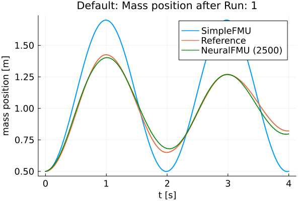
    


    
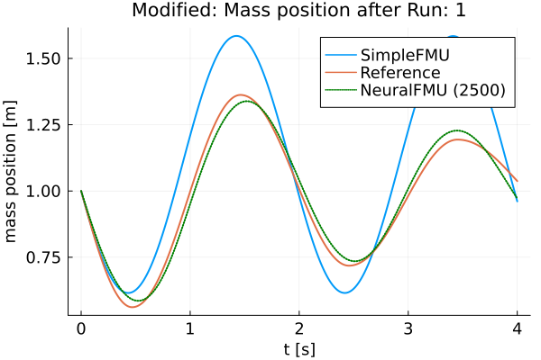
    


    
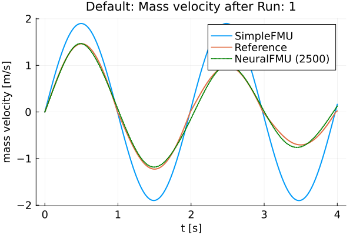
    


    
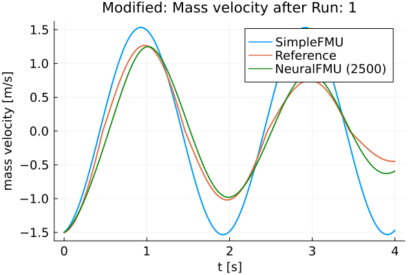
    


    ┌ Info: Friction model 1 mse: 6.076064634503042
    └ @ Main In[18]:29


    
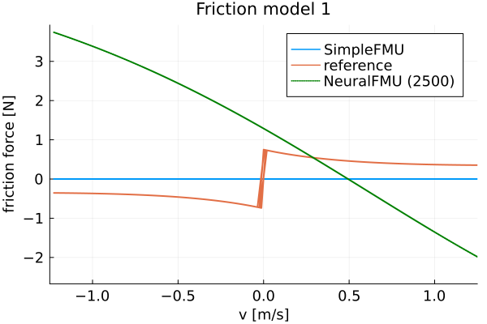
    


    
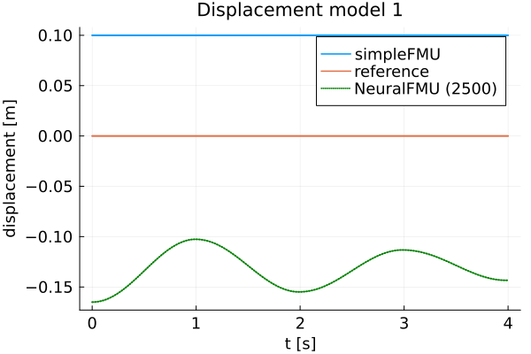
    


    ┌ Info: Run: 2/2  Epoch: 1/5
    └ @ Main In[26]:3
    ┌ Info:   Loss [2551]: 0.00186
    │         Avg displacement in data: 0.04311
    │         Weight/Scale: 1.0668086948844062   Bias/Offset: -0.09912319080256106
    └ @ Main In[14]:15
    ┌ Info:   Loss [2601]: 0.00181
    │         Avg displacement in data: 0.04259
    │         Weight/Scale: 1.0662763613823163   Bias/Offset: -0.09949487161954748
    └ @ Main In[14]:15
    ┌ Info:   Loss [2651]: 0.00177
    │         Avg displacement in data: 0.04208
    │         Weight/Scale: 1.0657925239029225   Bias/Offset: -0.099838257029901
    └ @ Main In[14]:15
    ┌ Info:   Loss [2701]: 0.00173
    │         Avg displacement in data: 0.0416
    │         Weight/Scale: 1.065348874984884   Bias/Offset: -0.100158164009002
    └ @ Main In[14]:15
    ┌ Info:   Loss [2751]: 0.00169
    │         Avg displacement in data: 0.04114
    │         Weight/Scale: 1.0649389236109952   Bias/Offset: -0.10045846622704088
    └ @ Main In[14]:15
    ┌ Info:   Loss [2801]: 0.00166
    │         Avg displacement in data: 0.0407
    │         Weight/Scale: 1.0645577412486122   Bias/Offset: -0.10074203308980646
    └ @ Main In[14]:15
    ┌ Info:   Loss [2851]: 0.00162
    │         Avg displacement in data: 0.04027
    │         Weight/Scale: 1.0642018598957625   Bias/Offset: -0.10101081761065459
    └ @ Main In[14]:15
    ┌ Info:   Loss [2901]: 0.00159
    │         Avg displacement in data: 0.03986
    │         Weight/Scale: 1.063868168384065   Bias/Offset: -0.10126594371101752
    └ @ Main In[14]:15
    ┌ Info:   Loss [2951]: 0.00156
    │         Avg displacement in data: 0.03946
    │         Weight/Scale: 1.0635539079350567   Bias/Offset: -0.10150766728906602
    └ @ Main In[14]:15
    ┌ Info:   Loss [3001]: 0.00153
    │         Avg displacement in data: 0.03908
    │         Weight/Scale: 1.0632582884102648   Bias/Offset: -0.1017364557659113
    └ @ Main In[14]:15
    ┌ Info: Run: 2/2  Epoch: 2/5
    └ @ Main In[26]:3
    ┌ Info:   Loss [3051]: 0.0015
    │         Avg displacement in data: 0.03871
    │         Weight/Scale: 1.0629809103907257   Bias/Offset: -0.10195243437903909
    └ @ Main In[14]:15
    ┌ Info:   Loss [3101]: 0.00147
    │         Avg displacement in data: 0.03835
    │         Weight/Scale: 1.062721528778951   Bias/Offset: -0.10215545323792298
    └ @ Main In[14]:15
    ┌ Info:   Loss [3151]: 0.00144
    │         Avg displacement in data: 0.03801
    │         Weight/Scale: 1.0624797972426554   Bias/Offset: -0.1023454177086838
    └ @ Main In[14]:15
    ┌ Info:   Loss [3201]: 0.00142
    │         Avg displacement in data: 0.03767
    │         Weight/Scale: 1.062255412308162   Bias/Offset: -0.10252221466552379
    └ @ Main In[14]:15
    ┌ Info:   Loss [3251]: 0.00139
    │         Avg displacement in data: 0.03734
    │         Weight/Scale: 1.0620480119707691   Bias/Offset: -0.10268577282663094
    └ @ Main In[14]:15
    ┌ Info:   Loss [3301]: 0.00137
    │         Avg displacement in data: 0.03702
    │         Weight/Scale: 1.0618571799310061   Bias/Offset: -0.10283613556064543
    └ @ Main In[14]:15
    ┌ Info:   Loss [3351]: 0.00135
    │         Avg displacement in data: 0.03671
    │         Weight/Scale: 1.0616823544342593   Bias/Offset: -0.10297350613756423
    └ @ Main In[14]:15
    ┌ Info:   Loss [3401]: 0.00133
    │         Avg displacement in data: 0.03643
    │         Weight/Scale: 1.061510530390365   Bias/Offset: -0.10305591604216134
    └ @ Main In[14]:15
    ┌ Info:   Loss [3451]: 0.0013
    │         Avg displacement in data: 0.0361
    │         Weight/Scale: 1.0612942238227683   Bias/Offset: -0.10321470838713605
    └ @ Main In[14]:15
    ┌ Info:   Loss [3501]: 0.00128
    │         Avg displacement in data: 0.03582
    │         Weight/Scale: 1.0611381461013012   Bias/Offset: -0.10332686185928314
    └ @ Main In[14]:15
    ┌ Info: Run: 2/2  Epoch: 3/5
    └ @ Main In[26]:3
    ┌ Info:   Loss [3551]: 0.00126
    │         Avg displacement in data: 0.03553
    │         Weight/Scale: 1.060996473988249   Bias/Offset: -0.10342731521757358
    └ @ Main In[14]:15
    ┌ Info:   Loss [3601]: 0.00124
    │         Avg displacement in data: 0.03525
    │         Weight/Scale: 1.0608667639082852   Bias/Offset: -0.10351748457419499
    └ @ Main In[14]:15
    ┌ Info:   Loss [3651]: 0.00131
    │         Avg displacement in data: 0.0362
    │         Weight/Scale: 1.0606770120806601   Bias/Offset: -0.10365785210034589
    └ @ Main In[14]:15
    ┌ Info:   Loss [3701]: 0.0012
    │         Avg displacement in data: 0.03471
    │         Weight/Scale: 1.0605299610298031   Bias/Offset: -0.1036786883470669
    └ @ Main In[14]:15
    ┌ Info:   Loss [3751]: 0.00119
    │         Avg displacement in data: 0.03446
    │         Weight/Scale: 1.0603941401538712   Bias/Offset: -0.10376279239854518
    └ @ Main In[14]:15
    ┌ Info:   Loss [3801]: 0.00117
    │         Avg displacement in data: 0.0342
    │         Weight/Scale: 1.0602723379056083   Bias/Offset: -0.10383893660272045
    └ @ Main In[14]:15
    ┌ Info:   Loss [3851]: 0.00115
    │         Avg displacement in data: 0.03395
    │         Weight/Scale: 1.0601592691509274   Bias/Offset: -0.10390859634761485
    └ @ Main In[14]:15
    ┌ Info:   Loss [3901]: 0.00114
    │         Avg displacement in data: 0.0337
    │         Weight/Scale: 1.060054578226171   Bias/Offset: -0.10397281175375585
    └ @ Main In[14]:15
    ┌ Info:   Loss [3951]: 0.00112
    │         Avg displacement in data: 0.03345
    │         Weight/Scale: 1.0599131158860837   Bias/Offset: -0.10400166882967721
    └ @ Main In[14]:15
    ┌ Info:   Loss [4001]: 0.0011
    │         Avg displacement in data: 0.03321
    │         Weight/Scale: 1.0597385771291812   Bias/Offset: -0.10410679757728769
    └ @ Main In[14]:15
    ┌ Info: Run: 2/2  Epoch: 4/5
    └ @ Main In[26]:3
    ┌ Info:   Loss [4051]: 0.00109
    │         Avg displacement in data: 0.03298
    │         Weight/Scale: 1.0596246938539982   Bias/Offset: -0.10417764559518738
    └ @ Main In[14]:15
    ┌ Info:   Loss [4101]: 0.00107
    │         Avg displacement in data: 0.03275
    │         Weight/Scale: 1.0595201290151535   Bias/Offset: -0.10424355037234778
    └ @ Main In[14]:15
    ┌ Info:   Loss [4151]: 0.00106
    │         Avg displacement in data: 0.03252
    │         Weight/Scale: 1.0594245230643016   Bias/Offset: -0.1043048362327687
    └ @ Main In[14]:15
    ┌ Info:   Loss [4201]: 0.00106
    │         Avg displacement in data: 0.03254
    │         Weight/Scale: 1.0593362057558378   Bias/Offset: -0.10430845317243581
    └ @ Main In[14]:15
    ┌ Info:   Loss [4251]: 0.00103
    │         Avg displacement in data: 0.03208
    │         Weight/Scale: 1.0591216185977248   Bias/Offset: -0.10443780119434082
    └ @ Main In[14]:15
    ┌ Info:   Loss [4301]: 0.00102
    │         Avg displacement in data: 0.03187
    │         Weight/Scale: 1.0590151492513797   Bias/Offset: -0.10451327183501805
    └ @ Main In[14]:15
    ┌ Info:   Loss [4351]: 0.001
    │         Avg displacement in data: 0.03165
    │         Weight/Scale: 1.058923045011262   Bias/Offset: -0.10458212091457411
    └ @ Main In[14]:15
    ┌ Info:   Loss [4401]: 0.00099
    │         Avg displacement in data: 0.03145
    │         Weight/Scale: 1.0588433179423473   Bias/Offset: -0.10464528309822899
    └ @ Main In[14]:15
    ┌ Info:   Loss [4451]: 0.00107
    │         Avg displacement in data: 0.03271
    │         Weight/Scale: 1.0588326281517397   Bias/Offset: -0.10463640531451984
    └ @ Main In[14]:15
    ┌ Info:   Loss [4501]: 0.00096
    │         Avg displacement in data: 0.03104
    │         Weight/Scale: 1.0585836640070059   Bias/Offset: -0.10478089254415496
    └ @ Main In[14]:15
    ┌ Info: Run: 2/2  Epoch: 5/5
    └ @ Main In[26]:3
    ┌ Info:   Loss [4551]: 0.00095
    │         Avg displacement in data: 0.03084
    │         Weight/Scale: 1.0585005403610852   Bias/Offset: -0.1048548906112387
    └ @ Main In[14]:15
    ┌ Info:   Loss [4601]: 0.00094
    │         Avg displacement in data: 0.03065
    │         Weight/Scale: 1.0584349213051993   Bias/Offset: -0.10492564349254259
    └ @ Main In[14]:15
    ┌ Info:   Loss [4651]: 0.00093
    │         Avg displacement in data: 0.03045
    │         Weight/Scale: 1.058383932295903   Bias/Offset: -0.10499043891018421
    └ @ Main In[14]:15
    ┌ Info:   Loss [4701]: 0.00092
    │         Avg displacement in data: 0.03027
    │         Weight/Scale: 1.0583481603307412   Bias/Offset: -0.10504943284207116
    └ @ Main In[14]:15
    ┌ Info:   Loss [4751]: 0.0009
    │         Avg displacement in data: 0.03008
    │         Weight/Scale: 1.058223120285205   Bias/Offset: -0.10510872542085002
    └ @ Main In[14]:15
    ┌ Info:   Loss [4801]: 0.00089
    │         Avg displacement in data: 0.0299
    │         Weight/Scale: 1.0581436627713   Bias/Offset: -0.10519919694566782
    └ @ Main In[14]:15
    ┌ Info:   Loss [4851]: 0.00088
    │         Avg displacement in data: 0.02972
    │         Weight/Scale: 1.0581095995960585   Bias/Offset: -0.1052757625482944
    └ @ Main In[14]:15
    ┌ Info:   Loss [4901]: 0.00087
    │         Avg displacement in data: 0.02954
    │         Weight/Scale: 1.0580891941654116   Bias/Offset: -0.10534790313494202
    └ @ Main In[14]:15
    ┌ Info:   Loss [4951]: 0.00086
    │         Avg displacement in data: 0.02937
    │         Weight/Scale: 1.0580831698928583   Bias/Offset: -0.10541519688135084
    └ @ Main In[14]:15
    ┌ Info:   Loss [5001]: 0.00101
    │         Avg displacement in data: 0.03184
    │         Weight/Scale: 1.0581614850341206   Bias/Offset: -0.10539398713829859
    └ @ Main In[14]:15


    121.576821 seconds (188.59 M allocations: 140.127 GiB, 16.98% gc time)


    
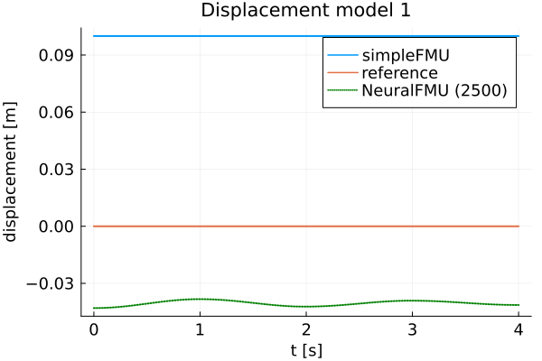
    


    
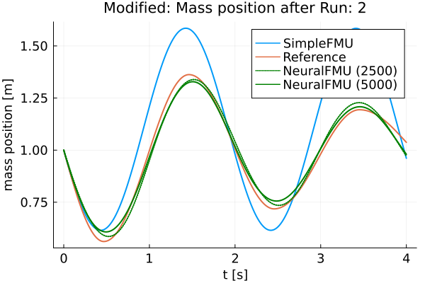
    


    

    


    
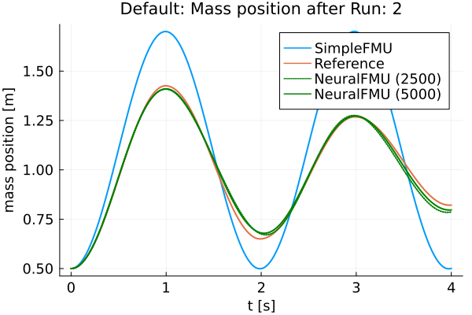
    


    ┌ Info: Friction model 1 mse: 6.076064634503042
    └ @ Main In[18]:29
    ┌ Info: Friction model 2 mse: 6.19198240945078
    └ @ Main In[18]:29


    
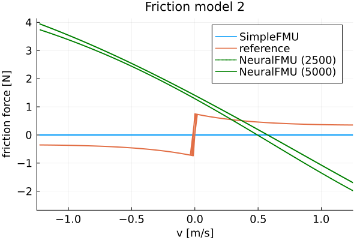
    


    
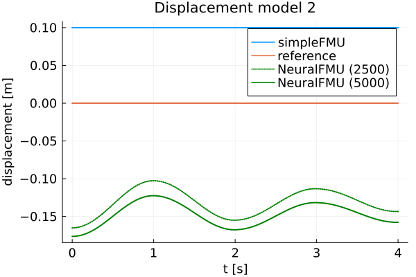
    


Finally, the FMU is cleaned-up.


```julia
fmiUnload(simpleFMU)
```

### Summary

Based on the plots, it can be seen that the curves of the *realFMU* and the *neuralFMU* are very close. The *neuralFMU* is able to learn the friction and displacement model.

### Source

[1] Tobias Thummerer, Lars Mikelsons and Josef Kircher. 2021. **NeuralFMU: towards structural integration of FMUs into neural networks.** Martin Sjölund, Lena Buffoni, Adrian Pop and Lennart Ochel (Ed.). Proceedings of 14th Modelica Conference 2021, Linköping, Sweden, September 20-24, 2021. Linköping University Electronic Press, Linköping (Linköping Electronic Conference Proceedings ; 181), 297-306. [DOI: 10.3384/ecp21181297](https://doi.org/10.3384/ecp21181297)

