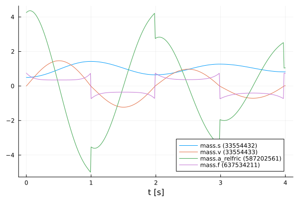
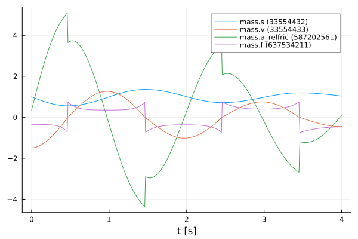
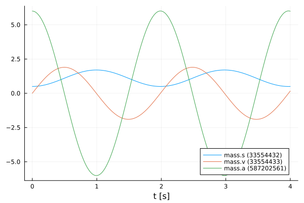
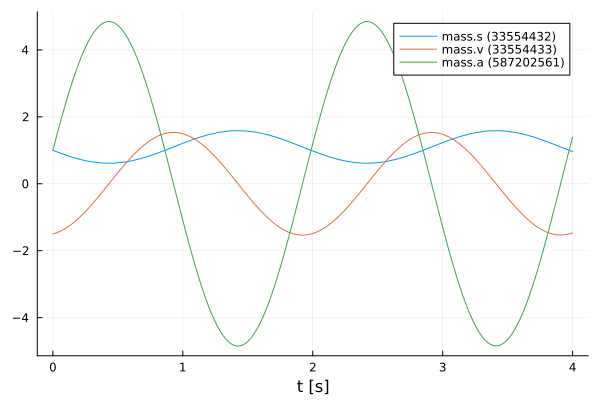
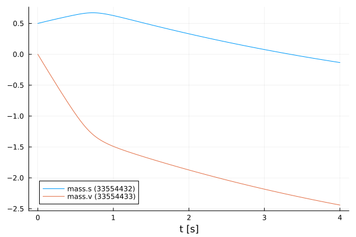
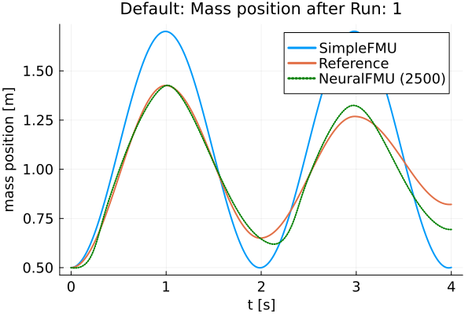
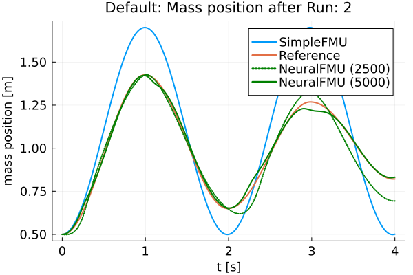

# ME-NeuralFMU from the Modelica Conference 2021
Tutorial by Johannes Stoljar, Tobias Thummerer

*Last edit: 29.03.2023*

## License


```julia
# Copyright (c) 2021 Tobias Thummerer, Lars Mikelsons, Johannes Stoljar
# Licensed under the MIT license. 
# See LICENSE (https://github.com/thummeto/FMIFlux.jl/blob/main/LICENSE) file in the project root for details.
```

## Motivation
The Julia Package *FMIFlux.jl* is motivated by the application of hybrid modeling. This package enables the user to integrate his simulation model between neural networks (NeuralFMU). For this, the simulation model must be exported as FMU (functional mock-up unit), which corresponds to a widely used standard. The big advantage of hybrid modeling with artificial neural networks is, that the effects that are difficult to model (because they might be unknown) can be easily learned by the neural networks. For this purpose, the NeuralFMU is trained with measurement data containing the not modeled physical effect. The final product is a simulation model including the originally not modeled effects. Another big advantage of the NeuralFMU is that it works with little data, because the FMU already contains the characteristic functionality of the simulation and only the missing effects are added.

NeuralFMUs do not need to be as easy as in this example. Basically a NeuralFMU can combine different ANN topologies that manipulate any FMU-input (system state, system inputs, time) and any FMU-output (system state derivative, system outputs, other system variables). However, for this example a NeuralFMU topology as shown in the following picture is used.


*NeuralFMU (ME) from* [[1]](#Source).

## Introduction to the example
In this example, simplified modeling of a one-dimensional spring pendulum (without friction) is compared to a model of the same system that includes a nonlinear friction model. The FMU with the simplified model will be named *simpleFMU* in the following and the model with the friction will be named *realFMU*. At the beginning, the actual state of both simulations is shown, whereby clear deviations can be seen in the graphs. In addition, the initial states are changed for both models and these graphs are also contrasted, and the differences can again be clearly seen. The *realFMU* serves as a reference graph. The *simpleFMU* is then integrated into a NeuralFMU architecture and a training of the entire network is performed. After the training the final state is compared again to the *realFMU*. It can be clearly seen that by using the NeuralFMU, learning of the friction process has taken place.  


## Target group
The example is primarily intended for users who work in the field of first principle and/or hybrid modeling and are further interested in hybrid model building. The example wants to show how simple it is to combine FMUs with machine learning and to illustrate the advantages of this approach.


## Other formats
Besides, this [Jupyter Notebook](https://github.com/thummeto/FMIFlux.jl/blob/examples/examples/src/modelica_conference_2021.ipynb) there is also a [Julia file](https://github.com/thummeto/FMIFlux.jl/blob/examples/examples/src/modelica_conference_2021.jl) with the same name, which contains only the code cells. For the documentation there is a [Markdown file](https://github.com/thummeto/FMIFlux.jl/blob/examples/examples/src/modelica_conference_2021.md) corresponding to the notebook.  


## Getting started

### Installation prerequisites
|     | Description                       | Command                   |   
|:----|:----------------------------------|:--------------------------|
| 1.  | Enter Package Manager via         | ]                         |
| 2.  | Install FMI via                   | add FMI                   | 
| 3.  | Install FMIFlux via               | add FMIFlux               | 
| 4.  | Install FMIZoo via                | add FMIZoo                | 
| 5.  | Install DifferentialEquations via | add DifferentialEquations |  
| 6.  | Install Plots via                 | add Plots                 | 
| 7.  | Install Random via                | add Random                | 

## Code section

To run the example, the previously installed packages must be included. 


```julia
# imports
using FMI
using FMIFlux
using FMIFlux.Flux
using FMIZoo
using DifferentialEquations: Tsit5
import Plots

# set seed
import Random
Random.seed!(1234);
```

    ┌ Warning: Error requiring `Enzyme` from `LinearSolve`
    │   exception =
    │    LoadError: ArgumentError: Package LinearSolve does not have Enzyme in its dependencies:
    │    - You may have a partially installed environment. Try `Pkg.instantiate()`
    │      to ensure all packages in the environment are installed.
    │    - Or, if you have LinearSolve checked out for development and have
    │      added Enzyme as a dependency but haven't updated your primary
    │      environment's manifest file, try `Pkg.resolve()`.
    │    - Otherwise you may need to report an issue with LinearSolve
    │    Stacktrace:
    │      [1] macro expansion
    │        @ .\loading.jl:1167 [inlined]
    │      [2] macro expansion
    │        @ .\lock.jl:223 [inlined]
    │      [3] require(into::Module, mod::Symbol)
    │        @ Base .\loading.jl:1144
    │      [4] include(mod::Module, _path::String)
    │        @ Base .\Base.jl:419
    │      [5] include(x::String)
    │        @ LinearSolve C:\Users\runneradmin\.julia\packages\LinearSolve\qCLK7\src\LinearSolve.jl:1
    │      [6] macro expansion
    │        @ C:\Users\runneradmin\.julia\packages\Requires\Z8rfN\src\Requires.jl:40 [inlined]
    │      [7] top-level scope
    │        @ C:\Users\runneradmin\.julia\packages\LinearSolve\qCLK7\src\init.jl:16
    │      [8] eval
    │        @ .\boot.jl:368 [inlined]
    │      [9] eval
    │        @ C:\Users\runneradmin\.julia\packages\LinearSolve\qCLK7\src\LinearSolve.jl:1 [inlined]
    │     [10] (::LinearSolve.var"#88#97")()
    │        @ LinearSolve C:\Users\runneradmin\.julia\packages\Requires\Z8rfN\src\require.jl:101
    │     [11] macro expansion
    │        @ timing.jl:382 [inlined]
    │     [12] err(f::Any, listener::Module, modname::String, file::String, line::Any)
    │        @ Requires C:\Users\runneradmin\.julia\packages\Requires\Z8rfN\src\require.jl:47
    │     [13] (::LinearSolve.var"#87#96")()
    │        @ LinearSolve C:\Users\runneradmin\.julia\packages\Requires\Z8rfN\src\require.jl:100
    │     [14] withpath(f::Any, path::String)
    │        @ Requires C:\Users\runneradmin\.julia\packages\Requires\Z8rfN\src\require.jl:37
    │     [15] (::LinearSolve.var"#86#95")()
    │        @ LinearSolve C:\Users\runneradmin\.julia\packages\Requires\Z8rfN\src\require.jl:99
    │     [16] #invokelatest#2
    │        @ .\essentials.jl:729 [inlined]
    │     [17] invokelatest
    │        @ .\essentials.jl:726 [inlined]
    │     [18] foreach(f::typeof(Base.invokelatest), itr::Vector{Function})
    │        @ Base .\abstractarray.jl:2774
    │     [19] loadpkg(pkg::Base.PkgId)
    │        @ Requires C:\Users\runneradmin\.julia\packages\Requires\Z8rfN\src\require.jl:27
    │     [20] #invokelatest#2
    │        @ .\essentials.jl:729 [inlined]
    │     [21] invokelatest
    │        @ .\essentials.jl:726 [inlined]
    │     [22] run_package_callbacks(modkey::Base.PkgId)
    │        @ Base .\loading.jl:869
    │     [23] _tryrequire_from_serialized(modkey::Base.PkgId, path::String, sourcepath::String, depmods::Vector{Any})
    │        @ Base .\loading.jl:944
    │     [24] _require_search_from_serialized(pkg::Base.PkgId, sourcepath::String, build_id::UInt64)
    │        @ Base .\loading.jl:1028
    │     [25] _require(pkg::Base.PkgId)
    │        @ Base .\loading.jl:1315
    │     [26] _require_prelocked(uuidkey::Base.PkgId)
    │        @ Base .\loading.jl:1200
    │     [27] macro expansion
    │        @ .\loading.jl:1180 [inlined]
    │     [28] macro expansion
    │        @ .\lock.jl:223 [inlined]
    │     [29] require(into::Module, mod::Symbol)
    │        @ Base .\loading.jl:1144
    │     [30] eval
    │        @ .\boot.jl:368 [inlined]
    │     [31] include_string(mapexpr::typeof(REPL.softscope), mod::Module, code::String, filename::String)
    │        @ Base .\loading.jl:1428
    │     [32] softscope_include_string(m::Module, code::String, filename::String)
    │        @ SoftGlobalScope C:\Users\runneradmin\.julia\packages\SoftGlobalScope\u4UzH\src\SoftGlobalScope.jl:65
    │     [33] execute_request(socket::ZMQ.Socket, msg::IJulia.Msg)
    │        @ IJulia C:\Users\runneradmin\.julia\packages\IJulia\Vo51o\src\execute_request.jl:67
    │     [34] #invokelatest#2
    │        @ .\essentials.jl:729 [inlined]
    │     [35] invokelatest
    │        @ .\essentials.jl:726 [inlined]
    │     [36] eventloop(socket::ZMQ.Socket)
    │        @ IJulia C:\Users\runneradmin\.julia\packages\IJulia\Vo51o\src\eventloop.jl:8
    │     [37] (::IJulia.var"#15#18")()
    │        @ IJulia .\task.jl:484
    │    in expression starting at C:\Users\runneradmin\.julia\packages\LinearSolve\qCLK7\ext\LinearSolveEnzymeExt.jl:1
    └ @ Requires C:\Users\runneradmin\.julia\packages\Requires\Z8rfN\src\require.jl:51
    

After importing the packages, the path to the *Functional Mock-up Units* (FMUs) is set. The exported FMU is a model meeting the *Functional Mock-up Interface* (FMI) Standard. The FMI is a free standard ([fmi-standard.org](http://fmi-standard.org/)) that defines a container and an interface to exchange dynamic models using a combination of XML files, binaries and C code zipped into a single file. 

The object-orientated structure of the *SpringPendulum1D* (*simpleFMU*) can be seen in the following graphic and corresponds to a simple modeling.


In contrast, the model *SpringFrictionPendulum1D* (*realFMU*) is somewhat more accurate, because it includes a friction component. 


Next, the start time and end time of the simulation are set. Finally, a step size is specified to store the results of the simulation at these time steps.


```julia
tStart = 0.0
tStep = 0.01
tStop = 4.0
tSave = collect(tStart:tStep:tStop)
```


    401-element Vector{Float64}:
     0.0
     0.01
     0.02
     0.03
     0.04
     0.05
     0.06
     0.07
     0.08
     0.09
     0.1
     0.11
     0.12
     ⋮
     3.89
     3.9
     3.91
     3.92
     3.93
     3.94
     3.95
     3.96
     3.97
     3.98
     3.99
     4.0


### RealFMU

In the next lines of code the FMU of the *realFMU* model from *FMIZoo.jl* is loaded and the information about the FMU is shown.  


```julia
realFMU = fmiLoad("SpringFrictionPendulum1D", "Dymola", "2022x")
fmiInfo(realFMU)
```

    #################### Begin information for FMU ####################
    	Model name:			SpringFrictionPendulum1D
    	FMI-Version:			2.0
    	GUID:				{2e178ad3-5e9b-48ec-a7b2-baa5669efc0c}
    	Generation tool:		Dymola Version 2022x (64-bit), 2021-10-08
    	Generation time:		2022-05-19T06:54:12Z
    	Var. naming conv.:		structured
    	Event indicators:		24
    	Inputs:				0
    	Outputs:			0
    	States:				2
    		33554432 ["mass.s"]
    		33554433 ["mass.v", "mass.v_relfric"]
    	Supports Co-Simulation:		true
    		Model identifier:	SpringFrictionPendulum1D
    		Get/Set State:		true
    		Serialize State:	true
    		Dir. Derivatives:	true
    		Var. com. steps:	true
    		Input interpol.:	true
    		Max order out. der.:	1
    	Supports Model-Exchange:	true
    		Model identifier:	SpringFrictionPendulum1D
    		Get/Set State:		true
    		Serialize State:	true
    		Dir. Derivatives:	true
    ##################### End information for FMU #####################
    

In the following two subsections, the *realFMU* is simulated twice with different initial states to show what effect the choice of initial states has.

#### Default initial states

In the next steps the parameters are defined. The first parameter is the initial position of the mass, which is initialized with $0.5m$, the second parameter is the initial velocity, which is initialized with $0\frac{m}{s}$. In the function `fmiSimulate()` the *realFMU* is simulated, still specifying the start and end time, the parameters and which variables are recorded. After the simulation is finished the result of the *realFMU* can be plotted. This plot also serves as a reference for the other model (*simpleFMU*). The extracted data will still be needed later on.


```julia
initStates = ["s0", "v0"]
x₀ = [0.5, 0.0]
params = Dict(zip(initStates, x₀))
vrs = ["mass.s", "mass.v", "mass.a", "mass.f"]

realSimData = fmiSimulate(realFMU, (tStart, tStop); parameters=params, recordValues=vrs, saveat=tSave)
posReal = fmi2GetSolutionValue(realSimData, "mass.s")
velReal = fmi2GetSolutionValue(realSimData, "mass.v")
fmiPlot(realSimData)
```

    
Simulating CS-FMU ...   0%|█                             |  ETA: N/A

    
Simulating CS-FMU ... 100%|██████████████████████████████| Time: 0:00:02
    


    

    


#### Define functions

The structure of the previous code section is used more often in the further sections, so for clarity the previously explained code section for setting the paramters and simulating are combined into one function `simulate()`.


```julia
function simulate(FMU, initStates, x₀, variables, tStart, tStop, tSave)
    params = Dict(zip(initStates, x₀))
    return fmiSimulate(FMU, (tStart, tStop); parameters=params, recordValues=variables, saveat=tSave)
end
```


    simulate (generic function with 1 method)


Also, a function to extract the position and velocity from the simulation data is created.


```julia
function extractPosVel(simData)
    if simData.states === nothing
        posData = fmi2GetSolutionValue(simData, "mass.s")
        velData = fmi2GetSolutionValue(simData, "mass.v")
    else
        posData = fmi2GetSolutionState(simData, 1; isIndex=true)
        velData = fmi2GetSolutionState(simData, 2; isIndex=true)
    end

    return posData, velData
end
```


    extractPosVel (generic function with 1 method)


#### Modified initial states

In contrast to the previous section, other initial states are selected. The position of the mass is initialized with $1.0m$ and the velocity is initialized with $-1.5\frac{m}{s}$. With the modified initial states the *realFMU* is simulated and a graph is generated.


```julia
xMod₀ = [1.0, -1.5]
realSimDataMod = simulate(realFMU, initStates, xMod₀, vrs, tStart, tStop, tSave)
fmiPlot(realSimDataMod)
```


    

    


 After the plots are created, the FMU is unloaded.


```julia
fmiUnload(realFMU)
```

### SimpleFMU

The following lines load the *simpleFMU* from *FMIZoo.jl*. 


```julia
simpleFMU = fmiLoad("SpringPendulum1D", "Dymola", "2022x")
fmiInfo(simpleFMU)
```

    #################### Begin information for FMU ####################
    	Model name:			SpringPendulum1D
    	FMI-Version:			2.0
    	GUID:				{fc15d8c4-758b-48e6-b00e-5bf47b8b14e5}
    	Generation tool:		Dymola Version 2022x (64-bit), 2021-10-08
    	Generation time:		2022-05-19T06:54:23Z
    	Var. naming conv.:		structured
    	Event indicators:		0
    	Inputs:				0
    	Outputs:			0
    	States:				2
    		33554432 ["mass.s"]
    		33554433 ["mass.v"]
    	Supports Co-Simulation:		true
    		Model identifier:	SpringPendulum1D
    		Get/Set State:		true
    		Serialize State:	true
    		Dir. Derivatives:	true
    		Var. com. steps:	true
    		Input interpol.:	true
    		Max order out. der.:	1
    	Supports Model-Exchange:	true
    		Model identifier:	SpringPendulum1D
    		Get/Set State:		true
    		Serialize State:	true
    		Dir. Derivatives:	true
    ##################### End information for FMU #####################
    

The differences between both systems can be clearly seen from the plots in the subchapters. In the plot for the *realFMU* it can be seen that the oscillation continues to decrease due to the effect of the friction. If you simulate long enough, the oscillation would come to a standstill in a certain time. The oscillation in the *simpleFMU* behaves differently, since the friction was not taken into account here. The oscillation in this model would continue to infinity with the same oscillation amplitude. From this observation the desire of an improvement of this model arises.     


In the following two subsections, the *simpleFMU* is simulated twice with different initial states to show what effect the choice of initial states has.

#### Default initial states

Similar to the simulation of the *realFMU*, the *simpleFMU* is also simulated with the default values for the position and velocity of the mass and then plotted. There is one difference, however, as another state representing a fixed displacement is set. In addition, the last variable is also removed from the variables to be plotted.


```julia
initStates = ["mass_s0", "mass_v0", "fixed.s0"]
displacement = 0.1
xSimple₀ = vcat(x₀, displacement)
vrs = vrs[1:end-1]

simpleSimData = simulate(simpleFMU, initStates, xSimple₀, vrs, tStart, tStop, tSave)
fmiPlot(simpleSimData)
```


    

    


#### Modified initial states

The same values for the initial states are used for this simulation as for the simulation from the *realFMU* with the modified initial states.


```julia
xSimpleMod₀ = vcat(xMod₀, displacement)

simpleSimDataMod = simulate(simpleFMU, initStates, xSimpleMod₀, vrs, tStart, tStop, tSave)
fmiPlot(simpleSimDataMod)
```


    

    


## NeuralFMU

#### Loss function

In order to train our model, a loss function must be implemented. The solver of the NeuralFMU can calculate the gradient of the loss function. The gradient descent is needed to adjust the weights in the neural network so that the sum of the error is reduced and the model becomes more accurate.

The error function in this implementation consists of the mean of the mean squared errors. The first part of the addition is the deviation of the position and the second part is the deviation of the velocity. The mean squared error (mse) for the position consists from the real position of the *realFMU* simulation (posReal) and the position data of the network (posNet). The mean squared error for the velocity consists of the real velocity of the *realFMU* simulation (velReal) and the velocity data of the network (velNet).
$$ e_{loss} = \frac{1}{2} \Bigl[ \frac{1}{n} \sum\limits_{i=0}^n (posReal[i] - posNet[i])^2 + \frac{1}{n} \sum\limits_{i=0}^n (velReal[i] - velNet[i])^2 \Bigr]$$


```julia
# loss function for training
function lossSum(p)
    global x₀
    solution = neuralFMU(x₀; p=p)

    posNet, velNet = extractPosVel(solution)

    (FMIFlux.Losses.mse(posReal, posNet) + FMIFlux.Losses.mse(velReal, velNet)) / 2.0
end
```


    lossSum (generic function with 1 method)


#### Callback

To output the loss in certain time intervals, a callback is implemented as a function in the following. Here a counter is incremented, every fiftieth pass the loss function is called and the average error is printed out. Also, the parameters for the velocity in the first layer are kept to a fixed value.


```julia
# callback function for training
global counter = 0
function callb(p)
    global counter
    counter += 1

    # freeze first layer parameters (2,4,6) for velocity -> (static) direct feed trough for velocity
    # parameters for position (1,3,5) are learned
    p[1][2] = 0.0
    p[1][4] = 1.0
    p[1][6] = 0.0

    if counter % 50 == 1
        avgLoss = lossSum(p[1])
        @info "  Loss [$counter]: $(round(avgLoss, digits=5))
        Avg displacement in data: $(round(sqrt(avgLoss), digits=5))
        Weight/Scale: $(paramsNet[1][1])   Bias/Offset: $(paramsNet[1][5])"
    end
end
```


    callb (generic function with 1 method)


#### Functions for plotting

In this section some important functions for plotting are defined. The function `generate_figure()` creates a new figure object and sets some attributes.


```julia
function generate_figure(title, xLabel, yLabel, xlim=:auto)
    Plots.plot(
        title=title, xlabel=xLabel, ylabel=yLabel, linewidth=2,
        xtickfontsize=12, ytickfontsize=12, xguidefontsize=12, yguidefontsize=12,
        legendfontsize=12, legend=:topright, xlim=xlim)
end
```


    generate_figure (generic function with 2 methods)


In the following function, the data of the *realFMU*, *simpleFMU* and *neuralFMU* are summarized and displayed in a graph.


```julia
function plot_results(title, xLabel, yLabel, interval, realData, simpleData, neuralData)
    linestyles = [:dot, :solid]
    
    fig = generate_figure(title, xLabel, yLabel)
    Plots.plot!(fig, interval, simpleData, label="SimpleFMU", linewidth=2)
    Plots.plot!(fig, interval, realData, label="Reference", linewidth=2)
    for i in 1:length(neuralData)
        Plots.plot!(fig, neuralData[i][1], neuralData[i][2], label="NeuralFMU ($(i*2500))", 
                    linewidth=2, linestyle=linestyles[i], linecolor=:green)
    end
    Plots.display(fig)
end
```


    plot_results (generic function with 1 method)


This is the superordinate function, which at the beginning extracts the position and velocity from the simulation data (`realSimData`, `realSimDataMod`, `simpleSimData`,..., `solutionAfterMod`). Four graphs are then generated, each comparing the corresponding data from the *realFMU*, *simpleFMU*, and *neuralFMU*. The comparison is made with the simulation data from the simulation with the default and modified initial states. According to the data, the designation of the title and the naming of the axes is adapted.


```julia
function plot_all_results(realSimData, realSimDataMod, simpleSimData, 
        simpleSimDataMod, solutionAfter, solutionAfterMod)    
    # collect all data
    posReal, velReal = extractPosVel(realSimData)
    posRealMod, velRealMod = extractPosVel(realSimDataMod)
    posSimple, velSimple = extractPosVel(simpleSimData)
    posSimpleMod, velSimpleMod = extractPosVel(simpleSimDataMod)
    
    run = length(solutionAfter)
    
    posNeural, velNeural = [], []
    posNeuralMod, velNeuralMod = [], []
    for i in 1:run
        dataNeural = extractPosVel(solutionAfter[i])
        time = fmi2GetSolutionTime(solutionAfter[i])

        push!(posNeural, (time, dataNeural[1]))
        push!(velNeural, (time, dataNeural[2]))
        
        dataNeuralMod = extractPosVel(solutionAfterMod[i])
        time = fmi2GetSolutionTime(solutionAfterMod[i])
        push!(posNeuralMod, (time, dataNeuralMod[1]))
        push!(velNeuralMod, (time, dataNeuralMod[2]))
    end
         
    # plot results s (default initial states)
    xLabel="t [s]"
    yLabel="mass position [m]"
    title = "Default: Mass position after Run: $(run)"
    plot_results(title, xLabel, yLabel, tSave, posReal, posSimple, posNeural)

    # plot results s (modified initial states)
    title = "Modified: Mass position after Run: $(run)"
    plot_results(title, xLabel, yLabel, tSave, posRealMod, posSimpleMod, posNeuralMod)

    # plot results v (default initial states)
    yLabel="mass velocity [m/s]"
    title = "Default: Mass velocity after Run: $(run)"
    plot_results(title, xLabel, yLabel, tSave, velReal, velSimple, velNeural)

    # plot results v (modified initial states)    
    title = "Modified: Mass velocity after Run: $(run)"
    plot_results(title, xLabel, yLabel, tSave, velRealMod, velSimpleMod, velNeuralMod)
end
```


    plot_all_results (generic function with 1 method)


The function `plot_friction_model()` compares the friction model of the *realFMU*, *simpleFMU* and *neuralFMU*. For this, the velocity and force from the simulation data of the *realFMU* is needed. The force data is calculated with the extracted last layer of the *neuralFMU* to the real velocity in line 9 by iterating over the vector `velReal`. In the next rows, the velocity and force data (if available) for each of the three FMUs are combined into a matrix. The first row of the matrix corresponds to the later x-axis and here the velocity is plotted. The second row corresponds to the y-axis and here the force is plotted. This matrix is sorted and plotted by the first entries (velocity) with the function `sortperm()`. The graph with at least three graphs is plotted in line 33. As output this function has the forces of the *neuralFMU*.


```julia
function plot_friction_model(realSimData, netBottom, forces)    
    linestyles = [:dot, :solid]
    
    velReal = fmi2GetSolutionValue(realSimData, "mass.v")
    forceReal = fmi2GetSolutionValue(realSimData, "mass.f")

    push!(forces, zeros(length(velReal)))
    for i in 1:length(velReal)
        forces[end][i] = -netBottom([velReal[i], 0.0])[2]
    end

    run = length(forces) 
    
    fig = generate_figure("Friction model $(run)", "v [m/s]", "friction force [N]", (-1.25, 1.25))

    fricSimple = hcat(velReal, zeros(length(velReal)))
    fricSimple[sortperm(fricSimple[:, 1]), :]
    Plots.plot!(fig, fricSimple[:,1], fricSimple[:,2], label="SimpleFMU", linewidth=2)

    fricReal = hcat(velReal, forceReal)
    fricReal[sortperm(fricReal[:, 1]), :]
    Plots.plot!(fig, fricReal[:,1], fricReal[:,2], label="reference", linewidth=2)

    for i in 1:run
        fricNeural = hcat(velReal, forces[i])
        fricNeural[sortperm(fricNeural[:, 1]), :]
        Plots.plot!(fig, fricNeural[:,1], fricNeural[:,2], label="NeuralFMU ($(i*2500))", 
                    linewidth=2, linestyle=linestyles[i], linecolor=:green)
        @info "Friction model $i mse: $(FMIFlux.Losses.mse(fricNeural[:,2], fricReal[:,2]))"
    end
    flush(stderr)

    Plots.display(fig)
    
    return forces   
end
```


    plot_friction_model (generic function with 1 method)


The following function is used to display the different displacement modells of the *realFMU*, *simpleFMU* and *neuralFMU*. The displacement of the *realFMU* and *simpleFMU* is very trivial and is only a constant. The position data of the *realFMU* is needed to calculate the displacement. The displacement for the *neuralFMU* is calculated using the first extracted layer of the neural network, subtracting the real position and the displacement of the *simpleFMU*. Also in this function, the graphs of the three FMUs are compared in a plot.


```julia
function plot_displacement_model(realSimData, netTop, displacements, tSave, displacement)
    linestyles = [:dot, :solid]
    
    posReal = fmi2GetSolutionValue(realSimData, "mass.s")
    
    push!(displacements, zeros(length(posReal)))
    for i in 1:length(posReal)
        displacements[end][i] = netTop([posReal[i], 0.0])[1] - posReal[i] - displacement
    end

    run = length(displacements)
    fig = generate_figure("Displacement model $(run)", "t [s]", "displacement [m]")
    Plots.plot!(fig, [tSave[1], tSave[end]], [displacement, displacement], label="simpleFMU", linewidth=2)
    Plots.plot!(fig, [tSave[1], tSave[end]], [0.0, 0.0], label="reference", linewidth=2)
    for i in 1:run
        Plots.plot!(fig, tSave, displacements[i], label="NeuralFMU ($(i*2500))", 
                    linewidth=2, linestyle=linestyles[i], linecolor=:green)
    end

    Plots.display(fig)
    
    return displacements
end
```


    plot_displacement_model (generic function with 1 method)


#### Structure of the NeuralFMU

In the following, the topology of the NeuralFMU is constructed. It consists of a dense layer that has exactly as many inputs and outputs as the model has states `numStates` (and therefore state derivatives). It also sets the initial weights and offsets for the first dense layer, as well as the activation function, which consists of the identity. An input layer follows, which then leads into the *simpleFMU* model. The ME-FMU computes the state derivatives for a given system state. Following the *simpleFMU* is a dense layer that has `numStates` states. The output of this layer consists of 8 output nodes and a *identity* activation function. The next layer has 8 input and output nodes with a *tanh* activation function. The last layer is again a dense layer with 8 input nodes and the number of states as outputs. Here, it is important that no *tanh*-activation function follows, because otherwise the pendulums state values would be limited to the interval $[-1;1]$.


```julia
# NeuralFMU setup
numStates = fmiGetNumberOfStates(simpleFMU)

# diagonal matrix 
initW = zeros(numStates, numStates)
for i in 1:numStates
    initW[i,i] = 1
end

net = Chain(Dense(numStates, numStates,  identity),
            x -> simpleFMU(x=x, dx_refs=:all),
            Dense(numStates, 8, identity),
            Dense(8, 8, tanh),
            Dense(8, numStates))
```


    Chain(
      Dense(2 => 2),                        # 6 parameters
      var"#1#2"(),
      Dense(2 => 8),                        # 24 parameters
      Dense(8 => 8, tanh),                  # 72 parameters
      Dense(8 => 2),                        # 18 parameters
    )                   # Total: 8 arrays, 120 parameters, 992 bytes.


#### Definition of the NeuralFMU

The instantiation of the ME-NeuralFMU is done as a one-liner. The FMU (*simpleFMU*), the structure of the network `net`, start `tStart` and end time `tStop`, the numerical solver `Tsit5()` and the time steps `tSave` for saving are specified.


```julia
neuralFMU = ME_NeuralFMU(simpleFMU, net, (tStart, tStop), Tsit5(); saveat=tSave);
```

#### Plot before training

Here the state trajectory of the *simpleFMU* is recorded. Doesn't really look like a pendulum yet, but the system is random initialized by default. In the plots later on, the effect of learning can be seen.


```julia
solutionBefore = neuralFMU(x₀)
fmiPlot(solutionBefore)
```

    ┌ Warning: No solver keyword detected for NeuralFMU.
    │ Continuous adjoint method is applied, which requires solving backward in time.
    │ This might be not supported by every FMU.
    │ (This message is only printed once.)
    └ @ FMICore C:\Users\runneradmin\.julia\packages\FMICore\adAsR\src\printing.jl:38
    


    

    


#### Training of the NeuralFMU

For the training of the NeuralFMU the parameters are extracted. All parameters of the first layer are set to the absolute value.


```julia
# train
paramsNet = FMIFlux.params(neuralFMU)

for i in 1:length(paramsNet[1])
    if paramsNet[1][i] < 0.0 
        paramsNet[1][i] = -paramsNet[1][i]
    end
end
```

The well-known Adam optimizer for minimizing the gradient descent is used as further passing parameters. Additionally, the previously defined loss and callback function as well as a one for the number of epochs are passed. Only one epoch is trained so that the NeuralFMU is precompiled.


```julia
optim = Adam()
FMIFlux.train!(lossSum, neuralFMU, Iterators.repeated((), 1), optim; cb=()->callb(paramsNet)) 
```

    ┌ Info:   Loss [1]: 0.64142
    │         Avg displacement in data: 0.80089
    └         Weight/Scale: 0.5550727972914904   Bias/Offset: 0.0009999999899994582
    

Some vectors for collecting data are initialized and the number of runs, epochs and iterations are set.


```julia
solutionAfter = []
solutionAfterMod = []
forces = []
displacements = []

numRuns = 2
numEpochs= 5
numIterations = 500;
```

#### Training loop

The code section shown here represents the training loop. The loop is structured so that it has `numRuns` runs, where each run has `numEpochs` epochs, and the training is performed at each epoch with `numIterations` iterations. In lines 9 and 10, the data for the *neuralFMU* for the default and modified initial states are appended to the corresponding vectors. The plots for the opposition of position and velocity is done in line 13 by calling the function `plot_all_results`. In the following lines the last layers are extracted from the *neuralFMU* and formed into an independent network `netBottom`. The parameters for the `netBottom` network come from the original architecture and are shared. In line 20, the new network is used to represent the friction model in a graph. An analogous construction of the next part of the training loop, where here the first layer is taken from the *neuralFMU* and converted to its own network `netTop`. This network is used to record the displacement model. The different graphs are generated for each run and can thus be compared. 


```julia
for run in 1:numRuns
    @time for epoch in 1:numEpochs
        @info "Run: $(run)/$(numRuns)  Epoch: $(epoch)/$(numEpochs)"
        FMIFlux.train!(lossSum, neuralFMU, Iterators.repeated((), numIterations), optim; cb=()->callb(paramsNet))
    end
    flush(stderr)
    flush(stdout)
    
    push!(solutionAfter, neuralFMU(x₀))
    push!(solutionAfterMod, neuralFMU(xMod₀))

    # generate all plots for the position and velocity
    plot_all_results(realSimData, realSimDataMod, simpleSimData, simpleSimDataMod, solutionAfter, solutionAfterMod)
    
    # friction model extraction
    layersBottom = neuralFMU.model.layers[3:5]
    netBottom = Chain(layersBottom...)
    transferFlatParams!(netBottom, paramsNet, 7)
    
    forces = plot_friction_model(realSimData, netBottom, forces) 
    
    # displacement model extraction
    layersTop = neuralFMU.model.layers[1:1]
    netTop = Chain(layersTop...)
    transferFlatParams!(netTop, paramsNet, 1)

    displacements = plot_displacement_model(realSimData, netTop, displacements, tSave, displacement)
end
```

    [ Info: Run: 1/2  Epoch: 1/5
    

    ┌ Info:   Loss [51]: 0.4549
    │         Avg displacement in data: 0.67446
    └         Weight/Scale: 0.6028851231915796   Bias/Offset: 0.04828355559237744
    

    ┌ Info:   Loss [101]: 0.39139
    │         Avg displacement in data: 0.62561
    └         Weight/Scale: 0.6409646484537395   Bias/Offset: 0.08735806986569811
    

    ┌ Info:   Loss [151]: 0.3573
    │         Avg displacement in data: 0.59775
    └         Weight/Scale: 0.6705313129361227   Bias/Offset: 0.11919690090163508
    

    ┌ Info:   Loss [201]: 0.33753
    │         Avg displacement in data: 0.58097
    └         Weight/Scale: 0.6940822733697701   Bias/Offset: 0.14525129042945722
    

    ┌ Info:   Loss [251]: 0.32536
    │         Avg displacement in data: 0.5704
    └         Weight/Scale: 0.7129765067937959   Bias/Offset: 0.16638533597170294
    

    ┌ Info:   Loss [301]: 0.31727
    │         Avg displacement in data: 0.56327
    └         Weight/Scale: 0.7281077846473388   Bias/Offset: 0.1831875951196361
    

    ┌ Info:   Loss [351]: 0.31095
    │         Avg displacement in data: 0.55763
    └         Weight/Scale: 0.7401151851399491   Bias/Offset: 0.1960782926331951
    

    ┌ Info:   Loss [401]: 0.30274
    │         Avg displacement in data: 0.55022
    └         Weight/Scale: 0.7494913134931117   Bias/Offset: 0.20521920138722397
    

    ┌ Info:   Loss [451]: 0.28765
    │         Avg displacement in data: 0.53633
    └         Weight/Scale: 0.7570834667450372   Bias/Offset: 0.21052929458275974
    

    ┌ Info:   Loss [501]: 0.23864
    │         Avg displacement in data: 0.4885
    └         Weight/Scale: 0.763265511863178   Bias/Offset: 0.2104525425573594
    

    [ Info: Run: 1/2  Epoch: 2/5
    ┌ Info:   Loss [551]: 0.17532
    │         Avg displacement in data: 0.41872
    └         Weight/Scale: 0.7715631189840524   Bias/Offset: 0.21452810025321914
    

    ┌ Info:   Loss [601]: 0.03243
    │         Avg displacement in data: 0.18008
    └         Weight/Scale: 0.7892922750259234   Bias/Offset: 0.2418465365214229
    

    ┌ Info:   Loss [651]: 0.02444
    │         Avg displacement in data: 0.15633
    └         Weight/Scale: 0.7843537998480821   Bias/Offset: 0.23212888648470248
    

    ┌ Info:   Loss [701]: 0.0202
    │         Avg displacement in data: 0.14214
    └         Weight/Scale: 0.7812826353302379   Bias/Offset: 0.2270946676016098
    

    ┌ Info:   Loss [751]: 0.01797
    │         Avg displacement in data: 0.13406
    └         Weight/Scale: 0.7786916793245329   Bias/Offset: 0.22320060014706938
    

    ┌ Info:   Loss [801]: 0.01701
    │         Avg displacement in data: 0.13043
    └         Weight/Scale: 0.7764426038754145   Bias/Offset: 0.22011561004842548
    

    ┌ Info:   Loss [851]: 0.01604
    │         Avg displacement in data: 0.12665
    └         Weight/Scale: 0.774628670336757   Bias/Offset: 0.21786511744422063
    

    ┌ Info:   Loss [901]: 0.01576
    │         Avg displacement in data: 0.12554
    └         Weight/Scale: 0.77318852938423   Bias/Offset: 0.21640112817927337
    

    ┌ Info:   Loss [951]: 0.0153
    │         Avg displacement in data: 0.12369
    └         Weight/Scale: 0.7714837713281952   Bias/Offset: 0.21463330423482357
    

    ┌ Info:   Loss [1001]: 0.01475
    │         Avg displacement in data: 0.12145
    └         Weight/Scale: 0.7700020188293136   Bias/Offset: 0.21331499223231953
    

    [ Info: Run: 1/2  Epoch: 3/5
    ┌ Info:   Loss [1051]: 0.01455
    │         Avg displacement in data: 0.12061
    └         Weight/Scale: 0.7685497254265342   Bias/Offset: 0.2122124806873035
    

    ┌ Info:   Loss [1101]: 0.01452
    │         Avg displacement in data: 0.12051
    └         Weight/Scale: 0.7669981729441928   Bias/Offset: 0.21100839625459603
    

    ┌ Info:   Loss [1151]: 0.01399
    │         Avg displacement in data: 0.11829
    └         Weight/Scale: 0.7654316325868997   Bias/Offset: 0.2097952559688302
    

    ┌ Info:   Loss [1201]: 0.01369
    │         Avg displacement in data: 0.11699
    └         Weight/Scale: 0.7640676142228295   Bias/Offset: 0.2089367225997708
    

    ┌ Info:   Loss [1251]: 0.01349
    │         Avg displacement in data: 0.11613
    └         Weight/Scale: 0.7623892439002146   Bias/Offset: 0.207704889126865
    

    ┌ Info:   Loss [1301]: 0.01302
    │         Avg displacement in data: 0.11409
    └         Weight/Scale: 0.7608489445844248   Bias/Offset: 0.20661321063512564
    

    ┌ Info:   Loss [1351]: 0.01299
    │         Avg displacement in data: 0.11398
    └         Weight/Scale: 0.7593526296444657   Bias/Offset: 0.20558804494623992
    

    ┌ Info:   Loss [1401]: 0.01268
    │         Avg displacement in data: 0.11262
    └         Weight/Scale: 0.7578600523946859   Bias/Offset: 0.20462035539880227
    

    ┌ Info:   Loss [1451]: 0.01244
    │         Avg displacement in data: 0.11151
    └         Weight/Scale: 0.7562913409873459   Bias/Offset: 0.20354570527525187
    

    ┌ Info:   Loss [1501]: 0.01221
    │         Avg displacement in data: 0.11048
    └         Weight/Scale: 0.754751882201362   Bias/Offset: 0.20248144035294505
    

    [ Info: Run: 1/2  Epoch: 4/5
    ┌ Info:   Loss [1551]: 0.01186
    │         Avg displacement in data: 0.10893
    └         Weight/Scale: 0.7531915935667031   Bias/Offset: 0.20135072372724824
    

    ┌ Info:   Loss [1601]: 0.01185
    │         Avg displacement in data: 0.10886
    └         Weight/Scale: 0.7516590191436273   Bias/Offset: 0.20019512238496412
    

    ┌ Info:   Loss [1651]: 0.01135
    │         Avg displacement in data: 0.10654
    └         Weight/Scale: 0.7502272138927651   Bias/Offset: 0.19913457639766907
    

    ┌ Info:   Loss [1701]: 0.01123
    │         Avg displacement in data: 0.10595
    └         Weight/Scale: 0.7488408809165489   Bias/Offset: 0.19809602298355294
    

    ┌ Info:   Loss [1751]: 0.01107
    │         Avg displacement in data: 0.10521
    └         Weight/Scale: 0.7474340330215761   Bias/Offset: 0.1970742693169464
    

    ┌ Info:   Loss [1801]: 0.01091
    │         Avg displacement in data: 0.10443
    └         Weight/Scale: 0.7460834762628212   Bias/Offset: 0.19610386330970456
    

    ┌ Info:   Loss [1851]: 0.01113
    │         Avg displacement in data: 0.10549
    └         Weight/Scale: 0.7447006975022545   Bias/Offset: 0.19513781935264726
    

    ┌ Info:   Loss [1901]: 0.01032
    │         Avg displacement in data: 0.10161
    └         Weight/Scale: 0.7432568626833963   Bias/Offset: 0.19380331360344485
    

    ┌ Info:   Loss [1951]: 0.01002
    │         Avg displacement in data: 0.10012
    └         Weight/Scale: 0.7420835755049895   Bias/Offset: 0.19275807347247914
    

    ┌ Info:   Loss [2001]: 0.00985
    │         Avg displacement in data: 0.09922
    └         Weight/Scale: 0.741076801876852   Bias/Offset: 0.19198834681974786
    

    [ Info: Run: 1/2  Epoch: 5/5
    ┌ Info:   Loss [2051]: 0.00963
    │         Avg displacement in data: 0.09814
    └         Weight/Scale: 0.7398698780928032   Bias/Offset: 0.19110322319974019
    

    ┌ Info:   Loss [2101]: 0.00944
    │         Avg displacement in data: 0.09714
    └         Weight/Scale: 0.7387364050184646   Bias/Offset: 0.1902584230794854
    

    ┌ Info:   Loss [2151]: 0.0092
    │         Avg displacement in data: 0.09592
    └         Weight/Scale: 0.7376537985094141   Bias/Offset: 0.18934912933881343
    

    ┌ Info:   Loss [2201]: 0.00889
    │         Avg displacement in data: 0.09428
    └         Weight/Scale: 0.7366777510432025   Bias/Offset: 0.18835661433608997
    

    ┌ Info:   Loss [2251]: 0.00855
    │         Avg displacement in data: 0.09247
    └         Weight/Scale: 0.7357906511840346   Bias/Offset: 0.18743648360208276
    

    ┌ Info:   Loss [2301]: 0.00841
    │         Avg displacement in data: 0.0917
    └         Weight/Scale: 0.7350464615465715   Bias/Offset: 0.18689924432984248
    

    ┌ Info:   Loss [2351]: 0.00812
    │         Avg displacement in data: 0.09013
    └         Weight/Scale: 0.7339969121110451   Bias/Offset: 0.18612124222507648
    

    ┌ Info:   Loss [2401]: 0.00793
    │         Avg displacement in data: 0.08908
    └         Weight/Scale: 0.7326717516638203   Bias/Offset: 0.1851036885505445
    

    ┌ Info:   Loss [2451]: 0.00753
    │         Avg displacement in data: 0.08677
    └         Weight/Scale: 0.7316912283399576   Bias/Offset: 0.18440136814990418
    

    ┌ Info:   Loss [2501]: 0.0073
    │         Avg displacement in data: 0.08546
    └         Weight/Scale: 0.7306344356827853   Bias/Offset: 0.1837703778691197
    

    681.803966 seconds (3.21 G allocations: 152.363 GiB, 3.12% gc time, 0.02% compilation time)
    


    

    


    

    


    

    


    

    


    [ Info: Friction model 1 mse: 15.12669966211756
    


    

    


    

    


    [ Info: Run: 2/2  Epoch: 1/5
    

    ┌ Info:   Loss [2551]: 0.0066
    │         Avg displacement in data: 0.08122
    └         Weight/Scale: 0.7294722625067702   Bias/Offset: 0.18293225499668095
    

    ┌ Info:   Loss [2601]: 0.00603
    │         Avg displacement in data: 0.07767
    └         Weight/Scale: 0.7287466673253917   Bias/Offset: 0.18225209958887134
    

    ┌ Info:   Loss [2651]: 0.0052
    │         Avg displacement in data: 0.07213
    └         Weight/Scale: 0.7287485382586419   Bias/Offset: 0.18182518699673822
    

    ┌ Info:   Loss [2701]: 0.0055
    │         Avg displacement in data: 0.07418
    └         Weight/Scale: 0.7303833567220868   Bias/Offset: 0.1825839482615801
    

    ┌ Info:   Loss [2751]: 0.00366
    │         Avg displacement in data: 0.06053
    └         Weight/Scale: 0.7323123677078334   Bias/Offset: 0.18358269036117894
    

    ┌ Info:   Loss [2801]: 0.00338
    │         Avg displacement in data: 0.05815
    └         Weight/Scale: 0.7343381283573703   Bias/Offset: 0.185258715292315
    

    ┌ Info:   Loss [2851]: 0.00303
    │         Avg displacement in data: 0.05508
    └         Weight/Scale: 0.7357657911860008   Bias/Offset: 0.18671734475678212
    

    ┌ Info:   Loss [2901]: 0.00282
    │         Avg displacement in data: 0.05313
    └         Weight/Scale: 0.7366622322683765   Bias/Offset: 0.1879260940466228
    

    ┌ Info:   Loss [2951]: 0.00256
    │         Avg displacement in data: 0.05059
    └         Weight/Scale: 0.737421537531958   Bias/Offset: 0.18924429261110745
    

    ┌ Info:   Loss [3001]: 0.00253
    │         Avg displacement in data: 0.05026
    └         Weight/Scale: 0.7380334506224158   Bias/Offset: 0.19047329704402016
    [ Info: Run: 2/2  Epoch: 2/5
    

    ┌ Info:   Loss [3051]: 0.00239
    │         Avg displacement in data: 0.04888
    └         Weight/Scale: 0.7385903595946945   Bias/Offset: 0.1917115498635097
    

    ┌ Info:   Loss [3101]: 0.0023
    │         Avg displacement in data: 0.04795
    └         Weight/Scale: 0.7390400912707692   Bias/Offset: 0.19291638530884084
    

    ┌ Info:   Loss [3151]: 0.00221
    │         Avg displacement in data: 0.047
    └         Weight/Scale: 0.7393522712352036   Bias/Offset: 0.19396778704456763
    

    ┌ Info:   Loss [3201]: 0.00208
    │         Avg displacement in data: 0.04556
    └         Weight/Scale: 0.739587683661609   Bias/Offset: 0.19499576904301963
    

    ┌ Info:   Loss [3251]: 0.00192
    │         Avg displacement in data: 0.04385
    └         Weight/Scale: 0.7397489875943187   Bias/Offset: 0.1958994492662145
    

    ┌ Info:   Loss [3301]: 0.00182
    │         Avg displacement in data: 0.04269
    └         Weight/Scale: 0.7399296146171744   Bias/Offset: 0.19683965719681404
    

    ┌ Info:   Loss [3351]: 0.00166
    │         Avg displacement in data: 0.04075
    └         Weight/Scale: 0.7400502417505842   Bias/Offset: 0.1976832990758858
    

    ┌ Info:   Loss [3401]: 0.00163
    │         Avg displacement in data: 0.04041
    └         Weight/Scale: 0.740239652566954   Bias/Offset: 0.19866305352151065
    

    ┌ Info:   Loss [3451]: 0.0017
    │         Avg displacement in data: 0.04122
    └         Weight/Scale: 0.7401438188882128   Bias/Offset: 0.19926984912385387
    

    ┌ Info:   Loss [3501]: 0.0015
    │         Avg displacement in data: 0.03874
    └         Weight/Scale: 0.740137231197973   Bias/Offset: 0.1999925148736434
    [ Info: Run: 2/2  Epoch: 3/5
    

    ┌ Info:   Loss [3551]: 0.00136
    │         Avg displacement in data: 0.03686
    └         Weight/Scale: 0.7400907075538734   Bias/Offset: 0.20068189455069224
    

    ┌ Info:   Loss [3601]: 0.0013
    │         Avg displacement in data: 0.03601
    └         Weight/Scale: 0.740058838515693   Bias/Offset: 0.20139228434198345
    

    ┌ Info:   Loss [3651]: 0.00122
    │         Avg displacement in data: 0.03493
    └         Weight/Scale: 0.7398959381755673   Bias/Offset: 0.20195059329011372
    

    ┌ Info:   Loss [3701]: 0.00118
    │         Avg displacement in data: 0.03433
    └         Weight/Scale: 0.7398924125748179   Bias/Offset: 0.20268393178184924
    

    ┌ Info:   Loss [3751]: 0.00116
    │         Avg displacement in data: 0.03402
    └         Weight/Scale: 0.7397913844781383   Bias/Offset: 0.203332075636317
    

    ┌ Info:   Loss [3801]: 0.00106
    │         Avg displacement in data: 0.03255
    └         Weight/Scale: 0.7396309459970485   Bias/Offset: 0.20382819668032928
    

    ┌ Info:   Loss [3851]: 0.00095
    │         Avg displacement in data: 0.03088
    └         Weight/Scale: 0.7396012149387735   Bias/Offset: 0.2044014248812001
    

    ┌ Info:   Loss [3901]: 0.00098
    │         Avg displacement in data: 0.0313
    └         Weight/Scale: 0.7395948430627212   Bias/Offset: 0.20518920029356646
    

    ┌ Info:   Loss [3951]: 0.00092
    │         Avg displacement in data: 0.0303
    └         Weight/Scale: 0.7393542186212828   Bias/Offset: 0.20567073983842699
    

    ┌ Info:   Loss [4001]: 0.00086
    │         Avg displacement in data: 0.02939
    └         Weight/Scale: 0.7391909099704085   Bias/Offset: 0.20620592991292247
    

    [ Info: Run: 2/2  Epoch: 4/5
    ┌ Info:   Loss [4051]: 0.00081
    │         Avg displacement in data: 0.02854
    └         Weight/Scale: 0.7390344904609177   Bias/Offset: 0.20674164449484883
    

    ┌ Info:   Loss [4101]: 0.00077
    │         Avg displacement in data: 0.02772
    └         Weight/Scale: 0.7388752088174673   Bias/Offset: 0.2072692342280151
    

    ┌ Info:   Loss [4151]: 0.00072
    │         Avg displacement in data: 0.02692
    └         Weight/Scale: 0.738712359127193   Bias/Offset: 0.20778760743744454
    

    ┌ Info:   Loss [4201]: 0.00069
    │         Avg displacement in data: 0.0262
    └         Weight/Scale: 0.7385363679767349   Bias/Offset: 0.20829650267069688
    

    ┌ Info:   Loss [4251]: 0.00066
    │         Avg displacement in data: 0.02563
    └         Weight/Scale: 0.7383110581204325   Bias/Offset: 0.20876674662687583
    

    ┌ Info:   Loss [4301]: 0.00063
    │         Avg displacement in data: 0.02507
    └         Weight/Scale: 0.7380051515299417   Bias/Offset: 0.20914647283901172
    

    ┌ Info:   Loss [4351]: 0.0006
    │         Avg displacement in data: 0.02446
    └         Weight/Scale: 0.737664753581302   Bias/Offset: 0.20946736221048162
    

    ┌ Info:   Loss [4401]: 0.00057
    │         Avg displacement in data: 0.02386
    └         Weight/Scale: 0.737376150570386   Bias/Offset: 0.20982938021780786
    

    ┌ Info:   Loss [4451]: 0.00054
    │         Avg displacement in data: 0.02334
    └         Weight/Scale: 0.7370976076274813   Bias/Offset: 0.2101992388385606
    

    ┌ Info:   Loss [4501]: 0.00052
    │         Avg displacement in data: 0.02288
    └         Weight/Scale: 0.7368127112735554   Bias/Offset: 0.21055998225998276
    [ Info: Run: 2/2  Epoch: 5/5
    

    ┌ Info:   Loss [4551]: 0.0005
    │         Avg displacement in data: 0.02245
    └         Weight/Scale: 0.736520335517526   Bias/Offset: 0.210909552638306
    

    ┌ Info:   Loss [4601]: 0.00049
    │         Avg displacement in data: 0.02207
    └         Weight/Scale: 0.736220452975838   Bias/Offset: 0.21124808798443512
    

    ┌ Info:   Loss [4651]: 0.00047
    │         Avg displacement in data: 0.02171
    └         Weight/Scale: 0.7359126614179736   Bias/Offset: 0.21157621322181722
    

    ┌ Info:   Loss [4701]: 0.00046
    │         Avg displacement in data: 0.02149
    └         Weight/Scale: 0.7355541140435535   Bias/Offset: 0.2118660594115363
    

    ┌ Info:   Loss [4751]: 0.00045
    │         Avg displacement in data: 0.02118
    └         Weight/Scale: 0.7352039117175605   Bias/Offset: 0.21214610810577803
    

    ┌ Info:   Loss [4801]: 0.00044
    │         Avg displacement in data: 0.02092
    └         Weight/Scale: 0.7348672952023434   Bias/Offset: 0.21243023710944609
    

    ┌ Info:   Loss [4851]: 0.00043
    │         Avg displacement in data: 0.0207
    └         Weight/Scale: 0.7345252753127329   Bias/Offset: 0.21270565190806262
    

    ┌ Info:   Loss [4901]: 0.00042
    │         Avg displacement in data: 0.02053
    └         Weight/Scale: 0.7341736844966333   Bias/Offset: 0.21296686384675304
    

    ┌ Info:   Loss [4951]: 0.00042
    │         Avg displacement in data: 0.02041
    └         Weight/Scale: 0.733809832998747   Bias/Offset: 0.21320809663231943
    

    ┌ Info:   Loss [5001]: 0.00042
    │         Avg displacement in data: 0.02047
    └         Weight/Scale: 0.7334373221851284   Bias/Offset: 0.2134380135556462
    

    684.071217 seconds (3.25 G allocations: 152.972 GiB, 3.09% gc time)
    


    

    


    

    


    

    


    

    


    [ Info: Friction model 1 mse: 15.12669966211756
    [ Info: Friction model 2 mse: 18.507130141703147
    


    

    


    

    


Finally, the FMU is cleaned-up.


```julia
fmiUnload(simpleFMU)
```

### Summary

Based on the plots, it can be seen that the curves of the *realFMU* and the *neuralFMU* are very close. The *neuralFMU* is able to learn the friction and displacement model.

### Source

[1] Tobias Thummerer, Lars Mikelsons and Josef Kircher. 2021. **NeuralFMU: towards structural integration of FMUs into neural networks.** Martin Sjölund, Lena Buffoni, Adrian Pop and Lennart Ochel (Ed.). Proceedings of 14th Modelica Conference 2021, Linköping, Sweden, September 20-24, 2021. Linköping University Electronic Press, Linköping (Linköping Electronic Conference Proceedings ; 181), 297-306. [DOI: 10.3384/ecp21181297](https://doi.org/10.3384/ecp21181297)

